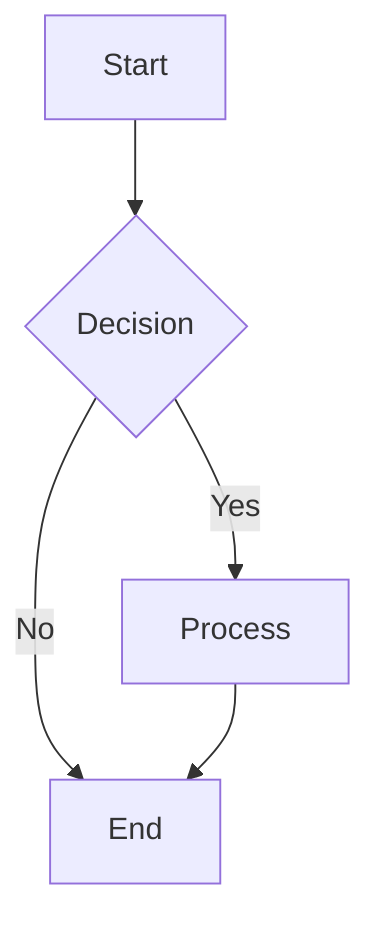
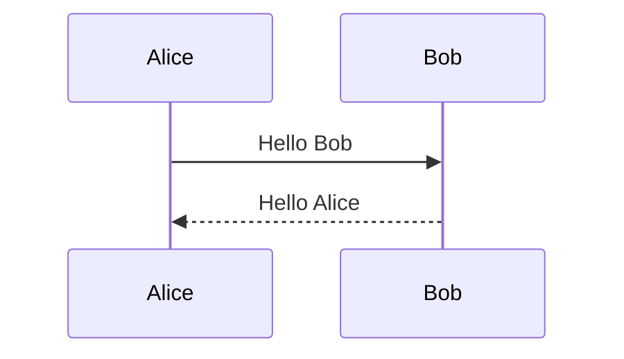
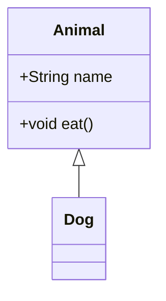
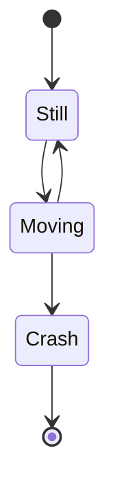
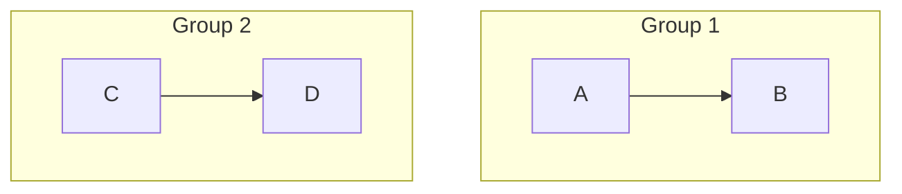
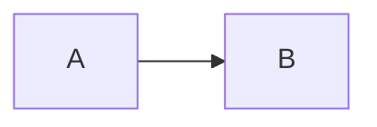

# Excalidraw 绘图语法规范

## 文件格式概述

Excalidraw 使用 JSON 格式存储绘图数据。文件扩展名为 `.excalidraw`，采用纯文本 JSON 结构。

## 基本文件结构

```json
{
  "type": "excalidraw",
  "version": 2,
  "source": "https://excalidraw.com",
  "elements": [],
  "appState": {},
  "files": {}
}
```

## 顶级属性

### 必需属性
- `type`: 固定值 `"excalidraw"`
- `version`: 数字，当前为 2
- `source`: 字符串，通常为 `"https://excalidraw.com"`
- `elements`: 数组，包含所有画布元素
- `appState`: 对象，应用程序状态配置
- `files`: 对象，图像数据存储

## 元素类型 (Element Types)

### 基础形状元素
1. **rectangle** - 矩形
2. **ellipse** - 椭圆/圆形  
3. **diamond** - 菱形

### 线条和箭头元素
4. **arrow** - 箭头
5. **line** - 直线

### 绘制和文本元素
6. **freedraw** - 自由绘制
7. **text** - 文本

### 媒体元素
8. **image** - 图像

### 高级元素
9. **frame** - 框架
10. **magicframe** - 智能框架
11. **embeddable** - 嵌入式元素

## 元素基本属性结构

```json
{
  "id": "unique-element-id",
  "type": "rectangle",
  "x": 100,
  "y": 100,
  "width": 200,
  "height": 150,
  "angle": 0,
  "strokeColor": "#1e1e1e",
  "backgroundColor": "transparent",
  "fillStyle": "hachure",
  "strokeWidth": 1,
  "strokeStyle": "solid",
  "roughness": 1,
  "opacity": 100,
  "groupIds": [],
  "frameId": null,
  "roundness": {
    "type": 3
  },
  "seed": 123456789,
  "versionNonce": 987654321,
  "isDeleted": false,
  "boundElements": null,
  "updated": 1,
  "link": null,
  "locked": false
}
```

## 核心属性详解

### 位置和尺寸
- `x`, `y`: 元素左上角坐标
- `width`, `height`: 元素宽度和高度
- `angle`: 旋转角度（弧度）

### 样式属性
- `strokeColor`: 边框颜色（十六进制）
- `backgroundColor`: 填充颜色
- `strokeWidth`: 边框宽度 (1-3)
- `strokeStyle`: 边框样式 (`"solid"` | `"dashed"` | `"dotted"`)
- `fillStyle`: 填充样式 (`"hachure"` | `"cross-hatch"` | `"solid"`)
- `roughness`: 粗糙度 (0-2)
- `opacity`: 透明度 (0-100)

### 交互属性
- `groupIds`: 所属组ID数组
- `frameId`: 所属框架ID
- `boundElements`: 绑定元素信息
- `link`: 链接URL
- `locked`: 是否锁定

### 系统属性
- `id`: 唯一标识符
- `seed`: 随机种子
- `versionNonce`: 版本标识
- `isDeleted`: 删除标记
- `updated`: 更新时间戳

## 文本元素特殊属性

```json
{
  "type": "text",
  "text": "文本内容",
  "fontSize": 20,
  "fontFamily": 1,
  "textAlign": "left",
  "verticalAlign": "top",
  "containerId": null,
  "originalText": "文本内容",
  "lineHeight": 1.25
}
```

### 文本属性
- `text`: 显示文本
- `fontSize`: 字体大小
- `fontFamily`: 字体族 (1: Virgil, 2: Helvetica, 3: Cascadia)
- `textAlign`: 水平对齐 (`"left"` | `"center"` | `"right"`)
- `verticalAlign`: 垂直对齐 (`"top"` | `"middle"` | `"bottom"`)
- `lineHeight`: 行高倍数

## 线性元素属性

对于 `arrow` 和 `line` 类型：

```json
{
  "type": "arrow",
  "points": [[0, 0], [100, 100]],
  "lastCommittedPoint": null,
  "startBinding": null,
  "endBinding": null,
  "startArrowhead": null,
  "endArrowhead": "arrow"
}
```

### 线性属性
- `points`: 点坐标数组
- `startBinding`, `endBinding`: 起始/结束绑定
- `startArrowhead`, `endArrowhead`: 箭头样式

## 应用状态 (appState)

```json
{
  "gridSize": null,
  "viewBackgroundColor": "#ffffff",
  "currentItemStrokeColor": "#1e1e1e",
  "currentItemBackgroundColor": "transparent",
  "currentItemFillStyle": "hachure",
  "currentItemStrokeWidth": 1,
  "currentItemStrokeStyle": "solid",
  "currentItemRoughness": 1,
  "currentItemOpacity": 100,
  "currentItemFontFamily": 1,
  "currentItemFontSize": 20,
  "currentItemTextAlign": "left",
  "currentItemStartArrowhead": null,
  "currentItemEndArrowhead": "arrow",
  "scrollX": 0,
  "scrollY": 0,
  "zoom": {
    "value": 1
  },
  "currentItemRoundness": "round",
  "gridEnabled": false,
  "currentStrokeOptions": null,
  "previousGridSize": null,
  "frameRendering": {
    "enabled": true,
    "clip": true,
    "name": true,
    "outline": true
  }
}
```

## 图像文件结构

```json
{
  "files": {
    "file-id-123": {
      "mimeType": "image/png",
      "id": "file-id-123",
      "dataURL": "data:image/png;base64,iVBORw0KGgoAAAANSUhEUgAA...",
      "created": 1640995200000,
      "lastRetrieved": 1640995200000
    }
  }
}
```

## 工具类型 (Tool Types)

- `selection` - 选择工具
- `lasso` - 套索选择
- `rectangle` - 矩形工具 (快捷键: R 或 2)
- `diamond` - 菱形工具 (快捷键: D 或 3)
- `ellipse` - 椭圆工具 (快捷键: O 或 4)
- `arrow` - 箭头工具 (快捷键: A 或 5)
- `line` - 直线工具 (快捷键: L 或 6)
- `freedraw` - 自由绘制 (快捷键: P 或 7)
- `text` - 文本工具 (快捷键: T 或 8)
- `image` - 图像工具 (快捷键: 9)
- `eraser` - 橡皮擦
- `hand` - 移动工具
- `frame` - 框架工具
- `magicframe` - 智能框架
- `embeddable` - 嵌入工具
- `laser` - 激光笔

## 颜色系统

### 预设颜色
- `#1e1e1e` - 黑色
- `#e03131` - 红色  
- `#2f9e44` - 绿色
- `#1971c2` - 蓝色
- `#f08c00` - 橙色
- `#9c36b5` - 紫色
- `#495057` - 灰色

### 透明度
- `transparent` - 透明
- 或使用 `opacity` 属性控制 (0-100)

## 创建元素的基本步骤

1. 生成唯一 ID
2. 设置元素类型
3. 定义位置和尺寸
4. 配置样式属性
5. 设置系统属性（seed, versionNonce等）
6. 添加到 elements 数组

## 验证规则

- `type` 必须为 `"excalidraw"`
- `elements` 必须为数组
- `appState` 必须为对象
- 每个元素必须包含 `id`, `type`, `x`, `y` 属性
- 颜色值必须为有效的十六进制格式

## 注意事项

1. 所有坐标使用像素单位
2. 角度使用弧度制
3. ID 必须全局唯一  
4. 删除元素时设置 `isDeleted: true` 而非移除
5. 修改元素时需更新 `versionNonce` 和 `updated`
6. 绑定关系需要双向维护

---

# Excalidraw 与 Mermaid 语法对比补充

## 概述

Excalidraw 提供可视化绘图功能，而 Mermaid 使用文本描述生成图表。两者在不同场景下各有优势：

- **Excalidraw**: 自由度高，适合手绘风格，支持复杂布局
- **Mermaid**: 代码化描述，版本控制友好，自动布局

## 图表类型映射

### 流程图 (Flowchart)

**Mermaid 语法:**


**Excalidraw 等价元素:**
- `rectangle` 对应 `[]` 矩形节点
- `diamond` 对应 `{}` 菱形决策节点
- `ellipse` 对应 `()` 圆形节点
- `arrow` 对应 `-->` 箭头连接

### 序列图 (Sequence Diagram)

**Mermaid 语法:**


**Excalidraw 实现:**
- 使用 `line` 绘制生命线
- 使用 `arrow` 绘制消息箭头
- 使用 `text` 标注消息内容
- 使用 `rectangle` 绘制激活框

### 类图 (Class Diagram)

**Mermaid 语法:**


**Excalidraw 实现:**
- 使用 `rectangle` 绘制类框
- 使用 `line` 分割属性和方法区域
- 使用 `arrow` 绘制继承关系
- 使用 `text` 添加类名、属性、方法

### 状态图 (State Diagram)

**Mermaid 语法:**


**Excalidraw 实现:**
- 使用 `ellipse` 绘制状态节点
- 使用 `arrow` 绘制状态转换
- 使用 `text` 标注转换条件

## 样式对应关系

### 颜色映射

| Mermaid 样式 | Excalidraw 颜色 | 用途 |
|-------------|----------------|------|
| `fill:#f9f,stroke:#333` | `backgroundColor: "#ffccff", strokeColor: "#1e1e1e"` | 自定义填充和边框 |
| `class nodeA someClass` | 预定义样式组合 | 样式类应用 |

### 形状对应

| Mermaid 形状 | Excalidraw 元素 | 描述 |
|-------------|----------------|------|
| `A[Rectangle]` | `type: "rectangle"` | 矩形节点 |
| `B(Round)` | `type: "ellipse"` | 圆形节点 |
| `C{Diamond}` | `type: "diamond"` | 菱形节点 |
| `D((Circle))` | `type: "ellipse"` 圆形 | 圆形节点 |
| `E>Flag]` | 自定义形状组合 | 旗帜形状 |

## 布局策略

### Mermaid 自动布局


### Excalidraw 手动布局
- 使用 `frame` 元素创建分组
- 手动计算坐标确保对齐
- 使用网格辅助布局 (`gridEnabled: true`)

## 交互性对比

### Mermaid 点击事件


### Excalidraw 链接
```json
{
  "type": "rectangle",
  "link": "https://example.com"
}
```

## 动画和状态

### Mermaid 不支持动画
- 静态图表生成
- 可通过 JavaScript 操作 DOM 实现动画

### Excalidraw 支持有限动画
- 激光笔工具 (`laser`) 用于演示
- 可通过修改元素属性实现简单动画

## 数据绑定

### Mermaid 支持动态数据
```javascript
const mermaidConfig = {
  startOnLoad: true,
  theme: 'default'
};
// 可通过 JavaScript 动态更新图表内容
```

### Excalidraw 数据绑定
```json
{
  "type": "text",
  "text": "动态内容: {{variable}}",
  "boundElements": [
    {
      "id": "data-source",
      "type": "binding"
    }
  ]
}
```

## 导出格式对比

### Mermaid 导出
- SVG (矢量图)
- PNG (位图)
- PDF (通过 puppeteer)

### Excalidraw 导出
- SVG 原生支持
- PNG 高质量导出
- JSON 格式保存
- 可嵌入其他应用

## 版本控制友好度

### Mermaid 优势
```
# 文本格式，Git diff 友好
flowchart TD
    A --> B
+   B --> C  # 新增连接
-   A --> D  # 删除连接
```

### Excalidraw 处理
```json
{
  "elements": [
    {
      "id": "element-1",
      "versionNonce": 123456789,  // 版本控制
      "updated": 1640995200000   // 时间戳
    }
  ]
}
```

## 最佳实践建议

### 选择 Mermaid 的场景
- 文档中的技术图表
- 需要版本控制的图表
- 标准化的图表类型
- 自动化生成需求

### 选择 Excalidraw 的场景
- 自由布局需求
- 手绘风格偏好
- 复杂的视觉设计
- 实时协作需求
- 演示和教学场景

### 混合使用策略
1. 初期设计使用 Excalidraw 快速原型
2. 确定后转换为 Mermaid 代码维护
3. 复杂部分保留 Excalidraw 格式
4. 简单流程图使用 Mermaid
