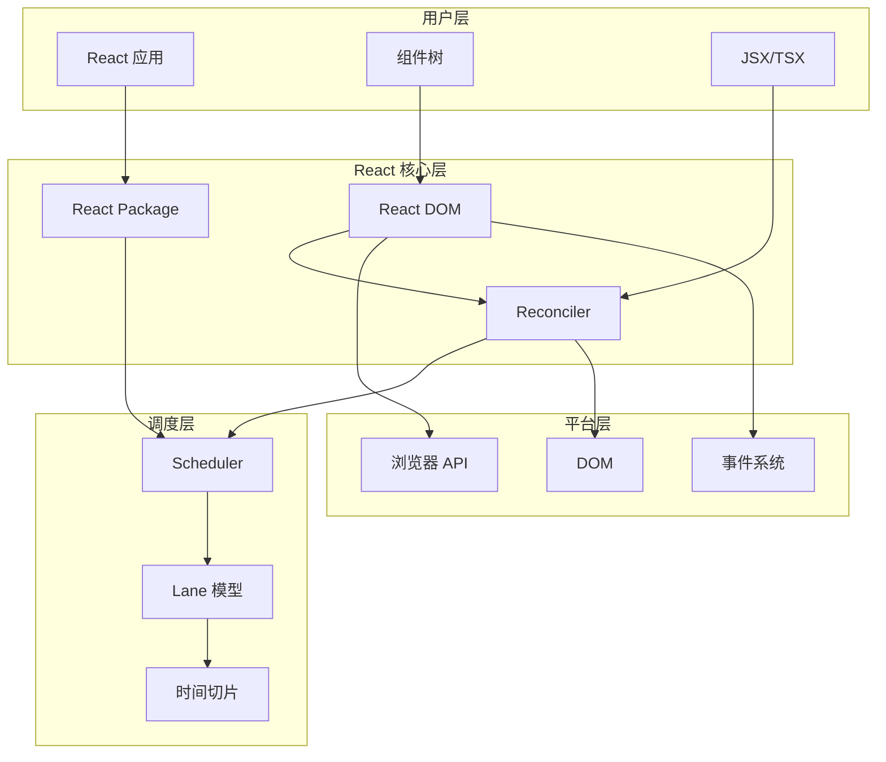
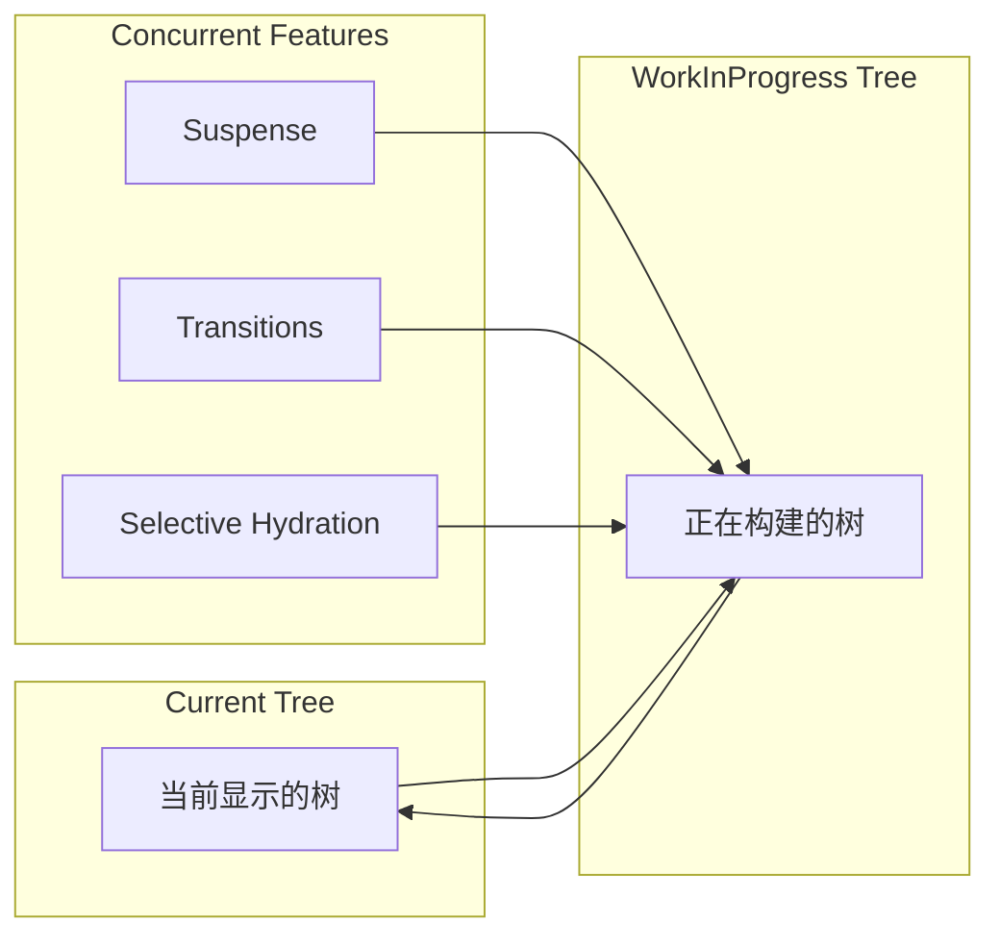
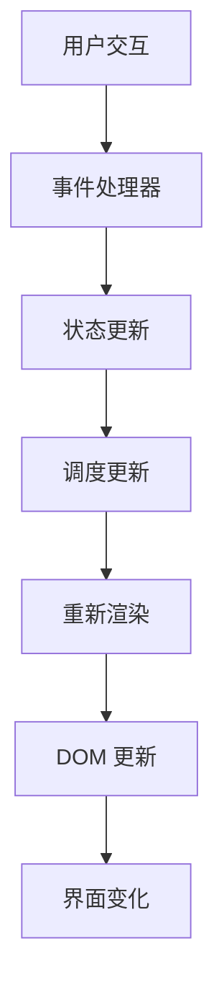
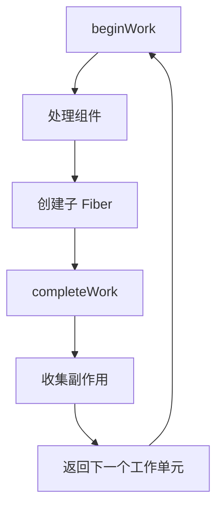
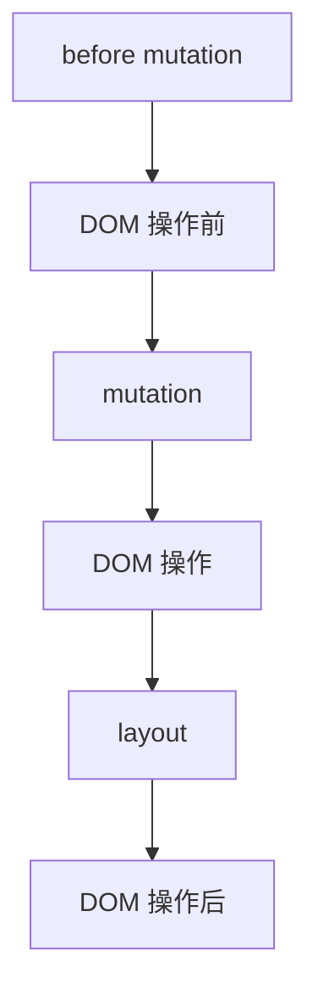

# React 19 架构概览

## 概述

React 19 采用了全新的并发架构，核心围绕 **Fiber**、**Scheduler** 和 **Lane** 三大核心系统构建。本章将从整体架构层面介绍 React 19 的设计思想和核心组件。

## 整体架构图



## 核心设计理念

### 1. 可中断渲染

React 19 的渲染过程是可中断的，这是通过以下机制实现的：

```javascript
// 简化的工作循环伪代码
function workLoopConcurrent() {
  while (workInProgress !== null && !shouldYield()) {
    // 执行一个工作单元
    performUnitOfWork(workInProgress);
  }
}

function shouldYield() {
  // 检查是否需要让出执行权
  return getCurrentTime() >= deadline;
}
```

**核心优势**：
- 避免长时间阻塞主线程
- 保持应用的响应性
- 支持优先级调度

### 2. 优先级调度

不同类型的更新具有不同的优先级：

```javascript
// 优先级从高到低
const priorities = {
  ImmediatePriority: 1,    // 同步任务（如用户输入）
  UserBlockingPriority: 2, // 用户交互（如点击、滚动）
  NormalPriority: 3,       // 一般更新（如网络请求结果）
  LowPriority: 4,          // 低优先级（如分析上报）
  IdlePriority: 5,         // 空闲时执行
};
```

### 3. 并发渲染

React 19 支持并发渲染，可以同时准备多个版本的组件树：



## 架构分层详解

### 第一层：用户界面层

```javascript
// 用户编写的组件
function App() {
  const [count, setCount] = useState(0);
  
  return (
    <div>
      <h1>Count: {count}</h1>
      <button onClick={() => setCount(count + 1)}>
        增加
      </button>
    </div>
  );
}

// JSX 被编译为
React.createElement('div', null,
  React.createElement('h1', null, 'Count: ', count),
  React.createElement('button', { onClick: () => setCount(count + 1) }, '增加')
);
```

### 第二层：React 核心层

#### React Package (react)
```javascript
// 主要导出 Hook 和工具函数
export {
  useState,
  useEffect,
  useContext,
  // ... 其他 Hook
} from './ReactHooks';

export {
  createElement,
  Fragment,
  // ... 其他工具
} from './ReactElement';
```

#### React DOM (react-dom)
```javascript
// 提供 DOM 相关的 API
export {
  createRoot,     // React 18+ 的新 API
  hydrateRoot,    // SSR 水合
  render,         // 兼容 API
} from './ReactDOMRoot';
```

#### Reconciler (react-reconciler)
协调器是 React 的核心，负责：

```javascript
// 简化的协调过程
function reconcileChildren(current, workInProgress, nextChildren) {
  if (current === null) {
    // 首次挂载
    workInProgress.child = mountChildFibers(workInProgress, null, nextChildren);
  } else {
    // 更新过程
    workInProgress.child = reconcileChildFibers(
      workInProgress,
      current.child,
      nextChildren
    );
  }
}
```

### 第三层：调度层

#### Scheduler
```javascript
// 任务调度的核心逻辑
function unstable_scheduleCallback(priorityLevel, callback, options) {
  var currentTime = getCurrentTime();
  var timeout = getTimeoutByPriorityLevel(priorityLevel);
  var expirationTime = currentTime + timeout;
  
  var newTask = {
    id: taskIdCounter++,
    callback,
    priorityLevel,
    startTime: currentTime,
    expirationTime,
    sortIndex: -1,
  };
  
  // 将任务加入调度队列
  push(taskQueue, newTask);
  
  // 开始调度
  requestHostCallback(flushWork);
}
```

#### Lane 模型
```javascript
// Lane 用二进制位表示优先级
const SyncLane = 0b0000000000000000000000000000001;
const InputContinuousLane = 0b0000000000000000000000000000100;
const DefaultLane = 0b0000000000000000000000000010000;
const TransitionLanes = 0b0000000001111111111111110000000;
const RetryLanes = 0b0000011110000000000000000000000;
```

### 第四层：平台层

```javascript
// DOM 操作抽象
const HostConfig = {
  createInstance(type, props) {
    return document.createElement(type);
  },
  
  appendInitialChild(parentInstance, child) {
    parentInstance.appendChild(child);
  },
  
  commitUpdate(instance, updatePayload, type, oldProps, newProps) {
    // 应用属性更新
    updateProperties(instance, updatePayload, type, oldProps, newProps);
  },
};
```

## 数据流架构

### 1. 单向数据流



### 2. 状态管理流程

```javascript
// 状态更新的完整流程
function updateState() {
  // 1. 创建更新对象
  const update = createUpdate(eventTime, lane, action);
  
  // 2. 将更新加入队列
  enqueueUpdate(fiber, update, lane);
  
  // 3. 调度根节点更新
  scheduleUpdateOnFiber(fiber, lane, eventTime);
  
  // 4. 在调度器中执行更新
  // 5. 协调器处理 Fiber 树
  // 6. 提交更改到 DOM
}
```

## 关键数据结构

### 1. Fiber Node

```javascript
// Fiber 节点的关键属性
function FiberNode(tag, pendingProps, key, mode) {
  // 静态数据结构
  this.tag = tag;                    // 节点类型
  this.key = key;                    // React 元素的 key
  this.elementType = null;           // 元素类型
  this.type = null;                  // 函数组件就是函数本身
  
  // 树形结构
  this.return = null;                // 父节点
  this.child = null;                 // 第一个子节点
  this.sibling = null;               // 下一个兄弟节点
  this.index = 0;                    // 在父节点中的索引
  
  // 动态工作单元
  this.pendingProps = pendingProps;  // 本次渲染需要使用的 props
  this.memoizedProps = null;         // 上次渲染使用的 props
  this.updateQueue = null;           // 更新队列
  this.memoizedState = null;         // 上次渲染后的 state
  
  // 副作用
  this.flags = NoFlags;              // 副作用标记
  this.subtreeFlags = NoFlags;       // 子树副作用标记
  this.deletions = null;             // 需要删除的子节点
  
  // 优先级相关
  this.lanes = NoLanes;              // 当前 Fiber 的优先级
  this.childLanes = NoLanes;         // 子树中的优先级
  
  // 双缓存
  this.alternate = null;             // 指向另一个 Fiber 树中的对应节点
}
```

### 2. Hook 对象

```javascript
// Hook 的数据结构
const hook = {
  memoizedState: null,    // Hook 的状态值
  baseState: null,        // 计算更新的基础状态
  baseQueue: null,        // 基础更新队列
  queue: null,            // 当前更新队列
  next: null,             // 指向下一个 Hook
};
```

### 3. Update 对象

```javascript
// 更新对象的结构
const update = {
  eventTime,             // 事件时间
  lane,                  // 更新优先级
  tag: UpdateState,      // 更新类型
  payload: null,         // 更新内容
  callback: null,        // 更新回调
  next: null,           // 下一个更新
};
```

## 渲染阶段概览

### 1. Render 阶段



**特点**：
- 可以被中断
- 可以重新开始
- 可以跳过某些组件（Bailout）

### 2. Commit 阶段



**特点**：
- 不可中断
- 同步执行
- 包含三个子阶段

## 并发特性

### 1. Time Slicing

```javascript
// 时间切片的实现原理
function workLoopConcurrent() {
  while (workInProgress !== null && !shouldYield()) {
    performUnitOfWork(workInProgress);
  }
}

// 通过 MessageChannel 实现
function postTask(callback) {
  port.postMessage(null);
}
```

### 2. Suspense

```javascript
// Suspense 的基本用法
function App() {
  return (
    <Suspense fallback={<Loading />}>
      <AsyncComponent />
    </Suspense>
  );
}

// 组件可以"挂起"渲染
function AsyncComponent() {
  const data = use(fetchData()); // 这里可能会抛出 Promise
  return <div>{data}</div>;
}
```

### 3. Transitions

```javascript
// 将更新标记为过渡
function App() {
  const [query, setQuery] = useState('');
  const [results, setResults] = useState([]);
  const [isPending, startTransition] = useTransition();
  
  const handleChange = (e) => {
    setQuery(e.target.value);
    
    // 低优先级更新
    startTransition(() => {
      setResults(search(e.target.value));
    });
  };
  
  return (
    <div>
      <input value={query} onChange={handleChange} />
      {isPending && <Spinner />}
      <SearchResults results={results} />
    </div>
  );
}
```

## 性能优化策略

### 1. Bailout 优化

```javascript
// React 会跳过没有变化的组件
function Component({ value }) {
  // 如果 props 没有变化，会跳过这个组件的渲染
  return <div>{value}</div>;
}

// 使用 memo 手动控制
const OptimizedComponent = memo(Component);
```

### 2. Lane 优化

```javascript
// 不同优先级的更新会被合并
function handleClick() {
  // 高优先级更新
  setUrgentState(newValue);
  
  // 低优先级更新可能会被延迟
  startTransition(() => {
    setNormalState(newValue);
  });
}
```

### 3. 批量更新

```javascript
// React 会自动批量处理多个状态更新
function handleClick() {
  setState1(value1); // 不会立即重渲染
  setState2(value2); // 不会立即重渲染
  setState3(value3); // 这里才会触发一次重渲染
}
```

## 调试和开发工具

### 1. React DevTools

```javascript
// 启用更多调试信息
if (__DEV__) {
  // 开发模式下的额外检查
  validatePropsTypes(element.type, element.props);
}
```

### 2. Concurrent Features DevTools

```javascript
// 查看并发特性的状态
console.log({
  isPending,
  startTransition,
  suspenseState: fiber.memoizedState,
});
```

## 总结

React 19 的架构设计体现了以下核心思想：

1. **可中断渲染**：通过 Fiber 和 Scheduler 实现
2. **优先级调度**：通过 Lane 模型管理不同优先级的更新
3. **并发渲染**：支持 Suspense、Transitions 等并发特性
4. **性能优化**：通过 Bailout、批量更新等策略提升性能

这种架构使 React 能够：
- 保持应用的响应性
- 提供更好的用户体验
- 支持复杂的并发场景
- 提供强大的性能优化能力

在后续章节中，我们将深入探讨每个组件的具体实现细节。