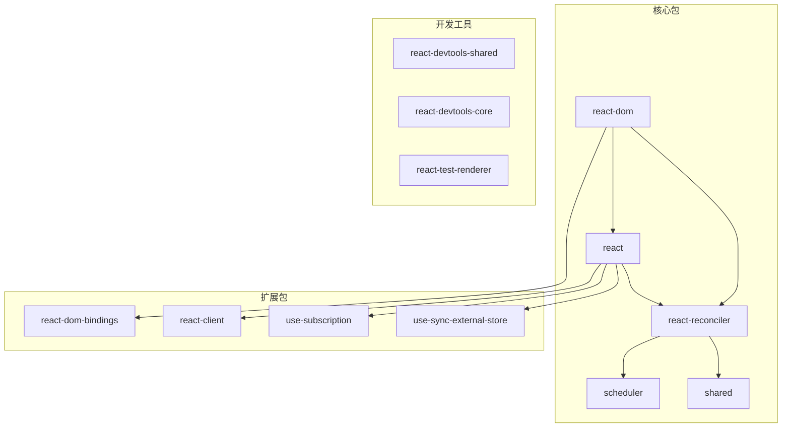
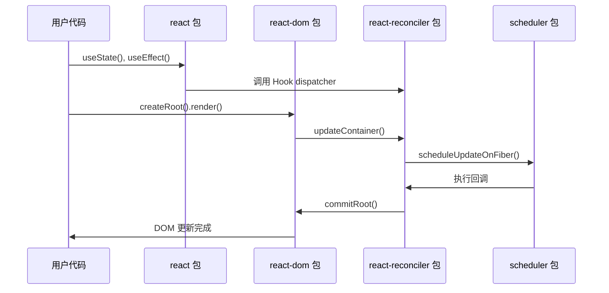

# 核心模块介绍

## 概述

React 19 由多个核心模块组成，每个模块都有特定的职责和功能。理解这些模块的作用和相互关系是深入学习 React 源码的基础。

## 模块架构图



## 核心包详解

### 1. react 包

React 包是用户直接使用的 API 层，提供组件定义和 Hook 接口。

#### 主要导出

```javascript
// packages/react/src/React.js
export {
  // 组件相关
  Component,
  PureComponent,
  Fragment,
  
  // 元素创建
  createElement,
  cloneElement,
  isValidElement,
  
  // Hook
  useState,
  useEffect,
  useContext,
  useReducer,
  useCallback,
  useMemo,
  useRef,
  useImperativeHandle,
  useLayoutEffect,
  useDebugValue,
  useDeferredValue,
  useTransition,
  useId,
  useSyncExternalStore,
  useInsertionEffect,
  
  // 并发特性
  Suspense,
  lazy,
  startTransition,
  
  // Context
  createContext,
  
  // Ref
  createRef,
  forwardRef,
  
  // 高阶组件
  memo,
  
  // 错误边界
  StrictMode,
} from './ReactHooks';
```

#### 核心文件结构

```
packages/react/src/
├── React.js                 # 主要导出文件
├── ReactHooks.js            # Hook 实现
├── ReactElement.js          # 元素创建和验证
├── ReactContext.js          # Context 相关
├── ReactLazy.js             # 懒加载组件
├── ReactMemo.js             # memo 高阶组件
└── ReactForwardRef.js       # forwardRef 实现
```

#### 典型实现示例

```javascript
// ReactHooks.js 中 Hook 的典型实现
function useState(initialState) {
  const dispatcher = resolveDispatcher();
  return dispatcher.useState(initialState);
}

function useEffect(create, deps) {
  const dispatcher = resolveDispatcher();
  return dispatcher.useEffect(create, deps);
}

// 根据当前执行上下文获取对应的 dispatcher
function resolveDispatcher() {
  const dispatcher = ReactCurrentDispatcher.current;
  if (__DEV__) {
    if (dispatcher === null) {
      console.error('Hook 只能在函数组件内部调用');
    }
  }
  return dispatcher;
}
```

### 2. react-dom 包

React DOM 包负责将 React 组件渲染到 DOM 环境中。

#### 主要 API

```javascript
// packages/react-dom/src/ReactDOM.js
export {
  // React 18+ 新 API
  createRoot,
  hydrateRoot,
  
  // 兼容 API
  render,
  hydrate,
  unmountComponentAtNode,
  
  // 工具函数
  findDOMNode,
  flushSync,
  
  // 事件相关
  unstable_batchedUpdates,
  
  // 服务端渲染
  version,
} from './ReactDOMRoot';
```

#### createRoot 实现

```javascript
// packages/react-dom/src/ReactDOMRoot.js
export function createRoot(container, options) {
  // 验证容器元素
  if (!isValidContainer(container)) {
    throw new Error('createRoot(...): Target container is not a DOM element.');
  }
  
  // 创建 Fiber 根节点
  const root = createContainer(
    container,
    ConcurrentRoot, // 并发模式
    false,          // 不是严格模式
    '',             // 标识符
    false,          // 不是服务端渲染
    false,          // 不是预热
    options?.identifierPrefix || '',
    options?.onRecoverableError || defaultOnRecoverableError,
    options?.transitionCallbacks || null,
  );
  
  // 标记容器
  markContainerAsRoot(root.current, container);
  
  // 创建根实例
  return new ReactDOMRoot(root);
}

class ReactDOMRoot {
  constructor(internalRoot) {
    this._internalRoot = internalRoot;
  }
  
  render(children) {
    const root = this._internalRoot;
    // 开始更新
    updateContainer(children, root, null, null);
  }
  
  unmount() {
    const root = this._internalRoot;
    updateContainer(null, root, null, null);
  }
}
```

### 3. react-reconciler 包

协调器是 React 的核心，负责比较新旧虚拟 DOM 树并找出变化。

#### 核心职责

1. **Fiber 树构建**：将 React 元素转换为 Fiber 节点
2. **diff 算法**：比较新旧 Fiber 树
3. **调度协调**：与 Scheduler 配合管理更新优先级
4. **副作用收集**：收集需要执行的 DOM 操作

#### 关键文件

```
packages/react-reconciler/src/
├── ReactFiberWorkLoop.js        # 工作循环
├── ReactFiberBeginWork.js       # beginWork 阶段
├── ReactFiberCompleteWork.js    # completeWork 阶段
├── ReactFiberCommitWork.js      # commit 阶段
├── ReactFiberHooks.js           # Hook 实现
├── ReactFiberLane.js            # Lane 模型
├── ReactFiberReconciler.js      # 协调器入口
└── ReactChildFiber.js           # 子节点协调
```

#### 工作循环实现

```javascript
// ReactFiberWorkLoop.js
function workLoopConcurrent() {
  // 并发模式下的工作循环
  while (workInProgress !== null && !shouldYield()) {
    performUnitOfWork(workInProgress);
  }
}

function performUnitOfWork(unitOfWork) {
  const current = unitOfWork.alternate;
  
  let next;
  if (enableProfilerTimer && (unitOfWork.mode & ProfileMode) !== NoMode) {
    startProfilerTimer(unitOfWork);
    next = beginWork(current, unitOfWork, subtreeRenderLanes);
    stopProfilerTimerIfRunningAndRecordDelta(unitOfWork, true);
  } else {
    next = beginWork(current, unitOfWork, subtreeRenderLanes);
  }
  
  unitOfWork.memoizedProps = unitOfWork.pendingProps;
  
  if (next === null) {
    // 没有子节点，完成这个工作单元
    completeUnitOfWork(unitOfWork);
  } else {
    // 继续处理子节点
    workInProgress = next;
  }
}
```

### 4. scheduler 包

调度器负责任务的优先级管理和时间切片。

#### 核心功能

1. **优先级管理**：管理不同优先级的任务
2. **时间切片**：实现可中断的任务执行
3. **任务调度**：决定何时执行任务

#### 优先级定义

```javascript
// packages/scheduler/src/SchedulerPriorities.js
export const ImmediatePriority = 1;      // 立即执行
export const UserBlockingPriority = 2;   // 用户阻塞
export const NormalPriority = 3;         // 正常优先级
export const LowPriority = 4;            // 低优先级
export const IdlePriority = 5;           // 空闲优先级
```

#### 调度实现

```javascript
// packages/scheduler/src/Scheduler.js
function unstable_scheduleCallback(priorityLevel, callback, options) {
  var currentTime = getCurrentTime();
  
  var timeout;
  switch (priorityLevel) {
    case ImmediatePriority:
      timeout = IMMEDIATE_PRIORITY_TIMEOUT; // -1
      break;
    case UserBlockingPriority:
      timeout = USER_BLOCKING_PRIORITY_TIMEOUT; // 250ms
      break;
    case IdlePriority:
      timeout = IDLE_PRIORITY_TIMEOUT; // 1073741823ms
      break;
    case LowPriority:
      timeout = LOW_PRIORITY_TIMEOUT; // 10000ms
      break;
    case NormalPriority:
    default:
      timeout = NORMAL_PRIORITY_TIMEOUT; // 5000ms
      break;
  }
  
  var expirationTime = currentTime + timeout;
  
  var newTask = {
    id: taskIdCounter++,
    callback,
    priorityLevel,
    startTime: currentTime,
    expirationTime,
    sortIndex: -1,
  };
  
  if (currentTime > startTime) {
    // 任务已过期，立即执行
    newTask.sortIndex = expirationTime;
    push(taskQueue, newTask);
    
    if (peek(timerQueue) === null && peek(taskQueue) === newTask) {
      if (isHostCallbackScheduled) {
        cancelHostCallback();
      } else {
        isHostCallbackScheduled = true;
      }
      requestHostCallback(flushWork, expirationTime - currentTime);
    }
  } else {
    // 延迟任务
    newTask.sortIndex = startTime;
    push(timerQueue, newTask);
    
    if (!isHostTimeoutScheduled && !isHostCallbackScheduled) {
      isHostTimeoutScheduled = true;
      requestHostTimeout(handleTimeout, startTime - currentTime);
    }
  }
  
  return newTask;
}
```

### 5. shared 包

Shared 包包含所有包共享的工具函数和常量。

#### 主要内容

```javascript
// packages/shared/src/ReactSymbols.js
export const REACT_ELEMENT_TYPE = Symbol.for('react.element');
export const REACT_PORTAL_TYPE = Symbol.for('react.portal');
export const REACT_FRAGMENT_TYPE = Symbol.for('react.fragment');
export const REACT_STRICT_MODE_TYPE = Symbol.for('react.strict_mode');
export const REACT_PROFILER_TYPE = Symbol.for('react.profiler');
export const REACT_PROVIDER_TYPE = Symbol.for('react.provider');
export const REACT_CONTEXT_TYPE = Symbol.for('react.context');
export const REACT_SUSPENSE_TYPE = Symbol.for('react.suspense');
export const REACT_SUSPENSE_LIST_TYPE = Symbol.for('react.suspense_list');
export const REACT_MEMO_TYPE = Symbol.for('react.memo');
export const REACT_LAZY_TYPE = Symbol.for('react.lazy');
```

```javascript
// packages/shared/src/ReactFeatureFlags.js
export const enableSchedulerDebugging = __DEV__;
export const enableProfilerTimer = __PROFILE__;
export const enableSuspenseServerRenderer = true;
export const enableSelectiveHydration = true;
export const enableLazyElements = true;
// ... 更多特性开关
```

## 扩展包介绍

### react-dom-bindings

提供 DOM 特定的绑定和事件处理。

```javascript
// packages/react-dom-bindings/src/events/EventRegistry.js
// 事件注册表
const allNativeEvents = new Set();

export function registerTwoPhaseEvent(registrationName, dependencies) {
  registerDirectEvent(registrationName, dependencies);
  registerDirectEvent(registrationName + 'Capture', dependencies);
}

// 注册所有原生事件
export function registerSimpleEvents() {
  registerSimpleEvent('cancel', 'cancel');
  registerSimpleEvent('close', 'close');
  registerSimpleEvent('invalid', 'invalid');
  registerSimpleEvent('load', 'load');
  registerSimpleEvent('toggle', 'toggle');
  // ... 更多事件
}
```

### use-sync-external-store

提供与外部状态库同步的 Hook。

```javascript
// packages/use-sync-external-store/src/useSyncExternalStore.js
export function useSyncExternalStore(subscribe, getSnapshot, getServerSnapshot) {
  const value = getSnapshot();
  const [{ inst }, forceUpdate] = useState({ inst: { value, getSnapshot } });
  
  // 使用 layout effect 同步更新
  useLayoutEffect(() => {
    inst.value = value;
    inst.getSnapshot = getSnapshot;
    
    if (checkIfSnapshotChanged(inst)) {
      forceUpdate({ inst });
    }
  }, [subscribe, value, getSnapshot]);
  
  useEffect(() => {
    if (checkIfSnapshotChanged(inst)) {
      forceUpdate({ inst });
    }
    
    const handleStoreChange = () => {
      if (checkIfSnapshotChanged(inst)) {
        forceUpdate({ inst });
      }
    };
    
    return subscribe(handleStoreChange);
  }, [subscribe]);
  
  return value;
}
```

## 模块间的交互

### 1. 数据流向



### 2. 调用链路

```javascript
// 典型的更新流程
setState(newValue) 
  ↓
dispatchSetState() // react-reconciler/ReactFiberHooks.js
  ↓  
scheduleUpdateOnFiber() // react-reconciler/ReactFiberWorkLoop.js
  ↓
ensureRootIsScheduled() // react-reconciler/ReactFiberWorkLoop.js
  ↓
scheduleCallback() // scheduler/Scheduler.js
  ↓
performConcurrentWorkOnRoot() // react-reconciler/ReactFiberWorkLoop.js
  ↓
renderRootConcurrent() // react-reconciler/ReactFiberWorkLoop.js
  ↓
commitRoot() // react-reconciler/ReactFiberWorkLoop.js
```

## 开发和调试工具

### react-devtools-shared

提供开发者工具的共享逻辑。

```javascript
// packages/react-devtools-shared/src/bridge.js
export default class Bridge extends EventEmitter {
  constructor(wall) {
    super();
    this._wall = wall;
    this._messageQueue = [];
    
    wall.listen(this._handleMessage);
  }
  
  send(event, payload, transferable) {
    if (this._isShutdown) {
      return;
    }
    
    this._messageQueue.push({ event, payload, transferable });
    this._flush();
  }
}
```

### react-test-renderer

提供测试环境下的渲染器。

```javascript
// packages/react-test-renderer/src/ReactTestRenderer.js
export function create(element, options) {
  const createNodeMock = options?.createNodeMock;
  const isConcurrent = options?.unstable_isConcurrent === true;
  
  const container = createContainer(
    null,
    isConcurrent ? ConcurrentRoot : LegacyRoot,
    false,
    '',
    false,
    false,
    '',
    null,
    null,
  );
  
  let root = {
    _Scheduler: Scheduler,
    render(element) {
      updateContainer(element, container, null, null);
    },
    unmount() {
      updateContainer(null, container, null, null);
    },
    // ... 其他方法
  };
  
  return root;
}
```

## 模块依赖关系

### 依赖层次

```
react (最上层)
  ↓ 依赖
react-reconciler (核心层)
  ↓ 依赖  
scheduler (调度层)
  ↓ 依赖
shared (基础层)
```

### 循环依赖的处理

React 通过以下方式避免循环依赖：

1. **分层架构**：上层依赖下层，下层不依赖上层
2. **依赖注入**：通过配置对象传递依赖
3. **事件机制**：使用事件而非直接调用

```javascript
// 依赖注入示例
const HostConfig = {
  createInstance,
  createTextInstance,
  appendInitialChild,
  commitUpdate,
  // ... 其他平台特定方法
};

// 将 HostConfig 传递给 reconciler
const reconciler = createReconciler(HostConfig);
```

## 总结

React 19 的模块设计体现了以下原则：

1. **单一职责**：每个模块都有明确的职责
2. **松耦合**：模块间通过接口交互，便于测试和维护
3. **可扩展**：通过配置和插件机制支持不同平台
4. **性能优先**：调度器和协调器的设计都以性能为核心

理解这些模块的职责和交互方式，是深入学习 React 源码的重要基础。在后续章节中，我们将深入探讨每个模块的具体实现细节。