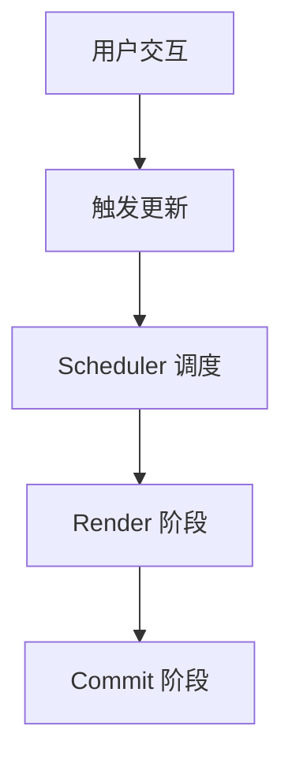

# 项目使用指南

## 项目概述

本项目是一个专门用于学习 React 19 源码的 monorepo 项目，包含调试环境和文档站点两个主要部分。

## 项目架构

### 整体结构

```
dive-react-19/
├── packages/
│   ├── react-dojo/           # React 源码调试实践环境
│   └── rspress-site/         # 源码解读文档站点
├── pnpm-workspace.yaml       # pnpm 工作空间配置
├── package.json              # 根包配置
├── outline.md                # 学习大纲
└── CLAUDE.md                 # 项目说明文档
```

### React Dojo 详细结构

```
packages/react-dojo/
├── source-code/              # React 官方源码
│   └── react/                # 完整的 React 仓库
│       ├── packages/         # React 各个包的源码
│       │   ├── react/        # React 核心包
│       │   ├── react-dom/    # React DOM 包
│       │   ├── react-reconciler/ # 协调器
│       │   ├── scheduler/    # 调度器
│       │   └── shared/       # 共享工具
│       └── ...
├── dojo/                     # 我们的实践代码
│   └── index.jsx             # 主要测试文件
├── public/                   # 静态资源
│   └── index.html            # HTML 模板
├── webpack.config.js         # Webpack 配置
└── package.json              # 包配置
```

### 文档站点结构

```
packages/rspress-site/
├── docs/                     # 文档内容
│   ├── basic/                # 基础准备
│   ├── browser/              # 浏览器架构
│   ├── hooks/                # Hook 系统
│   ├── fiber/                # Fiber 架构
│   ├── concurrent/           # 并发模式
│   ├── render/               # 渲染生命周期
│   ├── error-scheduler/      # 错误处理调度
│   ├── advanced/             # 高级特性
│   ├── tools/                # 工具生态
│   └── guide/                # 快速指南（已有）
├── components/               # 自定义组件
│   └── ui/                   # shadcn/ui 组件
├── theme/                    # 主题配置
├── rspress.config.ts         # 站点配置
└── package.json              # 包配置
```

## 快速开始

### 1. 环境准备

```bash
# 检查 Node.js 版本 (需要 16+)
node --version

# 安装 pnpm（如果没有）
npm install -g pnpm

# 克隆项目
git clone [repository-url]
cd dive-react-19

# 安装所有依赖
pnpm install
```

### 2. 启动调试环境

```bash
# 启动 React 调试环境（端口 8080）
pnpm react:dev

# 或者手动进入目录启动
cd packages/react-dojo
pnpm dev
```

访问 `http://localhost:8080` 开始调试。

### 3. 启动文档站点

```bash
# 启动文档开发服务器（端口 3000）
pnpm docs:dev

# 或者手动进入目录启动
cd packages/rspress-site
pnpm dev
```

访问 `http://localhost:3000` 查看文档。

## 核心功能详解

### React Dojo 特性

#### 1. 源码直接调试

通过 Webpack 别名配置，我们可以直接调试 React 源码：

```javascript
// 当你在 dojo/index.jsx 中写这行代码
import { useState } from 'react';

// 实际会导入
// source-code/react/packages/react/src/ReactHooks.js
```

#### 2. 完整的源码映射

```javascript
// webpack.config.js 核心配置
resolve: {
  alias: {
    react: "./source-code/react/packages/react",
    "react-dom": "./source-code/react/packages/react-dom",
    "react-reconciler": "./source-code/react/packages/react-reconciler",
    scheduler: "./source-code/react/packages/scheduler",
    shared: "./source-code/react/packages/shared",
  }
}
```

#### 3. 开发环境优化

```javascript
// 启用开发模式特性
plugins: [
  new webpack.DefinePlugin({
    "process.env.NODE_ENV": JSON.stringify("development"),
    __DEV__: true,
    __EXPERIMENTAL__: false,
    __PROFILE__: false,
  }),
]
```

### 文档站点特性

#### 1. 中文本地化

```typescript
// rspress.config.ts 中的本地化配置
themeConfig: {
  lastUpdatedText: "最后更新时间",
  outlineTitle: "大纲",
  prevPageText: "上一页",
  nextPageText: "下一页",
  searchPlaceholderText: "搜索文档",
}
```

#### 2. 代码高亮和预览

```markdown
```javascript
// 支持语法高亮的代码块
function Component() {
  return <div>Hello World</div>;
}
\```
```

#### 3. Mermaid 图表支持



#### 4. shadcn/ui 组件库

```jsx
import { Button } from '@/components/ui/button';

<Button variant="outline">点击按钮</Button>
```

## 开发工作流

### 学习新概念的典型流程

1. **查看文档**：在文档站点查找相关概念
2. **编写测试代码**：在 `dojo/index.jsx` 中编写测试用例
3. **设置断点调试**：在源码关键位置设置断点
4. **观察执行过程**：使用浏览器开发者工具调试
5. **记录理解**：将学习成果记录到文档中

### 示例：调试 useState

1. **编写测试代码**

```javascript
// packages/react-dojo/dojo/index.jsx
import { useState } from 'react';

function App() {
  const [count, setCount] = useState(0);
  
  // 设置断点观察状态更新
  const handleClick = () => {
    debugger;
    setCount(count + 1);
  };
  
  return (
    <div>
      <p>Count: {count}</p>
      <button onClick={handleClick}>增加</button>
    </div>
  );
}

export default App;
```

2. **在源码中设置断点**

在以下位置设置断点：
- `source-code/react/packages/react-reconciler/src/ReactFiberHooks.js` 中的 `useState` 函数
- `dispatchSetState` 函数

3. **启动调试**

```bash
pnpm react:dev
```

打开浏览器开发者工具，在 Sources 面板找到源码文件。

### 高级调试技巧

#### 1. 观察 Fiber 树

```javascript
// 在控制台中查看 Fiber 树
console.log(document.getElementById('root')._reactInternalFiber);
```

#### 2. 观察更新队列

```javascript
// 在 Hook 执行时观察更新队列
console.log(hook.queue.pending);
```

#### 3. 分析性能

使用 React DevTools Profiler 分析组件渲染性能。

## 项目管理

### 包管理

使用 pnpm workspace 管理多包项目：

```yaml
# pnpm-workspace.yaml
packages:
  - 'packages/*'
```

### 依赖管理

```bash
# 为特定包添加依赖
pnpm add lodash --filter react-dojo

# 为所有包添加开发依赖
pnpm add -D typescript --workspace-root

# 安装所有依赖
pnpm install
```

### 脚本命令

```json
{
  "scripts": {
    "react:dev": "pnpm --filter react-dojo dev",
    "docs:dev": "pnpm --filter rspress-docs dev",
    "docs:build": "pnpm --filter rspress-docs build"
  }
}
```

## 目录约定

### 文档编写约定

```
docs/
├── category/                 # 分类目录
│   ├── subcategory/         # 子分类（可选）
│   ├── topic.mdx            # 主题文档
│   └── index.md             # 分类介绍
```

### 代码组织约定

```
dojo/
├── index.jsx                # 主测试文件
├── examples/                # 示例代码目录
│   ├── hooks/               # Hook 相关示例
│   ├── performance/         # 性能测试示例
│   └── ...
└── utils/                   # 工具函数
```

## 常用命令速查

### 开发命令

```bash
# 启动 React 调试环境
pnpm react:dev

# 启动文档开发服务器
pnpm docs:dev

# 构建文档站点
pnpm docs:build

# 预览构建结果
cd packages/rspress-site && pnpm preview
```

### 维护命令

```bash
# 更新所有依赖
pnpm update

# 清理 node_modules
pnpm clean

# 重新安装依赖
rm -rf node_modules packages/*/node_modules pnpm-lock.yaml
pnpm install
```

## 贡献指南

### 添加新的调试示例

1. 在 `packages/react-dojo/dojo/` 中创建新的示例文件
2. 在 `packages/react-dojo/dojo/index.jsx` 中引入和使用
3. 添加相应的文档说明

### 编写文档

1. 遵循项目的中文技术写作规范
2. 代码示例必须可运行
3. 添加必要的流程图和图表
4. 更新侧边栏配置

### 文档格式

```markdown
# 标题

## 概述

简要介绍内容...

## 核心概念

### 子概念 1

详细说明...

```javascript
// 代码示例
function example() {
  return 'Hello World';
}
\```

## 实践示例

实际的使用示例...

## 总结

总结要点...
```

## 故障排除

### 常见问题

1. **端口占用**
   ```bash
   # 检查端口占用
   lsof -i :8080
   lsof -i :3000
   
   # 修改端口（在对应的 package.json 中）
   ```

2. **依赖安装失败**
   ```bash
   # 清理并重新安装
   pnpm clean
   pnpm install
   ```

3. **源码映射不工作**
   - 检查 webpack.config.js 中的别名配置
   - 确保 devtool 设置为 "cheap-module-source-map"

4. **热重载不工作**
   - 检查 webpack-dev-server 配置
   - 确保文件保存在正确的目录中

### 获取帮助

- 查看项目 README 和 CLAUDE.md
- 检查 Issues 和 Discussions
- 参考 React 官方文档

## 总结

这个项目为学习 React 19 源码提供了完整的环境：

1. **调试环境**：可以直接调试 React 源码
2. **文档系统**：系统化的学习资料
3. **工具支持**：丰富的开发和调试工具
4. **最佳实践**：规范的代码组织和文档结构

通过遵循这个使用指南，你可以高效地使用项目进行 React 源码学习。