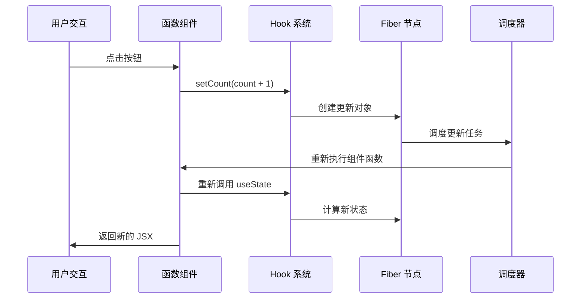
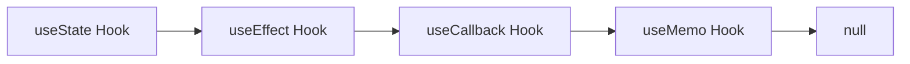

# Hook 背景

## 概述

Hook 是 React 16.8 引入的革命性特性，它彻底改变了 React 组件的编写方式和状态管理模式。在 React 19 中，Hook 机制得到了进一步完善和优化。本章将通过可执行的案例深入探讨 Hook 的设计背景、解决的问题，以及它为什么成为现代 React 开发的核心。

## 可执行案例：从类组件到 Hook 的演进

### 案例 1：计数器组件的演进

让我们通过一个简单的计数器来理解 Hook 解决的实际问题。

#### 传统类组件实现

```javascript
// 在 packages/react-dojo/dojo/index.jsx 中尝试这个例子

class ClassCounter extends React.Component {
  constructor(props) {
    super(props);
    this.state = { 
      count: 0,
      message: '计数器'
    };
    
    // 💔 需要手动绑定 this
    this.handleClick = this.handleClick.bind(this);
    this.handleReset = this.handleReset.bind(this);
  }
  
  componentDidMount() {
    // 💔 副作用逻辑分散
    document.title = `${this.state.message}: ${this.state.count}`;
    
    // 💔 相关逻辑被拆分到不同生命周期
    this.timer = setInterval(() => {
      console.log(`当前计数: ${this.state.count}`);
    }, 1000);
  }
  
  componentDidUpdate() {
    // 💔 重复的副作用逻辑
    document.title = `${this.state.message}: ${this.state.count}`;
  }
  
  componentWillUnmount() {
    // 💔 清理逻辑分离
    clearInterval(this.timer);
  }
  
  handleClick() {
    // 💔 需要使用 this.setState
    this.setState(prevState => ({
      count: prevState.count + 1
    }));
  }
  
  handleReset() {
    this.setState({ count: 0 });
  }
  
  render() {
    return (
      <div>
        <h2>{this.state.message}: {this.state.count}</h2>
        <button onClick={this.handleClick}>增加</button>
        <button onClick={this.handleReset}>重置</button>
      </div>
    );
  }
}
```

#### 现代 Hook 实现

```javascript
// 同样在 packages/react-dojo/dojo/index.jsx 中对比

function HookCounter() {
  const [count, setCount] = useState(0);
  const [message, setMessage] = useState('计数器');
  
  // ✅ 副作用逻辑聚合在一起
  useEffect(() => {
    document.title = `${message}: ${count}`;
  }, [message, count]);
  
  // ✅ 相关的逻辑可以组织在一起
  useEffect(() => {
    const timer = setInterval(() => {
      console.log(`当前计数: ${count}`);
    }, 1000);
    
    // ✅ 清理逻辑就在副作用旁边
    return () => clearInterval(timer);
  }, [count]);
  
  // ✅ 简洁的事件处理
  const handleClick = () => setCount(count + 1);
  const handleReset = () => setCount(0);
  
  return (
    <div>
      <h2>{message}: {count}</h2>
      <button onClick={handleClick}>增加</button>
      <button onClick={handleReset}>重置</button>
      <input 
        value={message} 
        onChange={(e) => setMessage(e.target.value)}
        placeholder="修改标题"
      />
    </div>
  );
}

// 使用示例
function App() {
  return (
    <div>
      <h1>类组件 vs Hook 对比</h1>
      <div style={{ display: 'flex', gap: '20px' }}>
        <div>
          <h3>类组件实现</h3>
          <ClassCounter />
        </div>
        <div>
          <h3>Hook 实现</h3>
          <HookCounter />
        </div>
      </div>
    </div>
  );
}

export default App;
```

### 工作流程分析

让我们深入分析 Hook 的工作流程，理解为什么它如此强大：



### 设计优势分析

#### 1. 逻辑聚合的优势

```javascript
// ❌ 类组件：相关逻辑分散
class UserProfile extends React.Component {
  componentDidMount() {
    this.fetchUserData();      // 数据获取
    this.setupWebSocket();     // WebSocket 连接
    this.startHeartbeat();     // 心跳检测
  }
  
  componentWillUnmount() {
    this.cleanupWebSocket();   // 清理分散在另一个方法
    this.stopHeartbeat();      // 清理分散在另一个方法
  }
  
  componentDidUpdate(prevProps) {
    if (prevProps.userId !== this.props.userId) {
      this.fetchUserData();    // 重复的逻辑
    }
  }
}

// ✅ Hook：相关逻辑聚合
function UserProfile({ userId }) {
  const [user, setUser] = useState(null);
  
  // 数据获取逻辑聚合
  useEffect(() => {
    fetchUserData(userId).then(setUser);
  }, [userId]);
  
  // WebSocket 逻辑聚合
  useEffect(() => {
    const ws = new WebSocket('/api/user-updates');
    ws.onmessage = (event) => {
      const update = JSON.parse(event.data);
      if (update.userId === userId) {
        setUser(update.user);
      }
    };
    
    return () => ws.close(); // 清理就在设置的旁边
  }, [userId]);
  
  // 心跳逻辑聚合
  useEffect(() => {
    const heartbeat = setInterval(() => {
      console.log('用户在线');
    }, 30000);
    
    return () => clearInterval(heartbeat);
  }, []);
}
```

## Hook 诞生的背景

### 类组件的局限性

在 Hook 出现之前，React 主要使用类组件来管理状态和生命周期：

```javascript
class Counter extends React.Component {
  constructor(props) {
    super(props);
    this.state = { count: 0 };
    this.handleClick = this.handleClick.bind(this);
  }
  
  componentDidMount() {
    document.title = `Count: ${this.state.count}`;
  }
  
  componentDidUpdate() {
    document.title = `Count: ${this.state.count}`;
  }
  
  handleClick() {
    this.setState({ count: this.state.count + 1 });
  }
  
  render() {
    return (
      <div>
        <p>Count: {this.state.count}</p>
        <button onClick={this.handleClick}>增加</button>
      </div>
    );
  }
}
```

#### 类组件存在的问题

1. **复杂的组件逻辑**：状态逻辑难以复用
2. **生命周期方法的滥用**：相关逻辑分散在不同生命周期中
3. **this 绑定问题**：需要手动绑定事件处理器
4. **难以理解**：类的概念对初学者不友好
5. **工具链问题**：压缩工具对类的优化效果差

### 函数组件的限制

早期的函数组件只能用于无状态组件：

```javascript
// 早期的函数组件只能这样写
function Welcome(props) {
  return <h1>Hello, {props.name}</h1>;
}

// 无法使用状态和生命周期
```

## React Hook vs Vue 3 Composition API 对比

在深入 Hook 设计之前，让我们对比一下 React Hook 和 Vue 3 Composition API 的不同设计哲学：

### 案例 2：状态管理对比

#### React Hook 实现

```javascript
// React Hook 方式
function useCounter(initialValue = 0) {
  const [count, setCount] = useState(initialValue);
  const [history, setHistory] = useState([]);
  
  const increment = useCallback(() => {
    setCount(prevCount => {
      const newCount = prevCount + 1;
      setHistory(prev => [...prev, { action: 'increment', value: newCount, time: Date.now() }]);
      return newCount;
    });
  }, []);
  
  const decrement = useCallback(() => {
    setCount(prevCount => {
      const newCount = prevCount - 1;
      setHistory(prev => [...prev, { action: 'decrement', value: newCount, time: Date.now() }]);
      return newCount;
    });
  }, []);
  
  const reset = useCallback(() => {
    setCount(initialValue);
    setHistory(prev => [...prev, { action: 'reset', value: initialValue, time: Date.now() }]);
  }, [initialValue]);
  
  return { count, history, increment, decrement, reset };
}

function ReactCounter() {
  const { count, history, increment, decrement, reset } = useCounter(0);
  
  return (
    <div>
      <h3>React Hook 计数器</h3>
      <p>当前值: {count}</p>
      <button onClick={increment}>+1</button>
      <button onClick={decrement}>-1</button>
      <button onClick={reset}>重置</button>
      <details>
        <summary>操作历史 ({history.length})</summary>
        <ul>
          {history.slice(-5).map((item, index) => (
            <li key={index}>
              {item.action}: {item.value} (时间: {new Date(item.time).toLocaleTimeString()})
            </li>
          ))}
        </ul>
      </details>
    </div>
  );
}
```

#### Vue 3 Composition API 实现

```javascript
// Vue 3 Composition API 方式 (仅用于对比)
import { ref, reactive, computed } from 'vue'

function useCounter(initialValue = 0) {
  const count = ref(initialValue)
  const history = reactive([])
  
  const increment = () => {
    count.value++
    history.push({ action: 'increment', value: count.value, time: Date.now() })
  }
  
  const decrement = () => {
    count.value--
    history.push({ action: 'decrement', value: count.value, time: Date.now() })
  }
  
  const reset = () => {
    count.value = initialValue
    history.push({ action: 'reset', value: initialValue, time: Date.now() })
  }
  
  return { count, history, increment, decrement, reset }
}
```

### 设计哲学对比

| 特性 | React Hook | Vue 3 Composition API | 优势分析 |
|------|------------|----------------------|----------|
| **状态更新** | `setState` 函数式更新 | `ref.value` 直接赋值 | React 更函数式，Vue 更直观 |
| **响应式系统** | 依赖手动优化 (`useCallback`, `useMemo`) | 自动响应式追踪 | Vue 更自动，React 更可控 |
| **重新渲染** | 整个组件函数重新执行 | 只更新变化的部分 | Vue 性能更好，React 更简单 |
| **调试体验** | 需要理解闭包和重新渲染 | 状态变化更容易追踪 | Vue 调试友好，React 需要更深理解 |

## Hook 的设计目标

Hook 的设计是为了解决以下核心问题：

### 1. 组件之间复用状态逻辑困难

**问题演示**：高阶组件和 render props 等模式会导致"包装地狱"

```javascript
// ❌ 类组件时代的复杂包装
function withTheme(Component) {
  return function ThemedComponent(props) {
    return (
      <ThemeContext.Consumer>
        {theme => <Component {...props} theme={theme} />}
      </ThemeContext.Consumer>
    );
  };
}

function withUser(Component) {
  return function UserComponent(props) {
    return (
      <UserContext.Consumer>
        {user => <Component {...props} user={user} />}
      </UserContext.Consumer>
    );
  };
}

// 多层包装导致的复杂性
const EnhancedComponent = withTheme(withUser(withPermission(MyComponent)));

// 在组件树中看起来像这样：
<ThemeProvider>
  <UserProvider>
    <PermissionProvider>
      <DataProvider>
        <LoadingProvider>
          <ErrorProvider>
            <MyComponent />  {/* 真正的组件被深深嵌套 */}
          </ErrorProvider>
        </LoadingProvider>
      </DataProvider>
    </PermissionProvider>
  </UserProvider>
</ThemeProvider>
```

**Hook 解决方案**：状态逻辑平铺和复用

```javascript
// ✅ 使用自定义 Hook 优雅地复用逻辑
function useTheme() {
  const theme = useContext(ThemeContext);
  const toggleTheme = useCallback(() => {
    // 主题切换逻辑
  }, []);
  return { theme, toggleTheme };
}

function useUser() {
  const user = useContext(UserContext);
  const login = useCallback(async (credentials) => {
    // 登录逻辑
  }, []);
  return { user, login };
}

function usePermissions() {
  const { user } = useUser();
  const permissions = useMemo(() => {
    return user ? getUserPermissions(user) : [];
  }, [user]);
  return permissions;
}

// 清晰的组件实现
function MyComponent() {
  const { theme, toggleTheme } = useTheme();
  const { user, login } = useUser();
  const permissions = usePermissions();
  
  // 所有逻辑都是平铺的，没有嵌套地狱
  return (
    <div className={theme.container}>
      <h1>欢迎, {user?.name}</h1>
      <button onClick={toggleTheme}>切换主题</button>
      {permissions.includes('admin') && <AdminPanel />}
    </div>
  );
}
```

### 2. 为什么这样设计？React 团队的考虑

#### 设计原则 1：组合优于继承

```javascript
// 可执行案例：组合多个 Hook
function useDataWithCache(url, options = {}) {
  // 组合多个基础 Hook
  const [data, setData] = useState(null);
  const [loading, setLoading] = useState(false);
  const [error, setError] = useState(null);
  const cache = useRef(new Map());
  
  const fetchData = useCallback(async () => {
    // 检查缓存
    if (cache.current.has(url)) {
      setData(cache.current.get(url));
      return;
    }
    
    setLoading(true);
    setError(null);
    
    try {
      const response = await fetch(url, options);
      if (!response.ok) throw new Error(`HTTP ${response.status}`);
      
      const result = await response.json();
      cache.current.set(url, result);
      setData(result);
    } catch (err) {
      setError(err.message);
    } finally {
      setLoading(false);
    }
  }, [url, JSON.stringify(options)]);
  
  useEffect(() => {
    fetchData();
  }, [fetchData]);
  
  const refetch = useCallback(() => {
    cache.current.delete(url);
    fetchData();
  }, [url, fetchData]);
  
  return { data, loading, error, refetch };
}

// 轻松复用复杂逻辑
function UserList() {
  const { data: users, loading, error, refetch } = useDataWithCache('/api/users');
  
  if (loading) return <div>加载中...</div>;
  if (error) return <div>错误: {error} <button onClick={refetch}>重试</button></div>;
  
  return (
    <div>
      <button onClick={refetch}>刷新用户列表</button>
      {users?.map(user => <UserCard key={user.id} user={user} />)}
    </div>
  );
}
```

### 2. 复杂组件难以理解

**问题**：相关逻辑分散在不同生命周期方法中

```javascript
class MyComponent extends React.Component {
  componentDidMount() {
    // 设置订阅
    this.subscription = subscribeToSomething(this.handleDataChange);
    // 设置定时器
    this.timer = setInterval(this.updateTime, 1000);
    // 获取数据
    this.fetchData();
  }
  
  componentWillUnmount() {
    // 清理订阅
    this.subscription.unsubscribe();
    // 清理定时器
    clearInterval(this.timer);
  }
  
  componentDidUpdate(prevProps) {
    // 检查 props 变化
    if (prevProps.id !== this.props.id) {
      this.fetchData();
    }
  }
}
```

**Hook 解决方案**：相关逻辑可以聚合在一起

```javascript
function MyComponent({ id }) {
  // 数据获取逻辑
  useEffect(() => {
    fetchData(id);
  }, [id]);
  
  // 订阅逻辑
  useEffect(() => {
    const subscription = subscribeToSomething(handleDataChange);
    return () => subscription.unsubscribe();
  }, []);
  
  // 定时器逻辑
  useEffect(() => {
    const timer = setInterval(updateTime, 1000);
    return () => clearInterval(timer);
  }, []);
}
```

### 3. 类对人和机器都很困难

**问题**：
- this 绑定复杂
- 热重载不稳定
- 代码压缩困难
- 学习曲线陡峭

**Hook 解决方案**：
- 函数更简单直观
- 更好的热重载支持
- 更容易被工具优化
- 学习成本更低

## Hook 的设计原则

### 1. 只在最顶层使用 Hook

```javascript
// ✅ 正确：在顶层调用
function MyComponent() {
  const [count, setCount] = useState(0);
  const [name, setName] = useState('');
  
  return <div>{count} - {name}</div>;
}

// ❌ 错误：在条件语句中调用
function MyComponent() {
  if (someCondition) {
    const [count, setCount] = useState(0); // 违反规则
  }
}
```

**原因**：Hook 依赖调用顺序来维持状态的对应关系。

### 2. 只在 React 函数中调用 Hook

```javascript
// ✅ 正确：在 React 函数组件中调用
function MyComponent() {
  const [count, setCount] = useState(0);
}

// ✅ 正确：在自定义 Hook 中调用
function useCounter() {
  const [count, setCount] = useState(0);
  return { count, setCount };
}

// ❌ 错误：在普通函数中调用
function regularFunction() {
  const [count, setCount] = useState(0); // 违反规则
}
```

## Hook 的实现原理概览

### 基本数据结构

Hook 在 React 内部通过链表结构存储：

```javascript
// Hook 对象的基本结构
const hook = {
  memoizedState: null,    // Hook 的状态值
  baseState: null,        // 基础状态
  baseQueue: null,        // 基础更新队列
  queue: null,            // 当前更新队列
  next: null,             // 指向下一个 Hook
};
```

### Hook 链表

每个函数组件对应一个 Hook 链表：



### 调用时序

```javascript
function MyComponent() {
  // 第一次渲染时创建 Hook 链表
  const [count, setCount] = useState(0);     // Hook 1
  const [name, setName] = useState('');      // Hook 2
  
  useEffect(() => {                          // Hook 3
    document.title = `${name}: ${count}`;
  }, [name, count]);
  
  const memoValue = useMemo(() => {          // Hook 4
    return expensiveCalculation(count);
  }, [count]);
  
  return <div>{name} - {count} - {memoValue}</div>;
}
```

## React 19 中的 Hook 优化

### 案例 3：React 19 的自动批处理演示

让我们通过一个可执行的例子来理解 React 19 的优化：

```javascript
// 在 packages/react-dojo/dojo/index.jsx 中尝试
function BatchingDemo() {
  const [count, setCount] = useState(0);
  const [name, setName] = useState('默认名称');
  const [color, setColor] = useState('blue');
  const renderCount = useRef(0);
  
  // 每次渲染时增加计数器
  renderCount.current += 1;
  
  console.log(`BatchingDemo 渲染第 ${renderCount.current} 次`);
  
  const handleMultipleUpdates = () => {
    console.log('=== 开始多个状态更新 ===');
    
    // React 19 会自动批处理这些更新
    setCount(prev => {
      console.log('更新 count:', prev + 1);
      return prev + 1;
    });
    
    setName(prev => {
      console.log('更新 name: 新名称');
      return '新名称';
    });
    
    setColor(prev => {
      console.log('更新 color: red');
      return 'red';
    });
    
    console.log('=== 状态更新调用完成 ===');
    // 注意：这里组件还没有重新渲染
  };
  
  const handleAsyncUpdates = async () => {
    console.log('=== 异步更新测试 ===');
    
    // 即使在异步函数中，React 19 也会批处理
    setTimeout(() => {
      setCount(prev => prev + 10);
      setName('异步更新');
      setColor('green');
      console.log('异步更新完成');
    }, 100);
  };
  
  return (
    <div style={{ padding: '20px', border: `2px solid ${color}` }}>
      <h3>React 19 批处理演示</h3>
      <p>渲染次数: {renderCount.current}</p>
      <p>计数: {count}</p>
      <p>名称: {name}</p>
      <p>颜色: {color}</p>
      
      <button onClick={handleMultipleUpdates}>
        同步多个更新 (应该只渲染一次)
      </button>
      
      <button onClick={handleAsyncUpdates}>
        异步多个更新 (React 19 也会批处理)
      </button>
      
      <button onClick={() => {
        // 对比：如果需要强制同步更新
        flushSync(() => {
          setCount(0);
        });
        flushSync(() => {
          setName('强制同步');
        });
        // 这会导致两次渲染
      }}>
        强制同步更新 (会渲染两次)
      </button>
    </div>
  );
}
```

### 为什么 React 选择这种批处理策略？

1. **性能优化**：减少不必要的渲染次数
2. **一致性**：确保状态更新的原子性
3. **用户体验**：避免界面闪烁

### 与 Vue 3 的对比

```javascript
// Vue 3 的响应式更新是自动的
const count = ref(0)
const name = ref('默认名称')

// Vue 会自动合并这些更新
count.value = 1
name.value = '新名称'
// Vue 内部会在下一个 tick 统一更新
```

### 1. 自动批处理的深层原理

```javascript
// React 19 内部的批处理机制
function batchedUpdates(fn) {
  const prevExecutionContext = executionContext;
  executionContext |= BatchedContext;
  try {
    return fn();
  } finally {
    executionContext = prevExecutionContext;
    if (executionContext === NoContext) {
      // 批处理结束，刷新更新
      flushSyncCallbacks();
    }
  }
}
```

### 2. 并发特性支持

```javascript
function MyComponent() {
  const [query, setQuery] = useState('');
  const [results, setResults] = useState([]);
  const [isPending, startTransition] = useTransition();
  
  const handleSearch = (value) => {
    setQuery(value);  // 高优先级更新
    
    startTransition(() => {
      setResults(search(value));  // 低优先级更新
    });
  };
}
```

### 3. 新的 Hook

React 19 引入了新的 Hook：

```javascript
// useDeferredValue - 延迟值更新
function SearchResults({ query }) {
  const deferredQuery = useDeferredValue(query);
  const results = useMemo(() => search(deferredQuery), [deferredQuery]);
  return <div>{results}</div>;
}

// useId - 生成唯一 ID
function Form() {
  const id = useId();
  return (
    <div>
      <label htmlFor={id}>Name:</label>
      <input id={id} type="text" />
    </div>
  );
}

// useSyncExternalStore - 同步外部存储
function useStore(store) {
  return useSyncExternalStore(
    store.subscribe,
    store.getSnapshot,
    store.getServerSnapshot
  );
}
```

## Hook 的核心价值

### 1. 更好的代码复用

```javascript
// 自定义 Hook 封装复杂逻辑
function useWindowSize() {
  const [size, setSize] = useState({ width: 0, height: 0 });
  
  useEffect(() => {
    const updateSize = () => {
      setSize({ width: window.innerWidth, height: window.innerHeight });
    };
    
    window.addEventListener('resize', updateSize);
    updateSize();
    
    return () => window.removeEventListener('resize', updateSize);
  }, []);
  
  return size;
}

// 在多个组件中复用
function Header() {
  const { width } = useWindowSize();
  return <header style={{ width }}>{/* ... */}</header>;
}

function Sidebar() {
  const { width } = useWindowSize();
  return <aside style={{ display: width > 768 ? 'block' : 'none' }}>
    {/* ... */}
  </aside>;
}
```

### 2. 更清晰的组件逻辑

```javascript
function UserProfile({ userId }) {
  // 用户数据逻辑
  const user = useUser(userId);
  
  // 权限逻辑
  const permissions = usePermissions(user);
  
  // 主题逻辑
  const theme = useTheme();
  
  // UI 状态逻辑
  const [isEditing, setIsEditing] = useState(false);
  
  return (
    <div className={theme.profile}>
      {/* 组件 UI */}
    </div>
  );
}
```

### 3. 更好的测试性

```javascript
// Hook 可以独立测试
import { renderHook, act } from '@testing-library/react-hooks';
import { useCounter } from './useCounter';

test('should increment counter', () => {
  const { result } = renderHook(() => useCounter());
  
  act(() => {
    result.current.increment();
  });
  
  expect(result.current.count).toBe(1);
});
```

## 性能考量

### 1. Hook 调用的性能开销

Hook 调用本身有一定的性能开销，但相比类组件的优势明显：

```javascript
// Hook 调用开销主要在于：
// 1. 链表遍历
// 2. 状态比较
// 3. 副作用调度

// 但比类组件的优势：
// 1. 没有实例创建开销
// 2. 没有生命周期方法调用开销
// 3. 更好的 Tree Shaking
```

### 2. 优化建议

```javascript
// ✅ 使用 useCallback 缓存函数
const handleClick = useCallback(() => {
  doSomething(param);
}, [param]);

// ✅ 使用 useMemo 缓存计算结果
const expensiveValue = useMemo(() => {
  return expensiveCalculation(data);
}, [data]);

// ✅ 合理设置依赖数组
useEffect(() => {
  fetchData(id);
}, [id]); // 只在 id 变化时重新执行
```

## 调试 Hook

### 1. React DevTools

React DevTools 提供了 Hook 调试功能：

- 查看 Hook 状态
- 修改 Hook 值
- 跟踪 Hook 调用

### 2. 自定义 Hook 调试

```javascript
function useDebugValue(value, format) {
  if (__DEV__) {
    React.useDebugValue(value, format);
  }
}

function useCounter(initialValue) {
  const [count, setCount] = useState(initialValue);
  
  // 在 DevTools 中显示调试信息
  useDebugValue(count > 10 ? 'High' : 'Low');
  
  return { count, setCount };
}
```

## 实际调试案例：深入理解 Hook 工作原理

### 案例 4：Hook 状态更新的调试

```javascript
// 在 packages/react-dojo/dojo/index.jsx 中设置断点调试
function HookDebuggingDemo() {
  const [count, setCount] = useState(0);
  const [multiplier, setMultiplier] = useState(2);
  
  // 设置断点，观察 Hook 链表的构建
  debugger; // 断点 1：观察初始化
  
  const result = useMemo(() => {
    console.log('useMemo 重新计算:', count, multiplier);
    return count * multiplier;
  }, [count, multiplier]);
  
  const handleIncrement = useCallback(() => {
    debugger; // 断点 2：观察状态更新
    setCount(prevCount => {
      console.log('useState 更新:', prevCount, '->', prevCount + 1);
      return prevCount + 1;
    });
  }, []);
  
  useEffect(() => {
    console.log('useEffect 执行: count =', count);
    
    // 在浏览器开发者工具中观察：
    // 1. Fiber 节点的 memoizedState 属性
    // 2. Hook 链表的结构
    // 3. 更新队列的状态
    
    const fiber = document.querySelector('#hook-demo')?._reactInternalFiber;
    if (fiber) {
      console.log('Fiber memoizedState:', fiber.memoizedState);
    }
  }, [count]);
  
  return (
    <div id="hook-demo" style={{ padding: '20px', border: '1px solid #ccc' }}>
      <h3>Hook 调试演示</h3>
      <p>计数: {count}</p>
      <p>倍数: {multiplier}</p>
      <p>结果: {result}</p>
      
      <button onClick={handleIncrement}>增加计数</button>
      <button onClick={() => setMultiplier(m => m + 1)}>增加倍数</button>
      
      <details>
        <summary>调试指南</summary>
        <ol>
          <li>打开浏览器开发者工具</li>
          <li>在 Sources 面板找到这个文件</li>
          <li>在 debugger 语句处设置断点</li>
          <li>观察 Call Stack 中的 renderWithHooks 函数</li>
          <li>在 Console 中执行 $0._reactInternalFiber 查看 Fiber 节点</li>
        </ol>
      </details>
    </div>
  );
}
```

### 调试技巧总结

1. **使用 React DevTools**：查看 Hook 状态和依赖
2. **设置断点**：在关键的 Hook 调用处
3. **观察 Fiber 节点**：理解 Hook 在内存中的存储
4. **监控性能**：使用 Profiler 分析渲染性能

## Hook 设计的核心价值

### 1. 函数式编程思想

```javascript
// Hook 体现了函数式编程的核心思想
const useFormState = (initialState) => {
  const [state, setState] = useState(initialState);
  
  // 纯函数：给定相同输入，总是返回相同输出
  const updateField = useCallback((field, value) => {
    setState(prev => ({ ...prev, [field]: value }));
  }, []);
  
  // 不可变性：总是返回新的状态对象
  const reset = useCallback(() => {
    setState(initialState);
  }, [initialState]);
  
  return { state, updateField, reset };
};
```

### 2. 组合性和可测试性

```javascript
// Hook 的组合性使得测试变得简单
import { renderHook, act } from '@testing-library/react-hooks';

test('useCounter should increment correctly', () => {
  const { result } = renderHook(() => useCounter(5));
  
  expect(result.current.count).toBe(5);
  
  act(() => {
    result.current.increment();
  });
  
  expect(result.current.count).toBe(6);
});
```

### 3. 心智模型的简化

| 概念 | 类组件 | Hook |
|------|--------|------|
| **状态管理** | this.setState() | useState() |
| **副作用** | 生命周期方法 | useEffect() |
| **性能优化** | shouldComponentUpdate | useMemo/useCallback |
| **逻辑复用** | HOC/render props | 自定义 Hook |
| **测试** | 需要渲染完整组件 | 可以独立测试逻辑 |

## 总结：为什么 Hook 是 React 的未来

Hook 的引入不仅仅是 API 的改变，更是编程范式的转变：

### 1. 解决了根本性问题
- **状态逻辑复用困难** → 自定义 Hook 轻松复用
- **复杂组件难以理解** → 相关逻辑聚合
- **类组件学习曲线陡峭** → 函数式编程更直观

### 2. 带来了新的可能性
- **并发特性**：useTransition、useDeferredValue
- **服务端渲染**：更好的 SSR 支持
- **开发工具**：更丰富的调试信息

### 3. 与现代前端趋势对齐
- **函数式编程**：更符合现代 JavaScript 发展趋势
- **TypeScript 友好**：更好的类型推导
- **工具链优化**：Tree shaking、压缩效果更好

### 4. React 19 的进一步优化
- **自动批处理**：更好的性能
- **并发渲染**：更流畅的用户体验
- **改进的 DevTools**：更强大的调试能力

Hook 不只是 React 的特性，它代表了现代组件开发的最佳实践。理解 Hook 的设计哲学和实现原理，是掌握现代 React 开发的关键。

### 与其他框架的对比

| 特性 | React Hook | Vue 3 Composition API | Svelte |
|------|------------|----------------------|--------|
| **学习曲线** | 中等（需理解闭包） | 简单（响应式直观） | 简单（编译时优化） |
| **性能** | 需手动优化 | 自动响应式追踪 | 编译时优化 |
| **生态系统** | 最丰富 | 快速发展 | 新兴但活跃 |
| **TypeScript** | 优秀 | 优秀 | 良好 |

Hook 的设计体现了 React 团队对于组件架构的深度思考，它不仅解决了过去的问题，也为未来的发展奠定了基础。

接下来我们将深入探讨 Hook 的分类和具体实现细节。