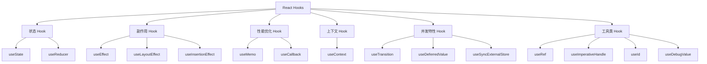
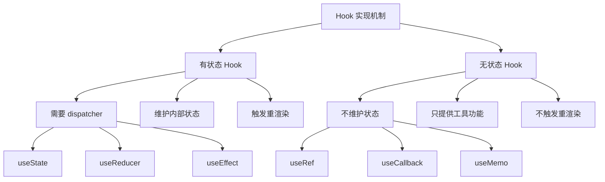

# Hook 分类

## 概述

React 19 提供了丰富的内置 Hook，每个 Hook 都有特定的用途和实现机制。本章将通过可执行的案例深入分析不同 Hook 的分类、工作原理，以及它们在实际项目中的应用场景。我们还会与 Vue 3 的 Composition API 进行对比，帮助你更好地理解 React Hook 的设计思想。

## 可执行案例：Hook 分类演示

### 综合案例：任务管理应用

让我们通过一个完整的任务管理应用来理解各种 Hook 的使用：

```javascript
// 在 packages/react-dojo/dojo/index.jsx 中尝试这个完整案例

import React, { useState, useEffect, useMemo, useCallback, useRef, useContext, useReducer, useTransition, useDeferredValue, useId } from 'react';

// 创建主题上下文
const ThemeContext = React.createContext();

// 任务状态管理 reducer
function taskReducer(state, action) {
  switch (action.type) {
    case 'ADD_TASK':
      return {
        ...state,
        tasks: [...state.tasks, { 
          id: Date.now(), 
          title: action.payload, 
          completed: false,
          createdAt: new Date()
        }],
        stats: {
          ...state.stats,
          total: state.stats.total + 1
        }
      };
    case 'TOGGLE_TASK':
      const newTasks = state.tasks.map(task =>
        task.id === action.payload
          ? { ...task, completed: !task.completed }
          : task
      );
      const completedCount = newTasks.filter(t => t.completed).length;
      return {
        ...state,
        tasks: newTasks,
        stats: {
          total: state.stats.total,
          completed: completedCount,
          pending: state.stats.total - completedCount
        }
      };
    case 'DELETE_TASK':
      const filteredTasks = state.tasks.filter(task => task.id !== action.payload);
      const newCompletedCount = filteredTasks.filter(t => t.completed).length;
      return {
        ...state,
        tasks: filteredTasks,
        stats: {
          total: filteredTasks.length,
          completed: newCompletedCount,
          pending: filteredTasks.length - newCompletedCount
        }
      };
    default:
      return state;
  }
}

// 主题提供者组件
function ThemeProvider({ children }) {
  const [theme, setTheme] = useState('light');
  
  const toggleTheme = useCallback(() => {
    setTheme(prev => prev === 'light' ? 'dark' : 'light');
  }, []);
  
  return (
    <ThemeContext.Provider value={{ theme, toggleTheme }}>
      {children}
    </ThemeContext.Provider>
  );
}

// 任务管理主组件
function TaskManager() {
  // 🔵 状态管理 Hook
  const [searchQuery, setSearchQuery] = useState('');
  const [sortBy, setSortBy] = useState('createdAt');
  
  // 🔵 复杂状态管理 Hook
  const [state, dispatch] = useReducer(taskReducer, {
    tasks: [],
    stats: { total: 0, completed: 0, pending: 0 }
  });
  
  // 🔵 上下文 Hook
  const { theme, toggleTheme } = useContext(ThemeContext);
  
  // 🔵 性能优化 Hook
  const deferredSearchQuery = useDeferredValue(searchQuery);
  
  // 🔵 并发特性 Hook
  const [isPending, startTransition] = useTransition();
  
  // 🔵 工具类 Hook
  const taskInputRef = useRef(null);
  const formId = useId();
  
  // 🔵 副作用 Hook
  useEffect(() => {
    // 保存到本地存储
    localStorage.setItem('tasks', JSON.stringify(state.tasks));
  }, [state.tasks]);
  
  useEffect(() => {
    // 从本地存储恢复
    const saved = localStorage.getItem('tasks');
    if (saved) {
      const tasks = JSON.parse(saved);
      tasks.forEach(task => {
        dispatch({ type: 'ADD_TASK', payload: task.title });
      });
    }
  }, []);
  
  // 🔵 性能优化的计算
  const filteredAndSortedTasks = useMemo(() => {
    console.log('🔄 重新计算过滤和排序的任务列表');
    
    let filtered = state.tasks;
    
    // 搜索过滤
    if (deferredSearchQuery) {
      filtered = filtered.filter(task =>
        task.title.toLowerCase().includes(deferredSearchQuery.toLowerCase())
      );
    }
    
    // 排序
    return filtered.sort((a, b) => {
      if (sortBy === 'createdAt') {
        return new Date(b.createdAt) - new Date(a.createdAt);
      } else if (sortBy === 'title') {
        return a.title.localeCompare(b.title);
      } else if (sortBy === 'status') {
        return a.completed - b.completed;
      }
      return 0;
    });
  }, [state.tasks, deferredSearchQuery, sortBy]);
  
  // 🔵 事件处理函数缓存
  const handleAddTask = useCallback((e) => {
    e.preventDefault();
    const title = taskInputRef.current?.value.trim();
    if (title) {
      dispatch({ type: 'ADD_TASK', payload: title });
      taskInputRef.current.value = '';
      taskInputRef.current.focus();
    }
  }, []);
  
  const handleSearchChange = useCallback((e) => {
    const query = e.target.value;
    setSearchQuery(query);
    
    // 使用 startTransition 标记搜索为低优先级更新
    startTransition(() => {
      // 这里可以放一些不紧急的更新
      console.log('搜索查询更新:', query);
    });
  }, [startTransition]);
  
  const handleToggleTask = useCallback((id) => {
    dispatch({ type: 'TOGGLE_TASK', payload: id });
  }, []);
  
  const handleDeleteTask = useCallback((id) => {
    dispatch({ type: 'DELETE_TASK', payload: id });
  }, []);
  
  return (
    <div 
      className={`task-manager ${theme}`}
      style={{
        padding: '20px',
        backgroundColor: theme === 'dark' ? '#2d3748' : '#ffffff',
        color: theme === 'dark' ? '#ffffff' : '#000000',
        minHeight: '100vh'
      }}
    >
      <header style={{ marginBottom: '20px' }}>
        <h1>任务管理器 {isPending && '⏳'}</h1>
        <button onClick={toggleTheme}>
          切换到 {theme === 'light' ? '深色' : '浅色'} 主题
        </button>
      </header>
      
      {/* 统计信息 */}
      <div style={{ marginBottom: '20px', padding: '10px', border: '1px solid #ccc' }}>
        <h3>统计信息</h3>
        <p>总任务: {state.stats.total}</p>
        <p>已完成: {state.stats.completed}</p>
        <p>待完成: {state.stats.pending}</p>
      </div>
      
      {/* 添加任务表单 */}
      <form onSubmit={handleAddTask} style={{ marginBottom: '20px' }}>
        <label htmlFor={`${formId}-task-input`}>添加新任务:</label>
        <input
          id={`${formId}-task-input`}
          ref={taskInputRef}
          type="text"
          placeholder="输入任务标题..."
          style={{ marginLeft: '10px', marginRight: '10px', padding: '5px' }}
        />
        <button type="submit">添加</button>
      </form>
      
      {/* 搜索和排序 */}
      <div style={{ marginBottom: '20px' }}>
        <input
          type="text"
          value={searchQuery}
          onChange={handleSearchChange}
          placeholder="搜索任务..."
          style={{ marginRight: '10px', padding: '5px' }}
        />
        <select 
          value={sortBy} 
          onChange={(e) => setSortBy(e.target.value)}
          style={{ padding: '5px' }}
        >
          <option value="createdAt">按创建时间排序</option>
          <option value="title">按标题排序</option>
          <option value="status">按状态排序</option>
        </select>
      </div>
      
      {/* 任务列表 */}
      <div>
        <h3>任务列表 ({filteredAndSortedTasks.length})</h3>
        {filteredAndSortedTasks.map(task => (
          <div 
            key={task.id} 
            style={{ 
              padding: '10px', 
              margin: '5px 0', 
              border: '1px solid #ccc',
              backgroundColor: task.completed ? '#d4edda' : 'transparent'
            }}
          >
            <input
              type="checkbox"
              checked={task.completed}
              onChange={() => handleToggleTask(task.id)}
              style={{ marginRight: '10px' }}
            />
            <span 
              style={{ 
                textDecoration: task.completed ? 'line-through' : 'none',
                marginRight: '10px'
              }}
            >
              {task.title}
            </span>
            <small style={{ color: '#666', marginRight: '10px' }}>
              {new Date(task.createdAt).toLocaleString()}
            </small>
            <button 
              onClick={() => handleDeleteTask(task.id)}
              style={{ 
                backgroundColor: '#dc3545', 
                color: 'white', 
                border: 'none', 
                padding: '2px 8px' 
              }}
            >
              删除
            </button>
          </div>
        ))}
        
        {filteredAndSortedTasks.length === 0 && (
          <p style={{ color: '#666', fontStyle: 'italic' }}>
            {deferredSearchQuery ? '没有匹配的任务' : '暂无任务，添加一个开始吧！'}
          </p>
        )}
      </div>
      
      {/* Hook 使用统计 */}
      <details style={{ marginTop: '20px' }}>
        <summary>本组件使用的 Hook 统计</summary>
        <ul>
          <li>✅ useState: 2 个 (searchQuery, sortBy)</li>
          <li>✅ useReducer: 1 个 (复杂状态管理)</li>
          <li>✅ useContext: 1 个 (主题上下文)</li>
          <li>✅ useEffect: 2 个 (本地存储)</li>
          <li>✅ useMemo: 1 个 (任务过滤排序)</li>
          <li>✅ useCallback: 4 个 (事件处理函数)</li>
          <li>✅ useRef: 1 个 (输入框引用)</li>
          <li>✅ useTransition: 1 个 (低优先级更新)</li>
          <li>✅ useDeferredValue: 1 个 (延迟搜索)</li>
          <li>✅ useId: 1 个 (唯一 ID 生成)</li>
        </ul>
      </details>
    </div>
  );
}

// 应用根组件
function App() {
  return (
    <ThemeProvider>
      <TaskManager />
    </ThemeProvider>
  );
}

export default App;
```

### 案例分析：每个 Hook 的作用

这个任务管理应用展示了各种 Hook 的实际应用场景：

1. **useState**: 管理简单的本地状态（搜索查询、排序方式）
2. **useReducer**: 管理复杂的状态逻辑（任务列表和统计）
3. **useContext**: 跨组件共享状态（主题系统）
4. **useEffect**: 处理副作用（本地存储同步）
5. **useMemo**: 缓存昂贵计算（任务过滤和排序）
6. **useCallback**: 缓存函数引用（防止子组件不必要重渲染）
7. **useRef**: 访问 DOM 元素（输入框操作）
8. **useTransition**: 标记非紧急更新（搜索功能）
9. **useDeferredValue**: 延迟值更新（防止输入卡顿）
10. **useId**: 生成唯一标识符（表单标签关联）

## Hook 分类体系

### 按功能分类



### 按实现机制分类



## React Hook vs Vue 3 Composition API 深度对比

### 状态管理对比案例

#### React Hook 实现

```javascript
// React Hook 状态管理
function useShoppingCart() {
  const [items, setItems] = useState([]);
  const [loading, setLoading] = useState(false);
  
  // React 需要手动优化计算
  const totalPrice = useMemo(() => {
    return items.reduce((sum, item) => sum + item.price * item.quantity, 0);
  }, [items]);
  
  const addItem = useCallback((product) => {
    setItems(prevItems => {
      const existingItem = prevItems.find(item => item.id === product.id);
      if (existingItem) {
        return prevItems.map(item =>
          item.id === product.id
            ? { ...item, quantity: item.quantity + 1 }
            : item
        );
      }
      return [...prevItems, { ...product, quantity: 1 }];
    });
  }, []);
  
  const removeItem = useCallback((productId) => {
    setItems(prevItems => prevItems.filter(item => item.id !== productId));
  }, []);
  
  // React 副作用需要手动管理依赖
  useEffect(() => {
    if (items.length > 0) {
      setLoading(true);
      // 模拟保存到服务器
      setTimeout(() => {
        localStorage.setItem('cart', JSON.stringify(items));
        setLoading(false);
      }, 500);
    }
  }, [items]);
  
  return { items, loading, totalPrice, addItem, removeItem };
}
```

#### Vue 3 Composition API 实现

```javascript
// Vue 3 Composition API 状态管理 (仅用于对比)
import { ref, computed, watch } from 'vue'

function useShoppingCart() {
  const items = ref([])
  const loading = ref(false)
  
  // Vue 3 自动追踪依赖，无需手动优化
  const totalPrice = computed(() => {
    return items.value.reduce((sum, item) => sum + item.price * item.quantity, 0)
  })
  
  const addItem = (product) => {
    const existingItem = items.value.find(item => item.id === product.id)
    if (existingItem) {
      existingItem.quantity++
    } else {
      items.value.push({ ...product, quantity: 1 })
    }
  }
  
  const removeItem = (productId) => {
    const index = items.value.findIndex(item => item.id === productId)
    if (index > -1) {
      items.value.splice(index, 1)
    }
  }
  
  // Vue 3 自动追踪依赖变化
  watch(items, (newItems) => {
    if (newItems.length > 0) {
      loading.value = true
      setTimeout(() => {
        localStorage.setItem('cart', JSON.stringify(newItems))
        loading.value = false
      }, 500)
    }
  }, { deep: true })
  
  return { items, loading, totalPrice, addItem, removeItem }
}
```

### 设计哲学对比分析

| 方面 | React Hook | Vue 3 Composition API | 分析 |
|------|------------|----------------------|------|
| **心智模型** | 函数式，不可变数据 | 响应式，可变数据 | React 更接近函数式编程，Vue 更接近面向对象 |
| **性能优化** | 手动（useMemo, useCallback） | 自动（响应式系统） | Vue 开发更简单，React 更可控 |
| **学习曲线** | 需要理解闭包、重新渲染 | 响应式概念更直观 | Vue 对初学者更友好 |
| **调试体验** | 需要理解渲染时机 | 状态变化立即可见 | Vue 调试更直观 |
| **TypeScript** | 优秀的类型推导 | 优秀的类型推导 | 两者都很好 |
| **生态系统** | 最成熟 | 快速发展 | React 目前仍有优势 |

### 为什么 React 选择这种设计？

#### 1. 不可变性的优势

```javascript
// React 的不可变性设计优势演示
function TodoList() {
  const [todos, setTodos] = useState([]);
  
  // ✅ 不可变更新，便于时间旅行调试
  const addTodo = (text) => {
    setTodos(prevTodos => [
      ...prevTodos,
      { id: Date.now(), text, completed: false }
    ]);
  };
  
  // ✅ 可以轻松实现撤销功能
  const [history, setHistory] = useState([]);
  
  const updateTodos = (newTodos) => {
    setHistory(prev => [...prev, todos]); // 保存历史状态
    setTodos(newTodos);
  };
  
  const undo = () => {
    if (history.length > 0) {
      const previousState = history[history.length - 1];
      setTodos(previousState);
      setHistory(prev => prev.slice(0, -1));
    }
  };
  
  return (
    <div>
      {todos.map(todo => <TodoItem key={todo.id} todo={todo} />)}
      <button onClick={undo} disabled={history.length === 0}>
        撤销 ({history.length})
      </button>
    </div>
  );
}
```

#### 2. 可预测的重新渲染

```javascript
// React 渲染的可预测性
function Parent() {
  const [count, setCount] = useState(0);
  const [name, setName] = useState('');
  
  console.log('Parent 重新渲染'); // 每次状态更新都会执行
  
  // 子组件只在 count 变化时重新渲染
  return (
    <div>
      <ExpensiveChild count={count} />
      <input value={name} onChange={e => setName(e.target.value)} />
      <button onClick={() => setCount(count + 1)}>增加计数</button>
    </div>
  );
}

const ExpensiveChild = memo(({ count }) => {
  console.log('ExpensiveChild 重新渲染');
  
  // 昂贵的计算
  const result = useMemo(() => {
    return Array.from({ length: count }, (_, i) => i).reduce((sum, n) => sum + n, 0);
  }, [count]);
  
  return <div>结果: {result}</div>;
});
```

## 状态管理 Hook 深度解析

### 1. useState 源码工作原理

**用途**：管理组件的局部状态

```javascript
// useState 的使用案例
function InteractiveCounter() {
  const [count, setCount] = useState(0);
  const [step, setStep] = useState(1);
  const [history, setHistory] = useState([]);
  
  // 演示函数式更新的优势
  const increment = () => {
    setCount(prevCount => {
      const newCount = prevCount + step;
      // 同时更新历史记录
      setHistory(prevHistory => [
        ...prevHistory,
        { action: 'increment', from: prevCount, to: newCount, time: Date.now() }
      ]);
      return newCount;
    });
  };
  
  // 演示批量更新
  const resetAll = () => {
    setCount(0);     // 这三个更新会被批处理
    setStep(1);      // 只触发一次重新渲染
    setHistory([]);  // (在 React 18+ 中)
  };
  
  return (
    <div style={{ padding: '20px', border: '1px solid #ccc' }}>
      <h3>交互式计数器</h3>
      <p>当前值: {count}</p>
      <p>步长: {step}</p>
      
      <div style={{ marginBottom: '10px' }}>
        <button onClick={increment}>增加 {step}</button>
        <button onClick={() => setCount(count - step)}>减少 {step}</button>
        <button onClick={resetAll}>重置所有</button>
      </div>
      
      <div style={{ marginBottom: '10px' }}>
        <label>
          步长: 
          <input 
            type="number" 
            value={step} 
            onChange={e => setStep(Number(e.target.value))}
            style={{ marginLeft: '5px', width: '60px' }}
          />
        </label>
      </div>
      
      <details>
        <summary>操作历史 ({history.length})</summary>
        <div style={{ maxHeight: '100px', overflow: 'auto' }}>
          {history.slice(-10).map((entry, index) => (
            <div key={index} style={{ fontSize: '12px', margin: '2px 0' }}>
              {entry.action}: {entry.from} → {entry.to} 
              (时间: {new Date(entry.time).toLocaleTimeString()})
            </div>
          ))}
        </div>
      </details>
    </div>
  );
}
```

**源码位置**：`react-reconciler/src/ReactFiberHooks.js`

```javascript
function useState(initialState) {
  return useReducer(basicStateReducer, initialState);
}

function basicStateReducer(state, action) {
  return typeof action === 'function' ? action(state) : action;
}
```

**特点**：
- 最简单的状态管理 Hook
- 内部实际调用 useReducer
- 支持函数式更新
- 可以传递初始值或初始化函数

### 2. useReducer

**用途**：管理复杂的状态逻辑

```javascript
// 复杂状态管理
const initialState = { count: 0, history: [] };

function reducer(state, action) {
  switch (action.type) {
    case 'increment':
      return {
        count: state.count + 1,
        history: [...state.history, 'increment']
      };
    case 'decrement':
      return {
        count: state.count - 1,
        history: [...state.history, 'decrement']
      };
    case 'reset':
      return initialState;
    default:
      throw new Error();
  }
}

function Counter() {
  const [state, dispatch] = useReducer(reducer, initialState);
  
  return (
    <div>
      Count: {state.count}
      <button onClick={() => dispatch({ type: 'increment' })}>+</button>
      <button onClick={() => dispatch({ type: 'decrement' })}>-</button>
      <button onClick={() => dispatch({ type: 'reset' })}>Reset</button>
    </div>
  );
}
```

**源码实现**：

```javascript
function useReducer(reducer, initialArg, init) {
  const hook = updateWorkInProgressHook();
  const queue = hook.queue;
  
  if (queue !== null) {
    // 有更新队列，处理所有更新
    const dispatch = queue.dispatch;
    const pendingQueue = queue.pending;
    
    if (pendingQueue !== null) {
      // 执行 reducer 计算新状态
      const newState = updateReducer(hook, queue, reducer);
      return [newState, dispatch];
    }
  }
  
  // 首次渲染
  const initialState = init !== undefined ? init(initialArg) : initialArg;
  hook.memoizedState = hook.baseState = initialState;
  
  // 创建更新队列
  const queue = {
    pending: null,
    dispatch: null,
    lastRenderedReducer: reducer,
    lastRenderedState: initialState,
  };
  hook.queue = queue;
  
  // 创建 dispatch 函数
  const dispatch = dispatchReducerAction.bind(null, currentlyRenderingFiber, queue);
  queue.dispatch = dispatch;
  
  return [hook.memoizedState, dispatch];
}
```

**特点**：
- 适合复杂状态逻辑
- 预测性的状态更新
- 便于测试
- 是 useState 的底层实现

## 副作用 Hook

### 1. useEffect

**用途**：处理副作用（数据获取、订阅、手动 DOM 操作等）

```javascript
function DataComponent({ userId }) {
  const [data, setData] = useState(null);
  const [loading, setLoading] = useState(true);
  
  // 数据获取副作用
  useEffect(() => {
    let cancelled = false;
    
    async function fetchData() {
      setLoading(true);
      try {
        const result = await api.fetchUser(userId);
        if (!cancelled) {
          setData(result);
        }
      } catch (error) {
        if (!cancelled) {
          console.error('获取数据失败:', error);
        }
      } finally {
        if (!cancelled) {
          setLoading(false);
        }
      }
    }
    
    fetchData();
    
    // 清理函数
    return () => {
      cancelled = true;
    };
  }, [userId]); // 依赖数组
  
  // 订阅副作用
  useEffect(() => {
    const subscription = eventBus.subscribe('dataUpdate', handleDataUpdate);
    
    return () => {
      subscription.unsubscribe();
    };
  }, []); // 空依赖数组，只在挂载时执行
  
  if (loading) return <div>Loading...</div>;
  return <div>{data?.name}</div>;
}
```

**执行时机**：
- 在组件渲染到屏幕之后异步执行
- 不会阻塞浏览器更新屏幕
- 适合大多数副作用场景

### 2. useLayoutEffect

**用途**：同步执行的副作用，在所有 DOM 变更之后立即执行

```javascript
function ResizeComponent() {
  const [height, setHeight] = useState(0);
  const divRef = useRef();
  
  useLayoutEffect(() => {
    // 同步测量 DOM 尺寸
    const updateHeight = () => {
      if (divRef.current) {
        setHeight(divRef.current.offsetHeight);
      }
    };
    
    updateHeight();
    window.addEventListener('resize', updateHeight);
    
    return () => {
      window.removeEventListener('resize', updateHeight);
    };
  }, []);
  
  return (
    <div ref={divRef}>
      <p>Height: {height}px</p>
      <p>这个组件会同步测量自己的高度</p>
    </div>
  );
}
```

**执行时机**：
- 在所有 DOM 变更之后同步执行
- 会阻塞浏览器绘制
- 适合需要同步读取 DOM 布局的场景

### 3. useInsertionEffect

**用途**：在所有 DOM 变更之前执行，主要用于 CSS-in-JS 库

```javascript
function useCSS(css) {
  useInsertionEffect(() => {
    // 在 DOM 变更前插入样式
    const style = document.createElement('style');
    style.textContent = css;
    document.head.appendChild(style);
    
    return () => {
      document.head.removeChild(style);
    };
  }, [css]);
}

function StyledComponent() {
  useCSS(`
    .my-component {
      background: linear-gradient(45deg, #f0f, #0ff);
      padding: 20px;
    }
  `);
  
  return <div className="my-component">Styled content</div>;
}
```

**执行时机**：
- 在所有 DOM 变更之前同步执行
- 比 useLayoutEffect 更早执行
- 主要用于 CSS-in-JS 库避免样式闪烁

## 性能优化 Hook

### 1. useMemo

**用途**：缓存计算结果，避免重复计算

```javascript
function ExpensiveComponent({ items, filter }) {
  // 缓存计算结果
  const filteredItems = useMemo(() => {
    console.log('执行过滤计算');
    return items.filter(item => item.category === filter);
  }, [items, filter]);
  
  // 缓存复杂对象
  const expensiveValue = useMemo(() => ({
    total: items.length,
    filtered: filteredItems.length,
    ratio: filteredItems.length / items.length,
  }), [items.length, filteredItems.length]);
  
  return (
    <div>
      <p>总数: {expensiveValue.total}</p>
      <p>过滤后: {expensiveValue.filtered}</p>
      <p>比例: {expensiveValue.ratio.toFixed(2)}</p>
    </div>
  );
}
```

**源码实现**：

```javascript
function useMemo(create, deps) {
  const hook = updateWorkInProgressHook();
  const nextDeps = deps === undefined ? null : deps;
  const prevState = hook.memoizedState;
  
  if (prevState !== null) {
    if (nextDeps !== null) {
      const prevDeps = prevState[1];
      if (areHookInputsEqual(nextDeps, prevDeps)) {
        // 依赖没有变化，返回缓存的值
        return prevState[0];
      }
    }
  }
  
  // 重新计算
  const nextValue = create();
  hook.memoizedState = [nextValue, nextDeps];
  return nextValue;
}
```

### 2. useCallback

**用途**：缓存函数引用，避免子组件不必要的重新渲染

```javascript
function ParentComponent({ items }) {
  const [filter, setFilter] = useState('');
  
  // 缓存事件处理函数
  const handleItemClick = useCallback((id) => {
    console.log('点击了项目:', id);
    // 处理点击逻辑
  }, []); // 空依赖，函数永不变化
  
  // 缓存带依赖的函数
  const handleFilter = useCallback((newFilter) => {
    setFilter(newFilter);
    analytics.track('filter_changed', { filter: newFilter });
  }, []); // setFilter 是稳定的，可以省略
  
  return (
    <div>
      <FilterInput onFilter={handleFilter} />
      {items.map(item => (
        <MemoizedItem 
          key={item.id} 
          item={item} 
          onClick={handleItemClick} 
        />
      ))}
    </div>
  );
}

// 子组件使用 memo 优化
const MemoizedItem = memo(function Item({ item, onClick }) {
  console.log('Item 重新渲染:', item.id);
  
  return (
    <div onClick={() => onClick(item.id)}>
      {item.name}
    </div>
  );
});
```

**源码实现**：

```javascript
function useCallback(callback, deps) {
  const hook = updateWorkInProgressHook();
  const nextDeps = deps === undefined ? null : deps;
  const prevState = hook.memoizedState;
  
  if (prevState !== null) {
    if (nextDeps !== null) {
      const prevDeps = prevState[1];
      if (areHookInputsEqual(nextDeps, prevDeps)) {
        // 依赖没有变化，返回缓存的函数
        return prevState[0];
      }
    }
  }
  
  // 缓存新函数
  hook.memoizedState = [callback, nextDeps];
  return callback;
}
```

## 上下文 Hook

### useContext

**用途**：订阅 React 上下文

```javascript
// 创建上下文
const ThemeContext = React.createContext();
const UserContext = React.createContext();

// 上下文提供者
function App() {
  const [theme, setTheme] = useState('light');
  const [user, setUser] = useState(null);
  
  return (
    <ThemeContext.Provider value={{ theme, setTheme }}>
      <UserContext.Provider value={{ user, setUser }}>
        <MainContent />
      </UserContext.Provider>
    </ThemeContext.Provider>
  );
}

// 消费上下文
function MainContent() {
  const { theme, setTheme } = useContext(ThemeContext);
  const { user } = useContext(UserContext);
  
  return (
    <div className={`app-${theme}`}>
      <h1>Welcome, {user?.name || 'Guest'}</h1>
      <button onClick={() => setTheme(theme === 'light' ? 'dark' : 'light')}>
        切换主题
      </button>
    </div>
  );
}
```

**源码实现**：

```javascript
function useContext(context) {
  const dispatcher = resolveDispatcher();
  return dispatcher.useContext(context);
}

// 在 reconciler 中的实现
function readContext(context, observedBits) {
  const contextItem = {
    context: context,
    observedBits: observedBits,
    next: null,
  };
  
  if (lastContextDependency === null) {
    lastContextDependency = contextItem;
    currentlyRenderingFiber.dependencies = {
      lanes: NoLanes,
      firstContext: contextItem,
      responders: null,
    };
  } else {
    lastContextDependency = lastContextDependency.next = contextItem;
  }
  
  return context._currentValue;
}
```

## 并发特性 Hook

### 1. useTransition

**用途**：将状态更新标记为过渡，避免阻塞紧急更新

```javascript
function SearchPage() {
  const [query, setQuery] = useState('');
  const [results, setResults] = useState([]);
  const [isPending, startTransition] = useTransition();
  
  const handleSearch = (value) => {
    // 紧急更新：立即更新输入框
    setQuery(value);
    
    // 过渡更新：可以被中断
    startTransition(() => {
      setResults(performExpensiveSearch(value));
    });
  };
  
  return (
    <div>
      <input 
        value={query} 
        onChange={(e) => handleSearch(e.target.value)}
        placeholder="搜索..." 
      />
      {isPending && <div>搜索中...</div>}
      <SearchResults results={results} />
    </div>
  );
}
```

### 2. useDeferredValue

**用途**：延迟值的更新，优化性能

```javascript
function App() {
  const [query, setQuery] = useState('');
  // 延迟值，在紧急更新时保持旧值
  const deferredQuery = useDeferredValue(query);
  
  return (
    <div>
      <input 
        value={query} 
        onChange={(e) => setQuery(e.target.value)} 
      />
      {/* 使用延迟值进行搜索，避免阻塞输入 */}
      <SearchResults query={deferredQuery} />
    </div>
  );
}

function SearchResults({ query }) {
  const results = useMemo(() => {
    // 昂贵的搜索操作
    return performSearch(query);
  }, [query]);
  
  return <div>{results.map(/* ... */)}</div>;
}
```

### 3. useSyncExternalStore

**用途**：同步外部存储状态

```javascript
// 外部存储
class Store {
  constructor() {
    this.state = { count: 0 };
    this.listeners = [];
  }
  
  getSnapshot = () => {
    return this.state;
  };
  
  subscribe = (listener) => {
    this.listeners.push(listener);
    return () => {
      const index = this.listeners.indexOf(listener);
      if (index > -1) {
        this.listeners.splice(index, 1);
      }
    };
  };
  
  increment = () => {
    this.state = { count: this.state.count + 1 };
    this.listeners.forEach(listener => listener());
  };
}

const store = new Store();

function Counter() {
  const state = useSyncExternalStore(
    store.subscribe,
    store.getSnapshot,
    store.getSnapshot // 服务端快照
  );
  
  return (
    <div>
      <p>Count: {state.count}</p>
      <button onClick={store.increment}>增加</button>
    </div>
  );
}
```

## 工具类 Hook

### 1. useRef

**用途**：创建可变的引用对象

```javascript
function TextInput() {
  const inputRef = useRef(null);
  const countRef = useRef(0);
  
  useEffect(() => {
    // 聚焦输入框
    inputRef.current.focus();
  }, []);
  
  const handleClick = () => {
    // 访问 DOM 元素
    console.log('输入值:', inputRef.current.value);
    
    // 保存不触发重渲染的值
    countRef.current += 1;
    console.log('点击次数:', countRef.current);
  };
  
  return (
    <div>
      <input ref={inputRef} type="text" />
      <button onClick={handleClick}>获取值</button>
    </div>
  );
}
```

### 2. useImperativeHandle

**用途**：自定义暴露给父组件的实例值

```javascript
const FancyInput = forwardRef((props, ref) => {
  const inputRef = useRef();
  
  useImperativeHandle(ref, () => ({
    focus: () => {
      inputRef.current.focus();
    },
    getValue: () => {
      return inputRef.current.value;
    },
    clear: () => {
      inputRef.current.value = '';
    }
  }));
  
  return <input ref={inputRef} {...props} />;
});

function Parent() {
  const fancyInputRef = useRef();
  
  return (
    <div>
      <FancyInput ref={fancyInputRef} />
      <button onClick={() => fancyInputRef.current.focus()}>
        聚焦
      </button>
      <button onClick={() => console.log(fancyInputRef.current.getValue())}>
        获取值
      </button>
    </div>
  );
}
```

### 3. useId

**用途**：生成唯一的 ID

```javascript
function FormField({ label, type = "text" }) {
  const id = useId();
  
  return (
    <div>
      <label htmlFor={id}>{label}</label>
      <input id={id} type={type} />
    </div>
  );
}

function LoginForm() {
  return (
    <form>
      <FormField label="用户名" />
      <FormField label="密码" type="password" />
    </form>
  );
}
```

### 4. useDebugValue

**用途**：在 React DevTools 中显示自定义 Hook 的标签

```javascript
function useOnlineStatus() {
  const [isOnline, setIsOnline] = useState(navigator.onLine);
  
  // 在 DevTools 中显示调试信息
  useDebugValue(isOnline ? 'Online' : 'Offline');
  
  useEffect(() => {
    const handleOnline = () => setIsOnline(true);
    const handleOffline = () => setIsOnline(false);
    
    window.addEventListener('online', handleOnline);
    window.addEventListener('offline', handleOffline);
    
    return () => {
      window.removeEventListener('online', handleOnline);
      window.removeEventListener('offline', handleOffline);
    };
  }, []);
  
  return isOnline;
}

function StatusIndicator() {
  const isOnline = useOnlineStatus();
  
  return (
    <div style={{ color: isOnline ? 'green' : 'red' }}>
      {isOnline ? '在线' : '离线'}
    </div>
  );
}
```

## Hook 调用顺序的重要性

### 为什么必须保持调用顺序

React 通过调用顺序来匹配 Hook 与其状态：

```javascript
// ✅ 正确：稳定的调用顺序
function MyComponent({ condition }) {
  const [count, setCount] = useState(0);        // Hook 1
  const [name, setName] = useState('');         // Hook 2
  
  useEffect(() => {                             // Hook 3
    document.title = `${name}: ${count}`;
  }, [name, count]);
  
  if (condition) {
    const [extra, setExtra] = useState(false);  // ❌ 条件性调用
  }
  
  return <div>{count} - {name}</div>;
}

// ✅ 正确的写法
function MyComponent({ condition }) {
  const [count, setCount] = useState(0);        // Hook 1
  const [name, setName] = useState('');         // Hook 2
  const [extra, setExtra] = useState(false);    // Hook 3
  
  useEffect(() => {                             // Hook 4
    document.title = `${name}: ${count}`;
  }, [name, count]);
  
  return (
    <div>
      {count} - {name}
      {condition && extra && <span>Extra</span>}
    </div>
  );
}
```

### Hook 链表结构

```javascript
// React 内部的 Hook 链表
const hookList = {
  hook1: { memoizedState: 0, next: hook2 },      // useState(0)
  hook2: { memoizedState: '', next: hook3 },     // useState('')
  hook3: { memoizedState: false, next: hook4 },  // useState(false)
  hook4: { memoizedState: null, next: null },    // useEffect
};
```

## Hook 性能最佳实践

### 实际性能优化案例

```javascript
// 性能优化前 vs 优化后的对比
function ProductList({ products, category, searchTerm }) {
  // ❌ 性能问题：每次渲染都会重新过滤和排序
  const filteredProducts = products
    .filter(p => p.category === category)
    .filter(p => p.name.toLowerCase().includes(searchTerm.toLowerCase()))
    .sort((a, b) => a.price - b.price);
  
  return (
    <div>
      {filteredProducts.map(product => (
        <ProductCard 
          key={product.id} 
          product={product}
          onClick={() => console.log('点击了', product.name)} // ❌ 每次都创建新函数
        />
      ))}
    </div>
  );
}

// ✅ 优化后的版本
function OptimizedProductList({ products, category, searchTerm }) {
  // ✅ 使用 useMemo 缓存计算结果
  const filteredProducts = useMemo(() => {
    console.log('🔄 重新计算产品列表'); // 只在依赖变化时执行
    return products
      .filter(p => p.category === category)
      .filter(p => p.name.toLowerCase().includes(searchTerm.toLowerCase()))
      .sort((a, b) => a.price - b.price);
  }, [products, category, searchTerm]);
  
  // ✅ 使用 useCallback 缓存事件处理函数
  const handleProductClick = useCallback((productName) => {
    console.log('点击了', productName);
    // 可以添加更复杂的逻辑，如分析统计等
  }, []);
  
  return (
    <div>
      {filteredProducts.map(product => (
        <MemoizedProductCard 
          key={product.id} 
          product={product}
          onClick={handleProductClick}
        />
      ))}
    </div>
  );
}

// ✅ 使用 memo 优化子组件
const MemoizedProductCard = memo(function ProductCard({ product, onClick }) {
  console.log('渲染 ProductCard:', product.name);
  
  return (
    <div onClick={() => onClick(product.name)}>
      <h3>{product.name}</h3>
      <p>${product.price}</p>
    </div>
  );
});
```

### Hook 选择指南

| 场景 | 推荐 Hook | 原因 |
|------|----------|------|
| 简单状态 | `useState` | 语法简洁，适合独立状态 |
| 复杂状态逻辑 | `useReducer` | 状态转换逻辑集中，便于测试 |
| 昂贵计算 | `useMemo` | 避免重复计算，提升性能 |
| 函数缓存 | `useCallback` | 防止子组件不必要重渲染 |
| DOM 操作 | `useRef` | 直接访问 DOM 元素 |
| 跨组件状态 | `useContext` | 避免 prop drilling |
| 数据获取 | `useEffect` | 处理副作用和清理 |
| 搜索/过滤 | `useDeferredValue` | 防止输入卡顿 |
| 非紧急更新 | `useTransition` | 保持界面响应性 |

## 调试和错误处理

### Hook 调试技巧

```javascript
// Hook 调试和错误处理最佳实践
function DebuggableComponent() {
  const [data, setData] = useState(null);
  const [error, setError] = useState(null);
  const [loading, setLoading] = useState(false);
  
  // 使用 useDebugValue 提供调试信息
  useDebugValue(data ? `数据已加载: ${data.length} 项` : '无数据');
  
  // 错误边界处理
  const fetchData = useCallback(async () => {
    try {
      setLoading(true);
      setError(null);
      
      const response = await fetch('/api/data');
      if (!response.ok) {
        throw new Error(`HTTP ${response.status}: ${response.statusText}`);
      }
      
      const result = await response.json();
      setData(result);
    } catch (err) {
      console.error('数据获取失败:', err);
      setError(err.message);
    } finally {
      setLoading(false);
    }
  }, []);
  
  // 开发环境下的额外调试信息
  useEffect(() => {
    if (process.env.NODE_ENV === 'development') {
      console.log('DebuggableComponent 状态:', { data, error, loading });
    }
  }, [data, error, loading]);
  
  if (loading) return <div>加载中...</div>;
  if (error) return <div>错误: {error}</div>;
  if (!data) return <button onClick={fetchData}>加载数据</button>;
  
  return <div>数据: {JSON.stringify(data)}</div>;
}
```

## 总结：React Hook 的设计智慧

React 19 的 Hook 系统体现了深度的设计思考：

### 1. 核心设计原则

- **组合优于继承**：通过组合基础 Hook 构建复杂功能
- **显式优于隐式**：依赖关系明确，副作用可控
- **性能与开发体验平衡**：提供优化工具，但需要开发者理解

### 2. Hook 分类总览

| 类别 | Hook | 核心价值 | 使用场景 |
|------|------|----------|----------|
| **状态管理** | useState, useReducer | 可预测的状态更新 | 本地状态、复杂状态逻辑 |
| **副作用** | useEffect, useLayoutEffect | 声明式副作用管理 | 数据获取、订阅、DOM 操作 |
| **性能优化** | useMemo, useCallback | 精细化性能控制 | 昂贵计算、函数缓存 |
| **上下文** | useContext | 跨组件状态共享 | 主题、用户信息、多语言 |
| **并发特性** | useTransition, useDeferredValue | 非阻塞用户界面 | 搜索、实时更新 |
| **工具类** | useRef, useId | 底层能力访问 | DOM 操作、唯一标识 |

### 3. 与其他方案的优势

| 对比项 | React Hook | Vue 3 Composition | Angular Signals |
|--------|------------|-------------------|-----------------|
| **学习成本** | 中等 | 较低 | 较高 |
| **性能控制** | 精细化 | 自动化 | 自动化 |
| **生态成熟度** | 最高 | 快速增长 | 新兴 |
| **调试体验** | 需要理解机制 | 直观 | 较好 |
| **TypeScript** | 优秀 | 优秀 | 优秀 |

### 4. 最佳实践总结

1. **合理选择 Hook**：根据场景选择最合适的 Hook
2. **理解依赖关系**：正确设置 useEffect 和 useMemo 的依赖数组
3. **避免过度优化**：不要盲目使用 useCallback 和 useMemo
4. **保持函数纯净**：Hook 函数应该是纯函数
5. **善用自定义 Hook**：将复杂逻辑抽象为可复用的自定义 Hook

### 5. 未来发展趋势

React Hook 的设计为未来发展奠定了基础：

- **编译器优化**：React Compiler 将自动优化 Hook 性能
- **并发特性增强**：更多并发模式下的 Hook
- **开发工具改进**：更好的调试和性能分析工具
- **生态系统完善**：更多高质量的自定义 Hook 库

React Hook 不仅解决了过去的问题，更为现代前端开发提供了强大而灵活的工具。理解 Hook 的分类、特点和最佳实践，是掌握现代 React 开发的关键。

接下来我们将深入探讨 Hook 与函数组件的关系，以及 Hook 在 Fiber 架构中的实现细节。