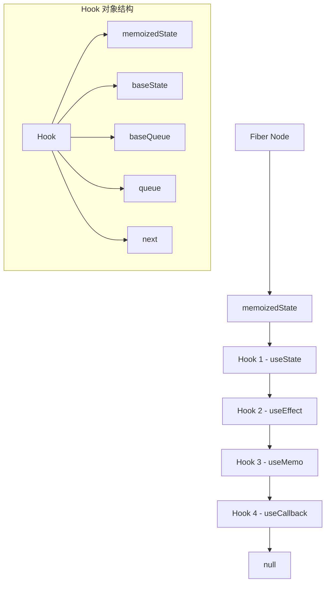
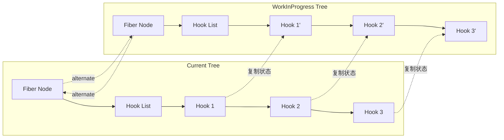

# Hook 与 Fiber

## 概述

Hook 的实现与 Fiber 架构密不可分。理解 Hook 如何在 Fiber 节点中存储和管理，是深入掌握 React 内部机制的关键。本章将详细探讨 Hook 与 Fiber 的深层关系。

## Fiber 节点中的 Hook 存储

### Fiber 节点结构

每个函数组件对应一个 Fiber 节点，Hook 信息存储在 Fiber 节点的特定属性中：

```javascript
// Fiber 节点的 Hook 相关属性
function FiberNode(tag, pendingProps, key, mode) {
  // ... 其他属性
  
  this.memoizedState = null;    // Hook 链表的头节点
  this.updateQueue = null;      // 副作用队列
  this.dependencies = null;     // Context 依赖
  
  // ... 其他属性
}
```

### Hook 在 Fiber 中的表示



## Hook 对象的详细结构

### 基础 Hook 结构

```javascript
// Hook 对象的基本结构
const hook = {
  memoizedState: null,    // 当前的状态值
  baseState: null,        // 基础状态（用于优先级调度）
  baseQueue: null,        // 基础更新队列
  queue: null,            // 当前更新队列
  next: null,             // 指向下一个 Hook
};
```

### 不同类型 Hook 的 memoizedState

不同类型的 Hook 在 `memoizedState` 中存储不同的数据：

```javascript
// useState/useReducer 的 memoizedState
const stateHook = {
  memoizedState: currentValue,  // 当前状态值
  baseState: baseValue,         // 基础状态值
  baseQueue: baseUpdateQueue,   // 基础更新队列
  queue: updateQueue,           // 当前更新队列
  next: nextHook,
};

// useEffect 的 memoizedState
const effectHook = {
  memoizedState: {
    create: effectFunction,     // 副作用函数
    destroy: cleanupFunction,   // 清理函数
    deps: [dep1, dep2],        // 依赖数组
    next: nextEffect,          // 下一个副作用
  },
  next: nextHook,
};

// useMemo 的 memoizedState
const memoHook = {
  memoizedState: [
    computedValue,              // 缓存的计算结果
    [dep1, dep2]               // 依赖数组
  ],
  next: nextHook,
};

// useRef 的 memoizedState
const refHook = {
  memoizedState: {
    current: refValue          // 引用的当前值
  },
  next: nextHook,
};
```

## Hook 链表的构建过程

### 挂载阶段的 Hook 创建

```javascript
// 在 react-reconciler/src/ReactFiberHooks.js 中

function mountWorkInProgressHook() {
  const hook = {
    memoizedState: null,
    baseState: null,
    baseQueue: null,
    queue: null,
    next: null,
  };
  
  if (workInProgressHook === null) {
    // 这是组件的第一个 Hook
    currentlyRenderingFiber.memoizedState = workInProgressHook = hook;
  } else {
    // 添加到 Hook 链表的末尾
    workInProgressHook = workInProgressHook.next = hook;
  }
  
  return workInProgressHook;
}
```

### 更新阶段的 Hook 复用

```javascript
function updateWorkInProgressHook() {
  let nextCurrentHook;
  
  if (currentHook === null) {
    // 这是组件中的第一个 Hook
    const current = currentlyRenderingFiber.alternate;
    if (current !== null) {
      nextCurrentHook = current.memoizedState;
    } else {
      nextCurrentHook = null;
    }
  } else {
    // 获取链表中的下一个 Hook
    nextCurrentHook = currentHook.next;
  }
  
  let nextWorkInProgressHook;
  if (workInProgressHook === null) {
    // 这是组件中的第一个 Hook
    nextWorkInProgressHook = currentlyRenderingFiber.memoizedState;
  } else {
    // 获取链表中的下一个 Hook
    nextWorkInProgressHook = workInProgressHook.next;
  }
  
  if (nextWorkInProgressHook !== null) {
    // 已有 workInProgress Hook，直接复用
    workInProgressHook = nextWorkInProgressHook;
    nextWorkInProgressHook = workInProgressHook.next;
    currentHook = nextCurrentHook;
  } else {
    // 需要创建新的 workInProgress Hook
    if (nextCurrentHook === null) {
      throw new Error('Hook 调用数量比上次渲染时更多');
    }
    
    currentHook = nextCurrentHook;
    
    const newHook = {
      memoizedState: currentHook.memoizedState,
      baseState: currentHook.baseState,
      baseQueue: currentHook.baseQueue,
      queue: currentHook.queue,
      next: null,
    };
    
    if (workInProgressHook === null) {
      currentlyRenderingFiber.memoizedState = workInProgressHook = newHook;
    } else {
      workInProgressHook = workInProgressHook.next = newHook;
    }
  }
  
  return workInProgressHook;
}
```

## 双缓存机制中的 Hook

### Current 树和 WorkInProgress 树

Fiber 采用双缓存机制，Hook 也参与这个机制：



### Hook 状态的复制和更新

```javascript
function cloneHook(currentHook) {
  const newHook = {
    memoizedState: currentHook.memoizedState,
    baseState: currentHook.baseState,
    baseQueue: currentHook.baseQueue,
    queue: currentHook.queue,
    next: null,
  };
  
  return newHook;
}

// 在 beginWork 阶段复制 Hook 状态
function updateFunctionComponent(current, workInProgress, Component, props) {
  // 设置当前工作的 Fiber
  currentlyRenderingFiber = workInProgress;
  
  // 如果有 current Fiber，从中复制 Hook 状态
  if (current !== null) {
    currentHook = current.memoizedState;
  }
  
  // 重置 workInProgress Hook
  workInProgressHook = null;
  workInProgress.memoizedState = null;
  
  // 调用组件函数，构建新的 Hook 链表
  const children = Component(props);
  
  return children;
}
```

## 状态更新队列在 Fiber 中的管理

### Update 对象结构

```javascript
// 状态更新对象
const update = {
  lane: updateLane,           // 更新的优先级
  action: newValue,           // 新的状态值或更新函数
  eagerReducer: null,         // 预计算的 reducer
  eagerState: null,           // 预计算的状态
  next: null,                 // 下一个更新
};
```

### 更新队列的管理

```javascript
// 更新队列结构
const updateQueue = {
  pending: null,              // 挂起的更新（环形链表）
  dispatch: null,             // dispatch 函数
  lastRenderedReducer: null,  // 上次使用的 reducer
  lastRenderedState: null,    // 上次渲染的状态
};

// 将更新加入队列
function enqueueUpdate(fiber, update) {
  const updateQueue = fiber.updateQueue;
  
  if (updateQueue === null) {
    // 第一个更新
    update.next = update;
    updateQueue.pending = update;
  } else {
    // 插入到环形链表中
    update.next = updateQueue.pending.next;
    updateQueue.pending.next = update;
    updateQueue.pending = update;
  }
}
```

### 更新的处理过程

```javascript
function processUpdateQueue(hook, queue, reducer) {
  const pending = queue.pending;
  
  if (pending !== null) {
    // 清空队列
    queue.pending = null;
    
    // 获取第一个更新
    const first = pending.next;
    let update = first;
    
    let newState = hook.baseState;
    let newBaseState = null;
    let newBaseQueue = null;
    
    do {
      const updateLane = update.lane;
      
      if (!isSubsetOfLanes(renderLanes, updateLane)) {
        // 优先级不够，跳过这个更新
        const clone = {
          lane: updateLane,
          action: update.action,
          eagerReducer: update.eagerReducer,
          eagerState: update.eagerState,
          next: null,
        };
        
        if (newBaseQueue === null) {
          newBaseQueue = clone;
          newBaseState = newState;
        } else {
          newBaseQueue.next = clone;
        }
      } else {
        // 处理这个更新
        if (update.eagerReducer === reducer) {
          // 使用预计算的状态
          newState = update.eagerState;
        } else {
          // 计算新状态
          const action = update.action;
          newState = reducer(newState, action);
        }
      }
      
      update = update.next;
    } while (update !== null && update !== first);
    
    // 更新 Hook 状态
    hook.memoizedState = newState;
    hook.baseState = newBaseState;
    hook.baseQueue = newBaseQueue;
    
    queue.lastRenderedState = newState;
  }
  
  return hook.memoizedState;
}
```

## 副作用在 Fiber 中的存储

### Effect 对象结构

```javascript
// 副作用对象
const effect = {
  tag: HookHasEffect | HookPassive,  // 副作用标记
  create: effectFunction,            // 副作用函数
  destroy: cleanupFunction,          // 清理函数
  deps: [dep1, dep2],               // 依赖数组
  next: null,                       // 下一个副作用
};
```

### Effect 链表的管理

```javascript
// 组件的副作用队列
const componentUpdateQueue = {
  lastEffect: null,               // 最后一个副作用（环形链表）
};

function pushEffect(tag, create, destroy, deps) {
  const effect = {
    tag,
    create,
    destroy,
    deps,
    next: null,
  };
  
  let componentUpdateQueue = currentlyRenderingFiber.updateQueue;
  if (componentUpdateQueue === null) {
    componentUpdateQueue = createFunctionComponentUpdateQueue();
    currentlyRenderingFiber.updateQueue = componentUpdateQueue;
    componentUpdateQueue.lastEffect = effect.next = effect;
  } else {
    const lastEffect = componentUpdateQueue.lastEffect;
    if (lastEffect === null) {
      componentUpdateQueue.lastEffect = effect.next = effect;
    } else {
      const firstEffect = lastEffect.next;
      lastEffect.next = effect;
      effect.next = firstEffect;
      componentUpdateQueue.lastEffect = effect;
    }
  }
  
  return effect;
}
```

## Context 依赖的管理

### Context 依赖结构

```javascript
// Context 依赖对象
const contextDependency = {
  context: MyContext,             // Context 对象
  observedBits: Number.MAX_VALUE, // 观察的位掩码
  next: null,                     // 下一个依赖
};

// Fiber 节点的依赖列表
const dependencies = {
  lanes: NoLanes,                 // 依赖的优先级
  firstContext: contextDependency, // 第一个 Context 依赖
  responders: null,               // 事件响应器
};
```

### useContext 的实现

```javascript
function readContext(context, observedBits) {
  if (lastContextDependency === null) {
    // 创建第一个依赖
    lastContextDependency = {
      context,
      observedBits,
      next: null,
    };
    
    currentlyRenderingFiber.dependencies = {
      lanes: NoLanes,
      firstContext: lastContextDependency,
      responders: null,
    };
  } else {
    // 添加到依赖链表
    lastContextDependency = lastContextDependency.next = {
      context,
      observedBits,
      next: null,
    };
  }
  
  return context._currentValue;
}
```

## Hook 调试信息的存储

### 开发环境的额外信息

```javascript
if (__DEV__) {
  // 开发环境下的额外 Hook 信息
  const hookDebugInfo = {
    hookName: 'useState',         // Hook 名称
    fileName: 'MyComponent.js',   // 文件名
    lineNumber: 42,               // 行号
    columnNumber: 8,              // 列号
  };
  
  // 附加到 Hook 对象
  hook._debugInfo = hookDebugInfo;
}
```

### useDebugValue 的实现

```javascript
function useDebugValue(value, formatterFn) {
  if (__DEV__) {
    const hook = updateWorkInProgressHook();
    hook._debugValue = formatterFn !== undefined ? formatterFn(value) : value;
  }
}
```

## Fiber 树遍历与 Hook 处理

### 在 beginWork 中处理 Hook

```javascript
function updateFunctionComponent(
  current,
  workInProgress,
  Component,
  props,
  renderLanes,
) {
  let nextChildren;
  
  prepareToReadContext(workInProgress, renderLanes);
  
  // 调用 renderWithHooks 处理 Hook
  nextChildren = renderWithHooks(
    current,
    workInProgress,
    Component,
    props,
    context,
    renderLanes,
  );
  
  if (current !== null && !didReceiveUpdate) {
    // 可以复用，跳过子节点处理
    bailoutHooks(current, workInProgress, renderLanes);
    return bailoutOnAlreadyFinishedWork(current, workInProgress, renderLanes);
  }
  
  // 处理子节点
  reconcileChildren(current, workInProgress, nextChildren, renderLanes);
  return workInProgress.child;
}
```

### 在 commitWork 中执行副作用

```javascript
function commitHookEffectListMount(tag, finishedWork) {
  const updateQueue = finishedWork.updateQueue;
  const lastEffect = updateQueue !== null ? updateQueue.lastEffect : null;
  
  if (lastEffect !== null) {
    const firstEffect = lastEffect.next;
    let effect = firstEffect;
    
    do {
      if ((effect.tag & tag) === tag) {
        // 执行副作用
        const create = effect.create;
        effect.destroy = create();
      }
      effect = effect.next;
    } while (effect !== firstEffect);
  }
}

function commitHookEffectListUnmount(tag, finishedWork) {
  const updateQueue = finishedWork.updateQueue;
  const lastEffect = updateQueue !== null ? updateQueue.lastEffect : null;
  
  if (lastEffect !== null) {
    const firstEffect = lastEffect.next;
    let effect = firstEffect;
    
    do {
      if ((effect.tag & tag) === tag) {
        // 执行清理函数
        const destroy = effect.destroy;
        effect.destroy = undefined;
        if (destroy !== undefined) {
          destroy();
        }
      }
      effect = effect.next;
    } while (effect !== firstEffect);
  }
}
```

## 性能优化与 Hook

### Hook 的 Bailout 优化

```javascript
function bailoutHooks(current, workInProgress, lanes) {
  workInProgress.updateQueue = current.updateQueue;
  
  if (workInProgress.mode & StrictEffectsMode) {
    workInProgress.flags &= ~(
      MountPassiveDevEffect |
      MountLayoutDevEffect |
      PassiveEffect |
      UpdateEffect
    );
  } else {
    workInProgress.flags &= ~(PassiveEffect | UpdateEffect);
  }
  
  current.lanes = removeLanes(current.lanes, lanes);
}
```

### Hook 状态的比较优化

```javascript
function areHookInputsEqual(nextDeps, prevDeps) {
  if (prevDeps === null) {
    return false;
  }
  
  for (let i = 0; i < prevDeps.length && i < nextDeps.length; i++) {
    if (is(nextDeps[i], prevDeps[i])) {
      continue;
    }
    return false;
  }
  
  return true;
}

// Object.is 的实现
function is(x, y) {
  return (
    (x === y && (x !== 0 || 1 / x === 1 / y)) || (x !== x && y !== y)
  );
}
```

## 调试 Hook 与 Fiber 的关系

### 使用 React DevTools

React DevTools 可以显示 Hook 在 Fiber 中的存储：

```javascript
// 在控制台中查看 Fiber 节点
const fiber = document.getElementById('root')._reactInternalFiber;
console.log('Fiber 节点:', fiber);
console.log('Hook 链表:', fiber.memoizedState);
console.log('副作用队列:', fiber.updateQueue);
console.log('Context 依赖:', fiber.dependencies);
```

### 自定义调试工具

```javascript
function debugHooks(fiberNode) {
  const hooks = [];
  let currentHook = fiberNode.memoizedState;
  let index = 0;
  
  while (currentHook !== null) {
    hooks.push({
      index,
      type: getHookType(currentHook),
      memoizedState: currentHook.memoizedState,
      queue: currentHook.queue,
    });
    
    currentHook = currentHook.next;
    index++;
  }
  
  return hooks;
}

function getHookType(hook) {
  if (hook.queue !== null) {
    return 'State Hook (useState/useReducer)';
  } else if (Array.isArray(hook.memoizedState)) {
    return 'Memo Hook (useMemo/useCallback)';
  } else if (hook.memoizedState && hook.memoizedState.current !== undefined) {
    return 'Ref Hook (useRef)';
  } else {
    return 'Effect Hook (useEffect/useLayoutEffect)';
  }
}
```

## 总结

Hook 与 Fiber 的关系体现了 React 架构的精妙设计：

1. **数据存储**：Hook 链表存储在 Fiber 节点的 `memoizedState` 中
2. **双缓存机制**：Hook 状态在 current 和 workInProgress 树之间复制
3. **更新队列**：状态更新通过环形链表在 Fiber 中管理
4. **副作用管理**：副作用通过环形链表在 `updateQueue` 中存储
5. **Context 依赖**：Context 订阅存储在 Fiber 的 `dependencies` 中
6. **性能优化**：通过 bailout 机制跳过不必要的 Hook 处理

理解这些机制有助于我们：
- 更好地理解 Hook 的工作原理
- 优化组件的性能
- 调试复杂的状态管理问题
- 设计更高效的自定义 Hook

接下来我们将深入探讨 `renderWithHooks` 函数的具体实现，这是连接 Hook 与 Fiber 的核心桥梁。