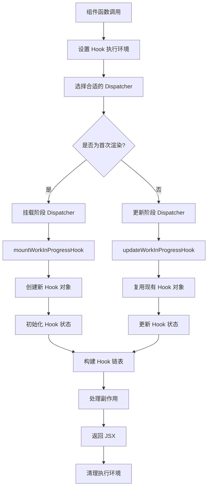
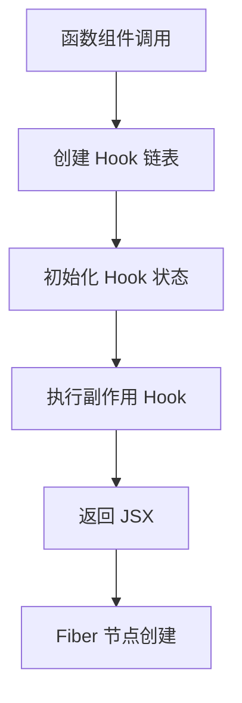
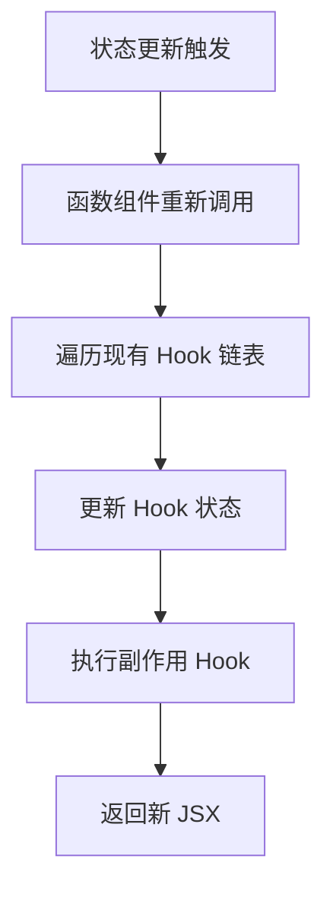

# Hook 与函数组件

## 概述

Hook 与函数组件的结合是 React 现代开发的核心模式。理解 Hook 如何在函数组件中工作，以及它们之间的深层关系，是掌握 React 状态管理的关键。本章通过可执行案例深入探讨这种关系的实现机制，解析 React 设计理念，并与 Vue 3 Composition API 进行对比分析。

## 可执行案例：函数组件演进历程

### 案例 1：状态管理能力的演进

让我们通过一个真实的用户信息管理组件来理解 Hook 带来的变革：

#### 传统类组件实现

```javascript
// 在 packages/react-dojo/dojo/index.jsx 中对比这两种实现

// React 16.8 之前：必须使用类组件来管理状态
class UserProfileClass extends React.Component {
  constructor(props) {
    super(props);
    // 💔 所有状态集中在一个对象中
    this.state = {
      user: null,
      loading: true,
      error: null,
      isEditing: false,
      formData: { name: '', email: '' },
      validationErrors: {}
    };
    
    // 💔 需要手动绑定方法
    this.handleEdit = this.handleEdit.bind(this);
    this.handleSave = this.handleSave.bind(this);
    this.handleCancel = this.handleCancel.bind(this);
    this.validateForm = this.validateForm.bind(this);
  }
  
  // 💔 生命周期方法分散，相关逻辑被拆分
  componentDidMount() {
    this.fetchUser();
    document.title = `用户资料 - ${this.props.userId}`;
    
    // 监听窗口大小变化
    window.addEventListener('resize', this.handleResize);
  }
  
  componentDidUpdate(prevProps, prevState) {
    if (prevProps.userId !== this.props.userId) {
      this.fetchUser();
    }
    
    if (prevState.user !== this.state.user && this.state.user) {
      document.title = `用户资料 - ${this.state.user.name}`;
    }
  }
  
  componentWillUnmount() {
    // 💔 清理逻辑远离设置逻辑
    window.removeEventListener('resize', this.handleResize);
  }
  
  // 💔 复杂的状态更新逻辑
  fetchUser = async () => {
    try {
      this.setState({ loading: true, error: null });
      const response = await fetch(`/api/users/${this.props.userId}`);
      
      if (!response.ok) {
        throw new Error('获取用户信息失败');
      }
      
      const user = await response.json();
      this.setState({ 
        user, 
        loading: false,
        formData: { name: user.name, email: user.email }
      });
    } catch (error) {
      this.setState({ error: error.message, loading: false });
    }
  };
  
  handleEdit() {
    this.setState({ isEditing: true });
  }
  
  handleSave = async () => {
    const errors = this.validateForm();
    if (Object.keys(errors).length > 0) {
      this.setState({ validationErrors: errors });
      return;
    }
    
    try {
      const response = await fetch(`/api/users/${this.props.userId}`, {
        method: 'PUT',
        headers: { 'Content-Type': 'application/json' },
        body: JSON.stringify(this.state.formData)
      });
      
      if (!response.ok) throw new Error('保存失败');
      
      const updatedUser = await response.json();
      this.setState({
        user: updatedUser,
        isEditing: false,
        validationErrors: {}
      });
    } catch (error) {
      this.setState({ error: error.message });
    }
  };
  
  handleCancel() {
    this.setState({
      isEditing: false,
      formData: { 
        name: this.state.user.name, 
        email: this.state.user.email 
      },
      validationErrors: {}
    });
  }
  
  validateForm() {
    const errors = {};
    const { name, email } = this.state.formData;
    
    if (!name.trim()) errors.name = '姓名不能为空';
    if (!email.trim()) errors.email = '邮箱不能为空';
    else if (!/\S+@\S+\.\S+/.test(email)) errors.email = '邮箱格式无效';
    
    return errors;
  }
  
  render() {
    const { user, loading, error, isEditing, formData, validationErrors } = this.state;
    
    if (loading) return <div className="loading">加载中...</div>;
    if (error) return <div className="error">错误: {error}</div>;
    if (!user) return <div>用户不存在</div>;
    
    return (
      <div className="user-profile">
        <h2>用户资料</h2>
        {isEditing ? (
          <form onSubmit={(e) => { e.preventDefault(); this.handleSave(); }}>
            <div>
              <label>姓名:</label>
              <input
                type="text"
                value={formData.name}
                onChange={(e) => this.setState({
                  formData: { ...formData, name: e.target.value }
                })}
              />
              {validationErrors.name && <span className="error">{validationErrors.name}</span>}
            </div>
            <div>
              <label>邮箱:</label>
              <input
                type="email"
                value={formData.email}
                onChange={(e) => this.setState({
                  formData: { ...formData, email: e.target.value }
                })}
              />
              {validationErrors.email && <span className="error">{validationErrors.email}</span>}
            </div>
            <button type="submit">保存</button>
            <button type="button" onClick={this.handleCancel}>取消</button>
          </form>
        ) : (
          <div>
            <p>姓名: {user.name}</p>
            <p>邮箱: {user.email}</p>
            <button onClick={this.handleEdit}>编辑</button>
          </div>
        )}
      </div>
    );
  }
}
```

#### 现代 Hook 实现

```javascript
// React 16.8+ 的函数组件：使用 Hook 实现相同功能

// 自定义 Hook：数据获取逻辑
function useUserData(userId) {
  const [user, setUser] = useState(null);
  const [loading, setLoading] = useState(true);
  const [error, setError] = useState(null);
  
  const fetchUser = useCallback(async () => {
    try {
      setLoading(true);
      setError(null);
      
      const response = await fetch(`/api/users/${userId}`);
      if (!response.ok) throw new Error('获取用户信息失败');
      
      const userData = await response.json();
      setUser(userData);
    } catch (err) {
      setError(err.message);
    } finally {
      setLoading(false);
    }
  }, [userId]);
  
  useEffect(() => {
    fetchUser();
  }, [fetchUser]);
  
  return { user, loading, error, refetch: fetchUser };
}

// 自定义 Hook：表单逻辑
function useFormValidation(initialData, validationRules) {
  const [formData, setFormData] = useState(initialData);
  const [errors, setErrors] = useState({});
  
  const updateField = useCallback((field, value) => {
    setFormData(prev => ({ ...prev, [field]: value }));
    // 清除该字段的错误
    if (errors[field]) {
      setErrors(prev => ({ ...prev, [field]: '' }));
    }
  }, [errors]);
  
  const validate = useCallback(() => {
    const newErrors = {};
    
    Object.entries(validationRules).forEach(([field, rules]) => {
      const value = formData[field];
      
      if (rules.required && !value?.trim()) {
        newErrors[field] = `${rules.label}不能为空`;
      } else if (rules.pattern && value && !rules.pattern.test(value)) {
        newErrors[field] = rules.message || `${rules.label}格式无效`;
      }
    });
    
    setErrors(newErrors);
    return Object.keys(newErrors).length === 0;
  }, [formData, validationRules]);
  
  const reset = useCallback(() => {
    setFormData(initialData);
    setErrors({});
  }, [initialData]);
  
  return {
    formData,
    errors,
    updateField,
    validate,
    reset,
    isValid: Object.keys(errors).length === 0
  };
}

// 自定义 Hook：编辑状态管理
function useEditMode(user) {
  const [isEditing, setIsEditing] = useState(false);
  
  const validationRules = useMemo(() => ({
    name: { required: true, label: '姓名' },
    email: {
      required: true,
      label: '邮箱',
      pattern: /\S+@\S+\.\S+/,
      message: '邮箱格式无效'
    }
  }), []);
  
  const formHook = useFormValidation(
    user ? { name: user.name, email: user.email } : { name: '', email: '' },
    validationRules
  );
  
  const startEdit = useCallback(() => {
    setIsEditing(true);
    formHook.reset();
  }, [formHook]);
  
  const cancelEdit = useCallback(() => {
    setIsEditing(false);
    formHook.reset();
  }, [formHook]);
  
  return {
    isEditing,
    setIsEditing,
    startEdit,
    cancelEdit,
    ...formHook
  };
}

// 主组件：组合所有 Hook
function UserProfileHooks({ userId }) {
  // ✅ 数据获取逻辑独立
  const { user, loading, error, refetch } = useUserData(userId);
  
  // ✅ 编辑逻辑独立
  const editHook = useEditMode(user);
  
  // ✅ 副作用逻辑聚合，相关逻辑在一起
  useEffect(() => {
    if (user) {
      document.title = `用户资料 - ${user.name}`;
    }
    
    return () => {
      document.title = '应用';
    };
  }, [user]);
  
  // ✅ 窗口大小监听逻辑独立
  useEffect(() => {
    const handleResize = () => {
      console.log('窗口大小变化:', window.innerWidth);
    };
    
    window.addEventListener('resize', handleResize);
    return () => window.removeEventListener('resize', handleResize);
  }, []);
  
  // ✅ 保存逻辑
  const handleSave = useCallback(async () => {
    if (!editHook.validate()) return;
    
    try {
      const response = await fetch(`/api/users/${userId}`, {
        method: 'PUT',
        headers: { 'Content-Type': 'application/json' },
        body: JSON.stringify(editHook.formData)
      });
      
      if (!response.ok) throw new Error('保存失败');
      
      editHook.setIsEditing(false);
      refetch(); // 重新获取数据
    } catch (err) {
      console.error('保存失败:', err.message);
    }
  }, [editHook, userId, refetch]);
  
  if (loading) return <div className="loading">加载中...</div>;
  if (error) return <div className="error">错误: {error}</div>;
  if (!user) return <div>用户不存在</div>;
  
  return (
    <div className="user-profile">
      <h2>用户资料</h2>
      {editHook.isEditing ? (
        <form onSubmit={(e) => { e.preventDefault(); handleSave(); }}>
          <div>
            <label>姓名:</label>
            <input
              type="text"
              value={editHook.formData.name}
              onChange={(e) => editHook.updateField('name', e.target.value)}
            />
            {editHook.errors.name && <span className="error">{editHook.errors.name}</span>}
          </div>
          <div>
            <label>邮箱:</label>
            <input
              type="email"
              value={editHook.formData.email}
              onChange={(e) => editHook.updateField('email', e.target.value)}
            />
            {editHook.errors.email && <span className="error">{editHook.errors.email}</span>}
          </div>
          <button type="submit">保存</button>
          <button type="button" onClick={editHook.cancelEdit}>取消</button>
        </form>
      ) : (
        <div>
          <p>姓名: {user.name}</p>
          <p>邮箱: {user.email}</p>
          <button onClick={editHook.startEdit}>编辑</button>
        </div>
      )}
    </div>
  );
}
```

### 与 Vue 3 Composition API 对比

```javascript
// Vue 3 Composition API 实现
<template>
  <div class="user-profile">
    <h2>用户资料</h2>
    <div v-if="loading" class="loading">加载中...</div>
    <div v-else-if="error" class="error">错误: {{ error }}</div>
    <div v-else-if="!user">用户不存在</div>
    <form v-else-if="isEditing" @submit.prevent="handleSave">
      <div>
        <label>姓名:</label>
        <input v-model="formData.name" type="text" />
        <span v-if="errors.name" class="error">{{ errors.name }}</span>
      </div>
      <div>
        <label>邮箱:</label>
        <input v-model="formData.email" type="email" />
        <span v-if="errors.email" class="error">{{ errors.email }}</span>
      </div>
      <button type="submit">保存</button>
      <button type="button" @click="cancelEdit">取消</button>
    </form>
    <div v-else>
      <p>姓名: {{ user.name }}</p>
      <p>邮箱: {{ user.email }}</p>
      <button @click="startEdit">编辑</button>
    </div>
  </div>
</template>

<script>
import { ref, reactive, computed, watch, onMounted, onUnmounted } from 'vue'

// Vue 3 组合式函数（类似 React Hook）
function useUserData(userId) {
  const user = ref(null)
  const loading = ref(true)
  const error = ref(null)
  
  const fetchUser = async () => {
    try {
      loading.value = true
      error.value = null
      
      const response = await fetch(`/api/users/${userId.value}`)
      if (!response.ok) throw new Error('获取用户信息失败')
      
      user.value = await response.json()
    } catch (err) {
      error.value = err.message
    } finally {
      loading.value = false
    }
  }
  
  // Vue 的 watch 类似 React 的 useEffect
  watch(userId, fetchUser, { immediate: true })
  
  return { user, loading, error, refetch: fetchUser }
}

function useEditMode(user) {
  const isEditing = ref(false)
  const formData = reactive({ name: '', email: '' })
  const errors = reactive({})
  
  const validate = () => {
    Object.keys(errors).forEach(key => delete errors[key])
    
    if (!formData.name.trim()) errors.name = '姓名不能为空'
    if (!formData.email.trim()) errors.email = '邮箱不能为空'
    else if (!/\S+@\S+\.\S+/.test(formData.email)) errors.email = '邮箱格式无效'
    
    return Object.keys(errors).length === 0
  }
  
  const startEdit = () => {
    isEditing.value = true
    if (user.value) {
      formData.name = user.value.name
      formData.email = user.value.email
    }
  }
  
  const cancelEdit = () => {
    isEditing.value = false
    Object.keys(errors).forEach(key => delete errors[key])
  }
  
  return {
    isEditing,
    formData,
    errors,
    validate,
    startEdit,
    cancelEdit
  }
}

export default {
  props: ['userId'],
  setup(props) {
    const { user, loading, error, refetch } = useUserData(toRef(props, 'userId'))
    const editHook = useEditMode(user)
    
    // 类似 useEffect
    watch(user, (newUser) => {
      if (newUser) {
        document.title = `用户资料 - ${newUser.name}`
      }
    })
    
    onMounted(() => {
      const handleResize = () => {
        console.log('窗口大小变化:', window.innerWidth)
      }
      window.addEventListener('resize', handleResize)
      
      onUnmounted(() => {
        window.removeEventListener('resize', handleResize)
        document.title = '应用'
      })
    })
    
    const handleSave = async () => {
      if (!editHook.validate()) return
      
      try {
        const response = await fetch(`/api/users/${props.userId}`, {
          method: 'PUT',
          headers: { 'Content-Type': 'application/json' },
          body: JSON.stringify(editHook.formData)
        })
        
        if (!response.ok) throw new Error('保存失败')
        
        editHook.isEditing.value = false
        refetch()
      } catch (err) {
        console.error('保存失败:', err.message)
      }
    }
    
    return {
      user,
      loading,
      error,
      ...editHook,
      handleSave
    }
  }
}
</script>
```

## Hook 工作流程深度解析

### 完整的 Hook 执行流程



### 案例 2：Hook 执行流程追踪

让我们通过一个实际案例来追踪 Hook 的完整执行流程：

```javascript
// 在 packages/react-dojo/dojo/index.jsx 中运行此案例

function HookFlowTracker() {
  console.log('🚀 组件函数开始执行');
  
  // Hook 1: useState
  console.log('📝 即将调用第一个 useState');
  const [count, setCount] = useState(() => {
    console.log('🔧 useState 初始化函数执行');
    return 0;
  });
  console.log('✅ 第一个 useState 完成，当前值:', count);
  
  // Hook 2: useState
  console.log('📝 即将调用第二个 useState');
  const [name, setName] = useState('React');
  console.log('✅ 第二个 useState 完成，当前值:', name);
  
  // Hook 3: useEffect
  console.log('📝 即将调用第一个 useEffect');
  useEffect(() => {
    console.log('🎯 useEffect 1 执行 - 挂载时');
    return () => {
      console.log('🧹 useEffect 1 清理函数');
    };
  }, []);
  console.log('✅ 第一个 useEffect 注册完成');
  
  // Hook 4: useEffect
  console.log('📝 即将调用第二个 useEffect');
  useEffect(() => {
    console.log('🎯 useEffect 2 执行 - count 变化:', count);
  }, [count]);
  console.log('✅ 第二个 useEffect 注册完成');
  
  // Hook 5: useMemo
  console.log('📝 即将调用 useMemo');
  const expensiveValue = useMemo(() => {
    console.log('🧮 useMemo 计算执行，count:', count);
    return count * 1000;
  }, [count]);
  console.log('✅ useMemo 完成，计算值:', expensiveValue);
  
  // Hook 6: useCallback
  console.log('📝 即将调用 useCallback');
  const handleIncrement = useCallback(() => {
    console.log('🖱️ handleIncrement 被调用');
    setCount(prev => {
      console.log('📊 setCount 更新，前值:', prev, '新值:', prev + 1);
      return prev + 1;
    });
  }, []);
  console.log('✅ useCallback 完成');
  
  console.log('🏁 组件函数执行完成，即将返回 JSX');
  
  return (
    <div>
      <h3>Hook 执行流程追踪</h3>
      <p>计数: {count}</p>
      <p>名称: {name}</p>
      <p>计算值: {expensiveValue}</p>
      <button onClick={handleIncrement}>增加计数</button>
      <button onClick={() => setName(name === 'React' ? 'Vue' : 'React')}>
        切换名称
      </button>
    </div>
  );
}
```

### React Hook 设计理念分析

**1. 单一职责原则**
```javascript
// ✅ React Hook 鼓励功能分离
function UserProfile() {
  const userData = useUserData();      // 数据获取
  const editMode = useEditMode();      // 编辑状态
  const validation = useValidation();  // 表单验证
  const permissions = usePermissions(); // 权限检查
  
  // 每个 Hook 专注于一个特定功能
}

// 对比 Vue 3，数据可能更集中
function useUserProfile() {
  const state = reactive({
    user: null,
    isEditing: false,
    formData: {},
    errors: {},
    permissions: []
  });
  
  // 所有状态在一个响应式对象中
}
```

**2. 函数式编程思想**
```javascript
// React Hook 体现函数式编程
const Component = () => {
  const [state, setState] = useState(0);
  
  // 状态是不可变的，通过函数更新
  const increment = () => setState(prev => prev + 1);
  
  return <button onClick={increment}>{state}</button>;
};

// Vue 3 更接近面向对象
const Component = {
  setup() {
    const state = ref(0);
    
    // 直接修改响应式引用
    const increment = () => state.value++;
    
    return { state, increment };
  }
};
```

**3. 显式依赖管理**
```javascript
// React Hook 显式声明依赖
useEffect(() => {
  // 副作用逻辑
}, [dep1, dep2]); // 明确指定依赖

// Vue 3 自动依赖收集
watch(() => {
  // Vue 自动追踪响应式数据的依赖
  console.log(count.value + name.value);
});
```

## Hook 在函数组件中的生命周期

### 组件挂载阶段



```javascript
function MyComponent() {
  console.log('1. 组件函数开始执行');
  
  // 2. 创建第一个 Hook
  const [count, setCount] = useState(0);
  console.log('2. useState Hook 创建');
  
  // 3. 创建第二个 Hook
  const [name, setName] = useState('');
  console.log('3. 第二个 useState Hook 创建');
  
  // 4. 创建 effect Hook
  useEffect(() => {
    console.log('5. useEffect 副作用执行');
    return () => {
      console.log('组件卸载时的清理');
    };
  }, []);
  console.log('4. useEffect Hook 创建');
  
  console.log('6. 组件函数执行完成');
  return <div>{count} - {name}</div>;
}
```

### 组件更新阶段



```javascript
function MyComponent() {
  const [count, setCount] = useState(0);
  
  useEffect(() => {
    console.log('组件更新，count:', count);
  }, [count]); // 依赖 count
  
  useEffect(() => {
    console.log('每次渲染都执行');
  }); // 无依赖数组
  
  useEffect(() => {
    console.log('只在挂载时执行');
  }, []); // 空依赖数组
  
  return (
    <div>
      <p>Count: {count}</p>
      <button onClick={() => setCount(count + 1)}>
        增加
      </button>
    </div>
  );
}
```

### 案例 3：Hook 生命周期可视化

```javascript
// 在 packages/react-dojo/dojo/index.jsx 中体验 Hook 生命周期

function LifecycleVisualizer({ userId }) {
  const [renderCount, setRenderCount] = useState(0);
  const [data, setData] = useState(null);
  
  // 组件每次渲染时增加计数
  useEffect(() => {
    setRenderCount(prev => prev + 1);
    console.log(`🔄 组件第 ${renderCount + 1} 次渲染`);
  });
  
  // 挂载时的副作用
  useEffect(() => {
    console.log('🎬 组件挂载 - 类似 componentDidMount');
    
    return () => {
      console.log('💀 组件卸载 - 类似 componentWillUnmount');
    };
  }, []);
  
  // 依赖变化时的副作用
  useEffect(() => {
    if (userId) {
      console.log('📡 userId 变化，重新获取数据:', userId);
      
      // 模拟数据获取
      const timer = setTimeout(() => {
        setData({ id: userId, name: `用户${userId}` });
      }, 1000);
      
      return () => {
        console.log('🚫 清理前一次的数据获取');
        clearTimeout(timer);
      };
    }
  }, [userId]);
  
  // 数据变化时的副作用
  useEffect(() => {
    if (data) {
      console.log('📊 用户数据更新:', data);
      document.title = `用户资料 - ${data.name}`;
    }
  }, [data]);
  
  return (
    <div>
      <h3>Hook 生命周期可视化</h3>
      <p>渲染次数: {renderCount}</p>
      <p>用户ID: {userId}</p>
      <p>用户数据: {data ? JSON.stringify(data) : '加载中...'}</p>
    </div>
  );
}

// 父组件用于测试生命周期
function LifecycleTester() {
  const [userId, setUserId] = useState(1);
  const [showComponent, setShowComponent] = useState(true);
  
  return (
    <div>
      <h2>Hook 生命周期测试</h2>
      <button onClick={() => setUserId(prev => prev + 1)}>
        切换用户 (当前: {userId})
      </button>
      <button onClick={() => setShowComponent(prev => !prev)}>
        {showComponent ? '卸载' : '挂载'}组件
      </button>
      
      {showComponent && <LifecycleVisualizer userId={userId} />}
    </div>
  );
}
```

## Hook 状态的存储机制

### Fiber 节点中的 Hook 存储

每个函数组件对应一个 Fiber 节点，Hook 链表存储在 Fiber 节点的 `memoizedState` 属性中：

```javascript
// Fiber 节点结构（简化）
const fiberNode = {
  type: MyComponent,           // 组件函数
  memoizedState: hookList,     // Hook 链表
  memoizedProps: props,        // 上次的 props
  pendingProps: newProps,      // 新的 props
  // ... 其他属性
};

// Hook 链表结构
const hookList = {
  // 第一个 Hook (useState)
  memoizedState: 0,           // 当前状态值
  queue: updateQueue,         // 更新队列
  next: hook2,                // 下一个 Hook
  
  // 第二个 Hook (useEffect)
  hook2: {
    memoizedState: {
      create: effectFunction,   // 副作用函数
      destroy: cleanupFunction, // 清理函数
      deps: [count],           // 依赖数组
    },
    next: hook3,
  },
  
  // ... 更多 Hook
};
```

### Hook 状态的读取和更新

```javascript
// 在 react-reconciler/src/ReactFiberHooks.js 中

// 全局变量，跟踪当前渲染的组件和 Hook
let currentlyRenderingFiber = null;
let currentHook = null;
let workInProgressHook = null;

function renderWithHooks(current, workInProgress, Component, props) {
  // 设置当前渲染的 Fiber
  currentlyRenderingFiber = workInProgress;
  
  // 重置 Hook 状态
  workInProgress.memoizedState = null;
  workInProgress.updateQueue = null;
  
  // 设置 Hook dispatcher
  ReactCurrentDispatcher.current = 
    current === null || current.memoizedState === null
      ? HooksDispatcherOnMount      // 首次渲染
      : HooksDispatcherOnUpdate;    // 更新渲染
  
  // 调用组件函数
  let children = Component(props, secondArg);
  
  // 清理全局状态
  currentlyRenderingFiber = null;
  currentHook = null;
  workInProgressHook = null;
  
  return children;
}
```

### 案例 4：深入理解 Hook 状态存储

```javascript
// 调试 Hook 状态存储的工具函数
function debugFiberHooks(componentName) {
  // 获取当前组件的 Fiber 节点
  const getCurrentFiber = () => {
    const reactInternalInstance = React.__SECRET_INTERNALS_DO_NOT_USE_OR_YOU_WILL_BE_FIRED.ReactCurrentFiber;
    return reactInternalInstance?.current;
  };
  
  // 解析 Hook 链表
  const parseHookList = (memoizedState) => {
    const hooks = [];
    let currentHook = memoizedState;
    let index = 0;
    
    while (currentHook) {
      hooks.push({
        index,
        type: getHookType(currentHook),
        memoizedState: currentHook.memoizedState,
        hasQueue: !!currentHook.queue,
        hasNext: !!currentHook.next
      });
      
      currentHook = currentHook.next;
      index++;
    }
    
    return hooks;
  };
  
  // 推断 Hook 类型
  const getHookType = (hook) => {
    if (hook.queue) {
      return 'State Hook (useState/useReducer)';
    } else if (Array.isArray(hook.memoizedState)) {
      return 'Memo Hook (useMemo/useCallback)';
    } else if (hook.memoizedState && typeof hook.memoizedState === 'object' && hook.memoizedState.current !== undefined) {
      return 'Ref Hook (useRef)';
    } else if (hook.memoizedState && typeof hook.memoizedState === 'object' && hook.memoizedState.create) {
      return 'Effect Hook (useEffect/useLayoutEffect)';
    } else {
      return 'Unknown Hook';
    }
  };
  
  return () => {
    const fiber = getCurrentFiber();
    if (fiber) {
      const hooks = parseHookList(fiber.memoizedState);
      console.group(`🔍 ${componentName} Hook 状态分析`);
      console.log('Fiber 节点:', fiber);
      console.log('Hook 链表:', fiber.memoizedState);
      console.table(hooks);
      console.groupEnd();
    }
  };
}

// 演示 Hook 状态存储的组件
function HookStorageDemo() {
  // 创建调试函数
  const debugHooks = debugFiberHooks('HookStorageDemo');
  
  // 各种类型的 Hook
  const [count, setCount] = useState(0);
  const [text, setText] = useState('Hello');
  const [visible, setVisible] = useState(true);
  
  const inputRef = useRef(null);
  
  const doubledCount = useMemo(() => {
    console.log('🧮 useMemo 计算执行');
    return count * 2;
  }, [count]);
  
  const handleClick = useCallback(() => {
    setCount(prev => prev + 1);
  }, []);
  
  useEffect(() => {
    console.log('👀 useEffect: count 变化为', count);
  }, [count]);
  
  useLayoutEffect(() => {
    if (inputRef.current) {
      inputRef.current.style.backgroundColor = visible ? 'lightblue' : 'lightcoral';
    }
  }, [visible]);
  
  // 在每次渲染后调试 Hook 状态
  useEffect(() => {
    debugHooks();
  });
  
  return (
    <div style={{ padding: '20px', border: '1px solid #ccc' }}>
      <h3>Hook 状态存储演示</h3>
      
      <div>
        <p>计数: {count} (双倍: {doubledCount})</p>
        <button onClick={handleClick}>增加计数</button>
      </div>
      
      <div>
        <input
          ref={inputRef}
          type="text"
          value={text}
          onChange={(e) => setText(e.target.value)}
          placeholder="输入文本"
        />
      </div>
      
      <div>
        <label>
          <input
            type="checkbox"
            checked={visible}
            onChange={(e) => setVisible(e.target.checked)}
          />
          显示特效
        </label>
      </div>
      
      <button onClick={debugHooks} style={{ marginTop: '10px' }}>
        手动调试 Hook 状态
      </button>
    </div>
  );
}
```

## Hook Dispatcher 机制

### 不同阶段的 Dispatcher

React 根据组件的渲染阶段使用不同的 Hook dispatcher：

```javascript
// 挂载阶段的 dispatcher
const HooksDispatcherOnMount = {
  useState: mountState,
  useEffect: mountEffect,
  useLayoutEffect: mountLayoutEffect,
  useMemo: mountMemo,
  useCallback: mountCallback,
  useRef: mountRef,
  // ... 其他 Hook
};

// 更新阶段的 dispatcher
const HooksDispatcherOnUpdate = {
  useState: updateState,
  useEffect: updateEffect,
  useLayoutEffect: updateLayoutEffect,
  useMemo: updateMemo,
  useCallback: updateCallback,
  useRef: updateRef,
  // ... 其他 Hook
};

// 重新渲染阶段的 dispatcher
const HooksDispatcherOnRerender = {
  useState: rerenderState,
  useEffect: updateEffect,
  useLayoutEffect: updateLayoutEffect,
  useMemo: updateMemo,
  useCallback: updateCallback,
  useRef: updateRef,
  // ... 其他 Hook
};
```

### useState 的不同实现

```javascript
// 挂载时的 useState
function mountState(initialState) {
  const hook = mountWorkInProgressHook();
  
  if (typeof initialState === 'function') {
    initialState = initialState();
  }
  
  hook.memoizedState = hook.baseState = initialState;
  
  const queue = {
    pending: null,
    dispatch: null,
    lastRenderedReducer: basicStateReducer,
    lastRenderedState: initialState,
  };
  hook.queue = queue;
  
  const dispatch = dispatchSetState.bind(null, currentlyRenderingFiber, queue);
  queue.dispatch = dispatch;
  
  return [hook.memoizedState, dispatch];
}

// 更新时的 useState
function updateState(initialState) {
  return updateReducer(basicStateReducer, initialState);
}

// 重新渲染时的 useState
function rerenderState(initialState) {
  return rerenderReducer(basicStateReducer, initialState);
}
```

### 案例 5：Dispatcher 切换可视化

```javascript
// 演示不同阶段 Dispatcher 的切换
function DispatcherDemo() {
  const [mountPhase, setMountPhase] = useState(true);
  const [updateCount, setUpdateCount] = useState(0);
  const [rerenderCount, setRerenderCount] = useState(0);
  
  // 跟踪当前 Dispatcher 类型
  const currentDispatcher = useRef('unknown');
  
  // 在不同阶段记录 Dispatcher 类型
  useEffect(() => {
    if (mountPhase) {
      currentDispatcher.current = 'HooksDispatcherOnMount';
      console.log('🎯 当前使用挂载阶段 Dispatcher');
      setMountPhase(false);
    } else {
      currentDispatcher.current = 'HooksDispatcherOnUpdate';
      console.log('🔄 当前使用更新阶段 Dispatcher');
    }
  });
  
  // 触发重新渲染的特殊情况
  const triggerRerender = () => {
    console.log('🔥 即将触发重新渲染 Dispatcher');
    // 在渲染过程中调用 setState 会触发重新渲染
    setRerenderCount(prev => {
      setUpdateCount(count => count + 1); // 这会触发 rerender
      return prev + 1;
    });
  };
  
  return (
    <div style={{ padding: '20px', border: '2px solid #007acc' }}>
      <h3>Dispatcher 切换演示</h3>
      
      <div>
        <p>当前 Dispatcher: <strong>{currentDispatcher.current}</strong></p>
        <p>更新次数: {updateCount}</p>
        <p>重新渲染次数: {rerenderCount}</p>
      </div>
      
      <div>
        <button onClick={() => setUpdateCount(prev => prev + 1)}>
          普通更新 (使用 UpdateDispatcher)
        </button>
        
        <button onClick={triggerRerender} style={{ marginLeft: '10px' }}>
          触发重新渲染 (使用 RerenderDispatcher)
        </button>
      </div>
      
      <div style={{ marginTop: '10px', fontSize: '12px', color: '#666' }}>
        <p>💡 打开开发者工具查看不同 Dispatcher 的切换日志</p>
      </div>
    </div>
  );
}
```

## Hook 调用顺序的保证机制

### Hook 索引机制

React 通过 Hook 调用的顺序来建立索引关系：

```javascript
function MyComponent() {
  // Hook 调用顺序:
  const [state1, setState1] = useState(1);    // 索引 0
  const [state2, setState2] = useState(2);    // 索引 1
  const [state3, setState3] = useState(3);    // 索引 2
  
  useEffect(() => {                           // 索引 3
    console.log('effect 1');
  }, [state1]);
  
  useEffect(() => {                           // 索引 4
    console.log('effect 2');
  }, [state2]);
  
  return <div>{state1 + state2 + state3}</div>;
}
```

### Hook 链表遍历

```javascript
function updateWorkInProgressHook() {
  let nextCurrentHook;
  
  if (currentHook === null) {
    // 这是组件中的第一个 Hook
    const current = currentlyRenderingFiber.alternate;
    if (current !== null) {
      nextCurrentHook = current.memoizedState;
    } else {
      nextCurrentHook = null;
    }
  } else {
    // 获取链表中的下一个 Hook
    nextCurrentHook = currentHook.next;
  }
  
  let nextWorkInProgressHook;
  if (workInProgressHook === null) {
    // 这是组件中的第一个 Hook
    nextWorkInProgressHook = currentlyRenderingFiber.memoizedState;
  } else {
    // 获取链表中的下一个 Hook
    nextWorkInProgressHook = workInProgressHook.next;
  }
  
  if (nextWorkInProgressHook !== null) {
    // 已有 workInProgress Hook，复用
    workInProgressHook = nextWorkInProgressHook;
    nextWorkInProgressHook = workInProgressHook.next;
    currentHook = nextCurrentHook;
  } else {
    // 创建新的 workInProgress Hook
    currentHook = nextCurrentHook;
    
    const newHook = {
      memoizedState: currentHook.memoizedState,
      baseState: currentHook.baseState,
      baseQueue: currentHook.baseQueue,
      queue: currentHook.queue,
      next: null,
    };
    
    if (workInProgressHook === null) {
      currentlyRenderingFiber.memoizedState = workInProgressHook = newHook;
    } else {
      workInProgressHook = workInProgressHook.next = newHook;
    }
  }
  
  return workInProgressHook;
}
```

### 案例 6：Hook 顺序违反检测

```javascript
// 演示 Hook 顺序规则和检测机制
function HookOrderDemo() {
  const [showConditional, setShowConditional] = useState(false);
  const [count, setCount] = useState(0);
  
  // ❌ 错误示例：条件性调用 Hook（仅用于演示，实际会报错）
  // if (showConditional) {
  //   const [conditionalState] = useState('bad practice');
  // }
  
  // ✅ 正确做法：Hook 总是在顶层调用
  const [conditionalState, setConditionalState] = useState('');
  
  // 通过状态控制逻辑，而不是控制 Hook 调用
  useEffect(() => {
    if (showConditional) {
      setConditionalState('conditional logic activated');
    } else {
      setConditionalState('');
    }
  }, [showConditional]);
  
  // Hook 调用顺序可视化
  const hookOrder = [
    { name: 'useState(showConditional)', index: 0, active: true },
    { name: 'useState(count)', index: 1, active: true },
    { name: 'useState(conditionalState)', index: 2, active: true },
    { name: 'useEffect(conditional logic)', index: 3, active: true },
    { name: 'useMemo(hookOrder)', index: 4, active: true }
  ];
  
  const memoizedOrder = useMemo(() => hookOrder, []);
  
  return (
    <div style={{ padding: '20px', border: '2px solid #28a745' }}>
      <h3>Hook 调用顺序演示</h3>
      
      <div>
        <label>
          <input
            type="checkbox"
            checked={showConditional}
            onChange={(e) => setShowConditional(e.target.checked)}
          />
          显示条件逻辑
        </label>
      </div>
      
      <div>
        <p>计数: {count}</p>
        <button onClick={() => setCount(prev => prev + 1)}>
          增加计数
        </button>
      </div>
      
      {showConditional && (
        <div style={{ backgroundColor: '#d4edda', padding: '10px', margin: '10px 0' }}>
          <p>条件状态: {conditionalState}</p>
        </div>
      )}
      
      <div style={{ marginTop: '20px' }}>
        <h4>Hook 调用顺序 (索引保持一致):</h4>
        <ol>
          {memoizedOrder.map((hook, idx) => (
            <li key={idx} style={{ 
              color: hook.active ? '#28a745' : '#dc3545',
              fontFamily: 'monospace'
            }}>
              {hook.name} - 索引: {hook.index}
            </li>
          ))}
        </ol>
      </div>
      
      <div style={{ fontSize: '12px', color: '#666', marginTop: '10px' }}>
        <p>✅ 所有 Hook 都在组件顶层调用，索引保持稳定</p>
        <p>✅ 通过状态控制渲染逻辑，而不是控制 Hook 调用</p>
      </div>
    </div>
  );
}
```

## 状态更新的完整流程

### 状态更新触发

```javascript
function MyComponent() {
  const [count, setCount] = useState(0);
  
  const handleClick = () => {
    // 触发状态更新
    setCount(count + 1);
  };
  
  return <button onClick={handleClick}>Count: {count}</button>;
}
```

### dispatchSetState 实现

```javascript
function dispatchSetState(fiber, queue, action) {
  const eventTime = requestEventTime();
  const lane = requestUpdateLane(fiber);
  
  const update = {
    lane,
    action,
    eagerReducer: null,
    eagerState: null,
    next: null,
  };
  
  // 尝试立即计算新状态（eager evaluation）
  if (fiber.lanes === NoLanes && (fiber.alternate === null || fiber.alternate.lanes === NoLanes)) {
    const lastRenderedReducer = queue.lastRenderedReducer;
    if (lastRenderedReducer !== null) {
      try {
        const currentState = queue.lastRenderedState;
        const eagerState = lastRenderedReducer(currentState, action);
        
        update.eagerReducer = lastRenderedReducer;
        update.eagerState = eagerState;
        
        if (is(eagerState, currentState)) {
          // 状态没有变化，跳过更新
          return;
        }
      } catch (error) {
        // 计算失败，继续正常流程
      }
    }
  }
  
  // 将更新加入队列
  enqueueUpdate(fiber, update);
  
  // 调度更新
  scheduleUpdateOnFiber(fiber, lane, eventTime);
}
```

### 案例 7：状态更新全流程追踪

```javascript
// 深入追踪状态更新的每个步骤
function StateUpdateFlowTracker() {
  const [count, setCount] = useState(0);
  const [updateHistory, setUpdateHistory] = useState([]);
  
  // 创建增强的 setState 函数来追踪更新流程
  const trackedSetCount = useCallback((newValue) => {
    const timestamp = Date.now();
    const updateId = Math.random().toString(36).substr(2, 9);
    
    console.group(`🚀 状态更新开始 - ID: ${updateId}`);
    console.log('1️⃣ 用户调用 setCount');
    console.log('2️⃣ 创建 update 对象');
    console.log('3️⃣ 将 update 加入队列');
    console.log('4️⃣ 调度更新 (scheduleUpdateOnFiber)');
    
    // 记录更新历史
    setUpdateHistory(prev => [
      ...prev,
      {
        id: updateId,
        timestamp,
        oldValue: count,
        newValue: typeof newValue === 'function' ? newValue(count) : newValue,
        type: typeof newValue === 'function' ? 'function' : 'value'
      }
    ]);
    
    // 实际更新状态
    setCount(newValue);
    
    console.log('5️⃣ 渲染阶段即将开始');
    console.groupEnd();
  }, [count]);
  
  // 监听状态变化
  useEffect(() => {
    console.log('✅ 状态更新完成，新值:', count);
    console.log('🔄 组件重新渲染完成');
  }, [count]);
  
  // 批量更新演示
  const batchUpdate = () => {
    console.log('🎯 开始批量更新');
    
    // React 会自动批处理这些更新
    trackedSetCount(prev => prev + 1);
    trackedSetCount(prev => prev + 1);
    trackedSetCount(prev => prev + 1);
    
    console.log('📦 批量更新调用完成，等待 React 批处理');
  };
  
  // 异步更新演示
  const asyncUpdate = async () => {
    console.log('⏰ 开始异步更新');
    
    setTimeout(() => {
      console.log('🕐 setTimeout 回调执行');
      trackedSetCount(prev => prev + 10);
    }, 100);
    
    // React 18 的自动批处理
    await Promise.resolve();
    console.log('🎉 Promise 完成后更新');
    trackedSetCount(prev => prev + 5);
  };
  
  return (
    <div style={{ padding: '20px', border: '2px solid #ff6b6b' }}>
      <h3>状态更新流程追踪</h3>
      
      <div>
        <p>当前计数: <strong>{count}</strong></p>
      </div>
      
      <div style={{ marginBottom: '20px' }}>
        <button onClick={() => trackedSetCount(count + 1)}>
          普通更新 (+1)
        </button>
        
        <button onClick={() => trackedSetCount(prev => prev * 2)} style={{ marginLeft: '10px' }}>
          函数更新 (×2)
        </button>
        
        <button onClick={batchUpdate} style={{ marginLeft: '10px' }}>
          批量更新 (+3)
        </button>
        
        <button onClick={asyncUpdate} style={{ marginLeft: '10px' }}>
          异步更新 (+15)
        </button>
      </div>
      
      <div>
        <h4>更新历史:</h4>
        <div style={{ maxHeight: '200px', overflow: 'auto', backgroundColor: '#f8f9fa', padding: '10px' }}>
          {updateHistory.map((update) => (
            <div key={update.id} style={{ marginBottom: '5px', fontSize: '12px' }}>
              <strong>ID:</strong> {update.id} |
              <strong> 时间:</strong> {new Date(update.timestamp).toLocaleTimeString()} |
              <strong> 变化:</strong> {update.oldValue} → {update.newValue} |
              <strong> 类型:</strong> {update.type}
            </div>
          ))}
        </div>
      </div>
      
      <div style={{ fontSize: '12px', color: '#666', marginTop: '10px' }}>
        <p>💡 打开开发者工具查看详细的状态更新流程</p>
      </div>
    </div>
  );
}
```

## 副作用的处理机制

### useEffect 的实现

```javascript
function mountEffect(create, deps) {
  return mountEffectImpl(
    PassiveEffect | PassiveStaticEffect,
    HookPassive,
    create,
    deps,
  );
}

function mountEffectImpl(fiberFlags, hookFlags, create, deps) {
  const hook = mountWorkInProgressHook();
  const nextDeps = deps === undefined ? null : deps;
  
  currentlyRenderingFiber.flags |= fiberFlags;
  
  hook.memoizedState = pushEffect(
    HookHasEffect | hookFlags,
    create,
    undefined,
    nextDeps,
  );
}

function pushEffect(tag, create, destroy, deps) {
  const effect = {
    tag,
    create,
    destroy,
    deps,
    next: null,
  };
  
  let componentUpdateQueue = currentlyRenderingFiber.updateQueue;
  if (componentUpdateQueue === null) {
    componentUpdateQueue = createFunctionComponentUpdateQueue();
    currentlyRenderingFiber.updateQueue = componentUpdateQueue;
    componentUpdateQueue.lastEffect = effect.next = effect;
  } else {
    const lastEffect = componentUpdateQueue.lastEffect;
    if (lastEffect === null) {
      componentUpdateQueue.lastEffect = effect.next = effect;
    } else {
      const firstEffect = lastEffect.next;
      lastEffect.next = effect;
      effect.next = firstEffect;
      componentUpdateQueue.lastEffect = effect;
    }
  }
  
  return effect;
}
```

### 副作用的执行时机

```javascript
// 在 commit 阶段执行副作用
function commitPassiveEffects(finishedWork) {
  const updateQueue = finishedWork.updateQueue;
  const lastEffect = updateQueue !== null ? updateQueue.lastEffect : null;
  
  if (lastEffect !== null) {
    const firstEffect = lastEffect.next;
    let effect = firstEffect;
    
    do {
      const { create, destroy, deps } = effect;
      
      if ((effect.tag & HookPassive) !== NoHookEffect) {
        // 执行销毁函数
        if (destroy !== undefined) {
          destroy();
        }
        
        // 执行创建函数
        const destroyFunc = create();
        if (typeof destroyFunc === 'function') {
          effect.destroy = destroyFunc;
        }
      }
      
      effect = effect.next;
    } while (effect !== firstEffect);
  }
}
```

### 案例 8：副作用执行时机演示

```javascript
// 演示不同类型副作用的执行时机和顺序
function EffectTimingDemo() {
  const [count, setCount] = useState(0);
  const [mounted, setMounted] = useState(false);
  
  // useLayoutEffect - 同步执行，在 DOM 更新后立即执行
  useLayoutEffect(() => {
    console.log('🎨 useLayoutEffect: DOM 更新后同步执行');
    console.log('📏 可以同步读取 DOM 尺寸和样式');
    
    return () => {
      console.log('🧹 useLayoutEffect 清理: 同步清理');
    };
  }, [count]);
  
  // useEffect - 异步执行，在渲染完成后异步执行
  useEffect(() => {
    console.log('⚡ useEffect: 渲染完成后异步执行');
    console.log('🌐 适合数据获取、订阅等副作用');
    
    return () => {
      console.log('🧹 useEffect 清理: 异步清理');
    };
  }, [count]);
  
  // 挂载时的副作用
  useEffect(() => {
    console.log('🎬 组件挂载完成');
    setMounted(true);
    
    // 模拟异步操作
    const timer = setTimeout(() => {
      console.log('⏰ 异步操作完成');
    }, 1000);
    
    return () => {
      console.log('💀 组件即将卸载');
      clearTimeout(timer);
      setMounted(false);
    };
  }, []);
  
  // 条件副作用
  useEffect(() => {
    if (count > 0) {
      console.log(`📊 计数大于0: ${count}`);
      document.title = `计数: ${count}`;
    }
    
    return () => {
      if (count > 0) {
        console.log(`🔄 重置文档标题`);
        document.title = '副作用演示';
      }
    };
  }, [count]);
  
  // 副作用执行顺序可视化
  const executionOrder = [
    '1. 组件函数执行',
    '2. useState 创建/更新状态',
    '3. 注册 useLayoutEffect',
    '4. 注册 useEffect',
    '5. 返回 JSX',
    '6. React 更新 DOM',
    '7. 执行 useLayoutEffect (同步)',
    '8. 浏览器绘制页面',
    '9. 执行 useEffect (异步)'
  ];
  
  return (
    <div style={{ padding: '20px', border: '2px solid #8e44ad' }}>
      <h3>副作用执行时机演示</h3>
      
      <div>
        <p>当前计数: <strong>{count}</strong></p>
        <p>组件状态: {mounted ? '已挂载' : '未挂载'}</p>
      </div>
      
      <div style={{ marginBottom: '20px' }}>
        <button onClick={() => setCount(prev => prev + 1)}>
          增加计数 (触发副作用)
        </button>
        
        <button onClick={() => setCount(0)} style={{ marginLeft: '10px' }}>
          重置计数
        </button>
      </div>
      
      <div>
        <h4>副作用执行顺序:</h4>
        <ol style={{ fontSize: '14px' }}>
          {executionOrder.map((step, index) => (
            <li key={index} style={{
              color: index < 6 ? '#2ecc71' : index < 8 ? '#e67e22' : '#9b59b6',
              marginBottom: '2px'
            }}>
              {step}
            </li>
          ))}
        </ol>
      </div>
      
      <div style={{ fontSize: '12px', color: '#666', marginTop: '10px' }}>
        <p>🟢 渲染阶段 | 🟠 Layout 阶段 | 🟣 Effect 阶段</p>
        <p>💡 查看控制台了解副作用的实际执行顺序</p>
      </div>
    </div>
  );
}
```

## 自定义 Hook 的实现原理

### 自定义 Hook 的本质

自定义 Hook 本质上是调用其他 Hook 的 JavaScript 函数：

```javascript
// 自定义 Hook：计数器
function useCounter(initialValue = 0) {
  const [count, setCount] = useState(initialValue);
  
  const increment = useCallback(() => {
    setCount(c => c + 1);
  }, []);
  
  const decrement = useCallback(() => {
    setCount(c => c - 1);
  }, []);
  
  const reset = useCallback(() => {
    setCount(initialValue);
  }, [initialValue]);
  
  return { count, increment, decrement, reset };
}

// 使用自定义 Hook
function Counter() {
  const { count, increment, decrement, reset } = useCounter(10);
  
  return (
    <div>
      <p>Count: {count}</p>
      <button onClick={increment}>+</button>
      <button onClick={decrement}>-</button>
      <button onClick={reset}>Reset</button>
    </div>
  );
}
```

### 复杂自定义 Hook 示例

```javascript
// 数据获取 Hook
function useAsyncData(url, deps = []) {
  const [data, setData] = useState(null);
  const [loading, setLoading] = useState(true);
  const [error, setError] = useState(null);
  
  const fetchData = useCallback(async () => {
    try {
      setLoading(true);
      setError(null);
      
      const response = await fetch(url);
      if (!response.ok) {
        throw new Error(`HTTP error! status: ${response.status}`);
      }
      
      const result = await response.json();
      setData(result);
    } catch (err) {
      setError(err.message);
    } finally {
      setLoading(false);
    }
  }, [url]);
  
  useEffect(() => {
    fetchData();
  }, [fetchData, ...deps]);
  
  const refetch = useCallback(() => {
    fetchData();
  }, [fetchData]);
  
  return { data, loading, error, refetch };
}

// 使用数据获取 Hook
function UserProfile({ userId }) {
  const { data: user, loading, error, refetch } = useAsyncData(
    `/api/users/${userId}`,
    [userId]
  );
  
  if (loading) return <div>Loading...</div>;
  if (error) return <div>Error: {error}</div>;
  
  return (
    <div>
      <h1>{user?.name}</h1>
      <p>{user?.email}</p>
      <button onClick={refetch}>刷新</button>
    </div>
  );
}
```

### 案例 9：企业级自定义 Hook 架构

```javascript
// 高级数据管理 Hook
function useAsyncResource(config) {
  const {
    fetcher,           // 数据获取函数
    key,              // 缓存键
    dependencies = [], // 依赖数组
    cacheTime = 300000, // 缓存时间 (5分钟)
    staleTime = 60000,  // 数据过期时间 (1分钟)
    retry = 3,         // 重试次数
    onSuccess,         // 成功回调
    onError           // 错误回调
  } = config;
  
  const [state, setState] = useState({
    data: null,
    loading: true,
    error: null,
    lastFetched: null,
    retryCount: 0
  });
  
  const cacheRef = useRef(new Map());
  const abortControllerRef = useRef(null);
  
  // 检查缓存
  const getCachedData = useCallback((cacheKey) => {
    const cached = cacheRef.current.get(cacheKey);
    if (!cached) return null;
    
    const now = Date.now();
    const isStale = now - cached.timestamp > staleTime;
    const isExpired = now - cached.timestamp > cacheTime;
    
    if (isExpired) {
      cacheRef.current.delete(cacheKey);
      return null;
    }
    
    return { ...cached, isStale };
  }, [staleTime, cacheTime]);
  
  // 设置缓存
  const setCachedData = useCallback((cacheKey, data) => {
    cacheRef.current.set(cacheKey, {
      data,
      timestamp: Date.now()
    });
  }, []);
  
  // 数据获取逻辑
  const fetchData = useCallback(async (retryCount = 0) => {
    const cacheKey = typeof key === 'function' ? key() : key;
    
    // 检查缓存
    const cached = getCachedData(cacheKey);
    if (cached && !cached.isStale) {
      setState(prev => ({ 
        ...prev, 
        data: cached.data, 
        loading: false, 
        error: null 
      }));
      return cached.data;
    }
    
    // 取消之前的请求
    if (abortControllerRef.current) {
      abortControllerRef.current.abort();
    }
    
    abortControllerRef.current = new AbortController();
    
    try {
      setState(prev => ({ 
        ...prev, 
        loading: true, 
        error: null, 
        retryCount 
      }));
      
      const data = await fetcher({ 
        signal: abortControllerRef.current.signal,
        dependencies 
      });
      
      // 缓存数据
      setCachedData(cacheKey, data);
      
      setState({
        data,
        loading: false,
        error: null,
        lastFetched: Date.now(),
        retryCount: 0
      });
      
      onSuccess?.(data);
      return data;
      
    } catch (error) {
      if (error.name === 'AbortError') {
        return; // 忽略取消的请求
      }
      
      // 重试逻辑
      if (retryCount < retry) {
        console.log(`重试第 ${retryCount + 1} 次...`);
        setTimeout(() => {
          fetchData(retryCount + 1);
        }, Math.pow(2, retryCount) * 1000); // 指数退避
        return;
      }
      
      setState(prev => ({ 
        ...prev, 
        loading: false, 
        error: error.message,
        retryCount 
      }));
      
      onError?.(error);
      throw error;
    }
  }, [fetcher, key, dependencies, retry, onSuccess, onError, getCachedData, setCachedData]);
  
  // 自动获取数据
  useEffect(() => {
    fetchData();
    
    return () => {
      if (abortControllerRef.current) {
        abortControllerRef.current.abort();
      }
    };
  }, [fetchData]);
  
  // 手动刷新
  const refresh = useCallback(() => {
    const cacheKey = typeof key === 'function' ? key() : key;
    cacheRef.current.delete(cacheKey);
    return fetchData();
  }, [key, fetchData]);
  
  // 清理缓存
  const clearCache = useCallback(() => {
    cacheRef.current.clear();
  }, []);
  
  return {
    ...state,
    refresh,
    clearCache,
    isStale: state.lastFetched && (Date.now() - state.lastFetched > staleTime)
  };
}

// 复杂表单管理 Hook
function useAdvancedForm(config) {
  const {
    initialValues = {},
    validationSchema,
    onSubmit,
    validateOnChange = true,
    validateOnBlur = true,
    enableReinitialize = false
  } = config;
  
  const [values, setValues] = useState(initialValues);
  const [errors, setErrors] = useState({});
  const [touched, setTouched] = useState({});
  const [isSubmitting, setIsSubmitting] = useState(false);
  const [submitCount, setSubmitCount] = useState(0);
  
  // 重新初始化
  useEffect(() => {
    if (enableReinitialize) {
      setValues(initialValues);
      setErrors({});
      setTouched({});
    }
  }, [initialValues, enableReinitialize]);
  
  // 验证函数
  const validate = useCallback(async (valuesToValidate = values) => {
    if (!validationSchema) return {};
    
    try {
      await validationSchema.validate(valuesToValidate, { abortEarly: false });
      return {};
    } catch (error) {
      const newErrors = {};
      error.inner.forEach(err => {
        if (err.path) {
          newErrors[err.path] = err.message;
        }
      });
      return newErrors;
    }
  }, [validationSchema, values]);
  
  // 设置字段值
  const setFieldValue = useCallback(async (field, value) => {
    const newValues = { ...values, [field]: value };
    setValues(newValues);
    
    if (validateOnChange) {
      const fieldErrors = await validate(newValues);
      setErrors(prev => ({ ...prev, [field]: fieldErrors[field] || null }));
    }
  }, [values, validateOnChange, validate]);
  
  // 设置字段为已触摸
  const setFieldTouched = useCallback(async (field, isTouched = true) => {
    setTouched(prev => ({ ...prev, [field]: isTouched }));
    
    if (validateOnBlur && isTouched) {
      const fieldErrors = await validate();
      setErrors(prev => ({ ...prev, [field]: fieldErrors[field] || null }));
    }
  }, [validateOnBlur, validate]);
  
  // 表单提交
  const handleSubmit = useCallback(async (e) => {
    if (e) e.preventDefault();
    
    setSubmitCount(prev => prev + 1);
    setIsSubmitting(true);
    
    try {
      const formErrors = await validate();
      
      if (Object.keys(formErrors).length > 0) {
        setErrors(formErrors);
        // 标记所有字段为已触摸
        const allTouched = {};
        Object.keys(values).forEach(key => {
          allTouched[key] = true;
        });
        setTouched(allTouched);
        return;
      }
      
      await onSubmit?.(values);
      
    } catch (error) {
      console.error('表单提交错误:', error);
    } finally {
      setIsSubmitting(false);
    }
  }, [validate, values, onSubmit]);
  
  // 重置表单
  const resetForm = useCallback(() => {
    setValues(initialValues);
    setErrors({});
    setTouched({});
    setIsSubmitting(false);
    setSubmitCount(0);
  }, [initialValues]);
  
  // 计算是否有效
  const isValid = useMemo(() => {
    return Object.keys(errors).length === 0;
  }, [errors]);
  
  // 计算是否为脏数据
  const isDirty = useMemo(() => {
    return JSON.stringify(values) !== JSON.stringify(initialValues);
  }, [values, initialValues]);
  
  return {
    values,
    errors,
    touched,
    isSubmitting,
    submitCount,
    isValid,
    isDirty,
    setFieldValue,
    setFieldTouched,
    handleSubmit,
    resetForm,
    validate
  };
}

// 使用示例
function EnterpriseFormExample() {
  // 数据获取
  const { data: userOptions, loading: optionsLoading } = useAsyncResource({
    fetcher: () => fetch('/api/users').then(r => r.json()),
    key: 'user-options',
    staleTime: 30000
  });
  
  // 表单管理
  const form = useAdvancedForm({
    initialValues: {
      name: '',
      email: '',
      role: ''
    },
    onSubmit: async (values) => {
      console.log('提交表单:', values);
      // 模拟提交
      await new Promise(resolve => setTimeout(resolve, 2000));
    }
  });
  
  return (
    <div style={{ padding: '20px', border: '2px solid #3498db' }}>
      <h3>企业级 Hook 架构演示</h3>
      
      <form onSubmit={form.handleSubmit}>
        <div style={{ marginBottom: '15px' }}>
          <label>姓名:</label>
          <input
            type="text"
            value={form.values.name}
            onChange={(e) => form.setFieldValue('name', e.target.value)}
            onBlur={() => form.setFieldTouched('name')}
            style={{ marginLeft: '10px', padding: '5px' }}
          />
          {form.touched.name && form.errors.name && (
            <span style={{ color: 'red', marginLeft: '10px' }}>
              {form.errors.name}
            </span>
          )}
        </div>
        
        <div style={{ marginBottom: '15px' }}>
          <label>邮箱:</label>
          <input
            type="email"
            value={form.values.email}
            onChange={(e) => form.setFieldValue('email', e.target.value)}
            onBlur={() => form.setFieldTouched('email')}
            style={{ marginLeft: '10px', padding: '5px' }}
          />
        </div>
        
        <div style={{ marginBottom: '15px' }}>
          <label>角色:</label>
          <select
            value={form.values.role}
            onChange={(e) => form.setFieldValue('role', e.target.value)}
            disabled={optionsLoading}
            style={{ marginLeft: '10px', padding: '5px' }}
          >
            <option value="">选择角色...</option>
            <option value="admin">管理员</option>
            <option value="user">用户</option>
          </select>
        </div>
        
        <div>
          <button 
            type="submit" 
            disabled={form.isSubmitting || !form.isValid}
            style={{ padding: '10px 20px' }}
          >
            {form.isSubmitting ? '提交中...' : '提交'}
          </button>
          
          <button 
            type="button" 
            onClick={form.resetForm}
            style={{ marginLeft: '10px', padding: '10px 20px' }}
          >
            重置
          </button>
        </div>
      </form>
      
      <div style={{ marginTop: '20px', fontSize: '12px' }}>
        <p>表单状态: {form.isDirty ? '已修改' : '未修改'} | 
           有效性: {form.isValid ? '有效' : '无效'} | 
           提交次数: {form.submitCount}</p>
      </div>
    </div>
  );
}
```

## 性能优化策略

### Hook 的性能考量

```javascript
function OptimizedComponent({ items, filter }) {
  // ✅ 缓存计算结果
  const filteredItems = useMemo(() => {
    return items.filter(item => item.category === filter);
  }, [items, filter]);
  
  // ✅ 缓存事件处理函数
  const handleItemClick = useCallback((id) => {
    console.log('点击项目:', id);
  }, []);
  
  // ✅ 分离不相关的状态
  const [selectedId, setSelectedId] = useState(null);
  const [isExpanded, setIsExpanded] = useState(false);
  
  // ✅ 合理使用 useEffect 依赖
  useEffect(() => {
    if (selectedId) {
      const item = items.find(item => item.id === selectedId);
      if (item) {
        analytics.track('item_selected', { category: item.category });
      }
    }
  }, [selectedId, items]); // 只在 selectedId 或 items 变化时执行
  
  return (
    <div>
      {filteredItems.map(item => (
        <OptimizedItem
          key={item.id}
          item={item}
          onClick={handleItemClick}
          isSelected={selectedId === item.id}
        />
      ))}
    </div>
  );
}

// 使用 memo 优化子组件
const OptimizedItem = memo(function Item({ item, onClick, isSelected }) {
  return (
    <div 
      className={isSelected ? 'selected' : ''}
      onClick={() => onClick(item.id)}
    >
      {item.name}
    </div>
  );
});
```

### 案例 10：Hook 性能优化综合案例

```javascript
// 高性能组件优化案例
function PerformanceOptimizedComponent({ items, categories, userId }) {
  // ✅ 状态分离 - 避免不必要的重渲染
  const [searchTerm, setSearchTerm] = useState('');
  const [selectedCategory, setSelectedCategory] = useState('all');
  const [sortBy, setSortBy] = useState('name');
  const [viewMode, setViewMode] = useState('grid');
  
  // ✅ 计算缓存 - 避免重复计算
  const filteredAndSortedItems = useMemo(() => {
    console.log('🧮 重新计算过滤和排序的项目');
    
    let result = items;
    
    // 过滤
    if (searchTerm) {
      result = result.filter(item => 
        item.name.toLowerCase().includes(searchTerm.toLowerCase())
      );
    }
    
    if (selectedCategory !== 'all') {
      result = result.filter(item => item.category === selectedCategory);
    }
    
    // 排序
    result = [...result].sort((a, b) => {
      switch (sortBy) {
        case 'name':
          return a.name.localeCompare(b.name);
        case 'price':
          return a.price - b.price;
        case 'date':
          return new Date(b.createdAt) - new Date(a.createdAt);
        default:
          return 0;
      }
    });
    
    return result;
  }, [items, searchTerm, selectedCategory, sortBy]);
  
  // ✅ 事件处理缓存 - 避免子组件不必要的重渲染
  const handleItemSelect = useCallback((itemId) => {
    console.log('选择项目:', itemId);
    // 这里可能会调用父组件的回调
  }, []);
  
  const handleItemFavorite = useCallback((itemId) => {
    console.log('收藏项目:', itemId);
    // 更新收藏状态的逻辑
  }, []);
  
  // ✅ 防抖搜索 - 减少搜索频率
  const debouncedSearch = useMemo(() => {
    const timeoutRef = { current: null };
    
    return (value) => {
      if (timeoutRef.current) {
        clearTimeout(timeoutRef.current);
      }
      
      timeoutRef.current = setTimeout(() => {
        setSearchTerm(value);
      }, 300);
    };
  }, []);
  
  // ✅ 虚拟化准备 - 大列表性能优化
  const itemHeight = 120;
  const containerHeight = 600;
  const visibleItems = Math.ceil(containerHeight / itemHeight) + 2;
  
  const [scrollTop, setScrollTop] = useState(0);
  const startIndex = Math.floor(scrollTop / itemHeight);
  const endIndex = Math.min(startIndex + visibleItems, filteredAndSortedItems.length);
  const visibleItemsData = filteredAndSortedItems.slice(startIndex, endIndex);
  
  // ✅ 用户偏好缓存
  const userPreferences = useMemo(() => {
    return {
      preferredView: viewMode,
      preferredSort: sortBy,
      lastSearches: [] // 可以实现搜索历史
    };
  }, [viewMode, sortBy]);
  
  // ✅ 性能监控
  const renderCount = useRef(0);
  useEffect(() => {
    renderCount.current += 1;
    console.log(`🔄 组件渲染次数: ${renderCount.current}`);
  });
  
  const performanceMetrics = useMemo(() => {
    return {
      totalItems: items.length,
      filteredItems: filteredAndSortedItems.length,
      visibleItems: visibleItemsData.length,
      renderCount: renderCount.current,
      lastUpdate: Date.now()
    };
  }, [items.length, filteredAndSortedItems.length, visibleItemsData.length]);
  
  return (
    <div style={{ padding: '20px', border: '2px solid #e74c3c' }}>
      <h3>Hook 性能优化演示</h3>
      
      {/* 控制面板 */}
      <div style={{ marginBottom: '20px', display: 'flex', gap: '10px', flexWrap: 'wrap' }}>
        <input
          type="text"
          placeholder="搜索项目..."
          onChange={(e) => debouncedSearch(e.target.value)}
          style={{ padding: '5px' }}
        />
        
        <select
          value={selectedCategory}
          onChange={(e) => setSelectedCategory(e.target.value)}
          style={{ padding: '5px' }}
        >
          <option value="all">所有分类</option>
          {categories.map(cat => (
            <option key={cat} value={cat}>{cat}</option>
          ))}
        </select>
        
        <select
          value={sortBy}
          onChange={(e) => setSortBy(e.target.value)}
          style={{ padding: '5px' }}
        >
          <option value="name">按名称排序</option>
          <option value="price">按价格排序</option>
          <option value="date">按日期排序</option>
        </select>
        
        <button
          onClick={() => setViewMode(prev => prev === 'grid' ? 'list' : 'grid')}
          style={{ padding: '5px 10px' }}
        >
          {viewMode === 'grid' ? '列表视图' : '网格视图'}
        </button>
      </div>
      
      {/* 虚拟化列表容器 */}
      <div
        style={{
          height: containerHeight,
          overflow: 'auto',
          border: '1px solid #ddd'
        }}
        onScroll={(e) => setScrollTop(e.target.scrollTop)}
      >
        <div style={{ height: filteredAndSortedItems.length * itemHeight, position: 'relative' }}>
          {visibleItemsData.map((item, index) => (
            <OptimizedItemCard
              key={item.id}
              item={item}
              style={{
                position: 'absolute',
                top: (startIndex + index) * itemHeight,
                left: 0,
                right: 0,
                height: itemHeight - 10
              }}
              onSelect={handleItemSelect}
              onFavorite={handleItemFavorite}
              viewMode={viewMode}
            />
          ))}
        </div>
      </div>
      
      {/* 性能指标 */}
      <div style={{ marginTop: '20px', fontSize: '12px', backgroundColor: '#f8f9fa', padding: '10px' }}>
        <h4>性能指标:</h4>
        <div style={{ display: 'grid', gridTemplateColumns: 'repeat(auto-fit, minmax(150px, 1fr))', gap: '10px' }}>
          <div>总项目: {performanceMetrics.totalItems}</div>
          <div>过滤后: {performanceMetrics.filteredItems}</div>
          <div>可见项目: {performanceMetrics.visibleItems}</div>
          <div>渲染次数: {performanceMetrics.renderCount}</div>
        </div>
      </div>
      
      <div style={{ fontSize: '10px', color: '#666', marginTop: '10px' }}>
        <p>✅ 使用了 useMemo、useCallback、虚拟化等优化技术</p>
        <p>✅ 状态分离避免不必要的重渲染</p>
        <p>✅ 防抖搜索减少计算频率</p>
      </div>
    </div>
  );
}

// 优化的项目卡片组件
const OptimizedItemCard = memo(function ItemCard({ item, style, onSelect, onFavorite, viewMode }) {
  console.log(`🎨 渲染项目卡片: ${item.name}`);
  
  const handleClick = useCallback(() => {
    onSelect(item.id);
  }, [item.id, onSelect]);
  
  const handleFavoriteClick = useCallback((e) => {
    e.stopPropagation();
    onFavorite(item.id);
  }, [item.id, onFavorite]);
  
  return (
    <div
      style={{
        ...style,
        padding: '10px',
        border: '1px solid #eee',
        margin: '5px',
        cursor: 'pointer',
        backgroundColor: '#fff',
        display: viewMode === 'grid' ? 'block' : 'flex',
        alignItems: viewMode === 'list' ? 'center' : 'stretch'
      }}
      onClick={handleClick}
    >
      <div style={{ flex: 1 }}>
        <h4 style={{ margin: 0 }}>{item.name}</h4>
        <p style={{ margin: '5px 0', color: '#666' }}>{item.category}</p>
        <p style={{ margin: 0, fontWeight: 'bold' }}>¥{item.price}</p>
      </div>
      
      <button
        onClick={handleFavoriteClick}
        style={{ padding: '5px', marginLeft: '10px' }}
      >
        ❤️
      </button>
    </div>
  );
});
```

## 调试技巧

### Hook 调试最佳实践

```javascript
function DebuggableComponent() {
  const [count, setCount] = useState(0);
  const [name, setName] = useState('');
  
  // 使用 useDebugValue 提供调试信息
  useDebugValue(`count: ${count}, name: ${name}`);
  
  // 使用自定义 Hook 封装调试逻辑
  useTraceUpdate({ count, name });
  
  return <div>{count} - {name}</div>;
}

// 自定义调试 Hook
function useTraceUpdate(props) {
  const prev = useRef(props);
  
  useEffect(() => {
    const changedProps = Object.entries(props).reduce((ps, [k, v]) => {
      if (prev.current[k] !== v) {
        ps[k] = [prev.current[k], v];
      }
      return ps;
    }, {});
    
    if (Object.keys(changedProps).length > 0) {
      console.log('Changed props:', changedProps);
    }
    
    prev.current = props;
  });
}
```

### 案例 11：Hook 调试工具集

```javascript
// 完整的 Hook 调试工具集
function useDebugger(componentName, props) {
  const renderCount = useRef(0);
  const prevProps = useRef(props);
  const startTime = useRef(Date.now());
  
  // 渲染计数
  renderCount.current += 1;
  
  // Props 变化检测
  const changedProps = useMemo(() => {
    const changes = {};
    Object.keys(props).forEach(key => {
      if (prevProps.current[key] !== props[key]) {
        changes[key] = {
          from: prevProps.current[key],
          to: props[key]
        };
      }
    });
    prevProps.current = props;
    return changes;
  }, [props]);
  
  // 性能监控
  useEffect(() => {
    const renderTime = Date.now() - startTime.current;
    console.log(`⏱️ ${componentName} 渲染耗时: ${renderTime}ms`);
    startTime.current = Date.now();
  });
  
  // Hook 使用统计
  const [hookStats, setHookStats] = useState({ useEffect: 0, useState: 0, useMemo: 0 });
  
  useEffect(() => {
    setHookStats(prev => ({ ...prev, useEffect: prev.useEffect + 1 }));
  });
  
  // 调试信息输出
  useDebugValue({
    renderCount: renderCount.current,
    changedProps: Object.keys(changedProps),
    hookStats
  });
  
  return {
    renderCount: renderCount.current,
    changedProps,
    hookStats,
    log: (message, data) => {
      console.group(`🐛 ${componentName} - 渲染 #${renderCount.current}`);
      console.log(message, data);
      if (Object.keys(changedProps).length > 0) {
        console.log('Props 变化:', changedProps);
      }
      console.groupEnd();
    }
  };
}

// Hook 性能分析器
function usePerformanceProfiler(name) {
  const mountTime = useRef(Date.now());
  const lastRenderTime = useRef(Date.now());
  const renderTimes = useRef([]);
  
  useEffect(() => {
    const now = Date.now();
    const renderDuration = now - lastRenderTime.current;
    renderTimes.current.push(renderDuration);
    lastRenderTime.current = now;
    
    // 保留最近20次渲染时间
    if (renderTimes.current.length > 20) {
      renderTimes.current.shift();
    }
  });
  
  const getProfileData = useCallback(() => {
    const times = renderTimes.current;
    const avgRenderTime = times.reduce((a, b) => a + b, 0) / times.length;
    const maxRenderTime = Math.max(...times);
    const minRenderTime = Math.min(...times);
    
    return {
      name,
      mountTime: mountTime.current,
      totalLifetime: Date.now() - mountTime.current,
      renderCount: times.length,
      avgRenderTime: avgRenderTime.toFixed(2),
      maxRenderTime,
      minRenderTime
    };
  }, [name]);
  
  return { getProfileData };
}

// 调试演示组件
function DebuggingDemo({ items = [], filter = '' }) {
  const debugger = useDebugger('DebuggingDemo', { items, filter });
  const profiler = usePerformanceProfiler('DebuggingDemo');
  
  const [count, setCount] = useState(0);
  const [text, setText] = useState('');
  
  const filteredItems = useMemo(() => {
    debugger.log('🔍 计算过滤项目', { itemsLength: items.length, filter });
    return items.filter(item => item.includes(filter));
  }, [items, filter, debugger]);
  
  const expensiveCalculation = useMemo(() => {
    debugger.log('🧮 执行昂贵计算', { count });
    // 模拟昂贵计算
    let result = 0;
    for (let i = 0; i < count * 1000; i++) {
      result += Math.random();
    }
    return result;
  }, [count, debugger]);
  
  const handleIncrement = useCallback(() => {
    debugger.log('🖱️ 处理点击事件');
    setCount(prev => prev + 1);
  }, [debugger]);
  
  useEffect(() => {
    debugger.log('🎯 useEffect 执行', { count, text });
  }, [count, text, debugger]);
  
  // 显示性能数据
  const showPerformanceData = () => {
    const data = profiler.getProfileData();
    console.table(data);
    alert(`性能数据已输出到控制台\n平均渲染时间: ${data.avgRenderTime}ms`);
  };
  
  return (
    <div style={{ padding: '20px', border: '2px solid #f39c12' }}>
      <h3>Hook 调试工具演示</h3>
      
      <div style={{ marginBottom: '15px' }}>
        <p>渲染次数: <strong>{debugger.renderCount}</strong></p>
        <p>计数: {count}</p>
        <p>过滤后项目数: {filteredItems.length}</p>
        <p>计算结果: {expensiveCalculation.toFixed(2)}</p>
      </div>
      
      <div style={{ marginBottom: '15px' }}>
        <input
          type="text"
          value={text}
          onChange={(e) => setText(e.target.value)}
          placeholder="输入文本..."
          style={{ padding: '5px', marginRight: '10px' }}
        />
        
        <button onClick={handleIncrement} style={{ padding: '5px 10px' }}>
          增加计数
        </button>
        
        <button onClick={showPerformanceData} style={{ padding: '5px 10px', marginLeft: '10px' }}>
          查看性能数据
        </button>
      </div>
      
      <div style={{ fontSize: '12px', color: '#666' }}>
        <p>🐛 调试信息已输出到控制台</p>
        <p>🔍 使用 React DevTools 查看更多详细信息</p>
        <p>⚡ 尝试修改 props 观察变化检测</p>
      </div>
      
      {/* 显示变化的 Props */}
      {Object.keys(debugger.changedProps).length > 0 && (
        <div style={{ backgroundColor: '#fff3cd', padding: '10px', marginTop: '10px' }}>
          <h4>Props 变化:</h4>
          <pre style={{ fontSize: '12px' }}>
            {JSON.stringify(debugger.changedProps, null, 2)}
          </pre>
        </div>
      )}
    </div>
  );
}

// 主演示组件
function HookFunctionComponentsDemo() {
  const [testItems, setTestItems] = useState(['苹果', '香蕉', '橙子', '葡萄']);
  const [filter, setFilter] = useState('');
  
  return (
    <div>
      <h2>Hook 与函数组件完整演示</h2>
      
      <div style={{ marginBottom: '20px' }}>
        <input
          type="text"
          value={filter}
          onChange={(e) => setFilter(e.target.value)}
          placeholder="过滤项目..."
          style={{ padding: '5px', marginRight: '10px' }}
        />
        
        <button onClick={() => setTestItems([...testItems, `新项目${Date.now()}`])}>
          添加项目
        </button>
      </div>
      
      <DebuggingDemo items={testItems} filter={filter} />
    </div>
  );
}
```

## React Hook vs Vue 3 设计理念对比

| 特性 | React Hook | Vue 3 Composition API |
|------|------------|------------------------|
| **状态管理** | 不可变状态，通过 setter 更新 | 响应式引用，直接修改 |
| **依赖管理** | 手动指定依赖数组 | 自动依赖追踪 |
| **副作用** | useEffect 显式声明 | watch/watchEffect 自动追踪 |
| **组合方式** | Hook 链表顺序敏感 | 组合式函数灵活组合 |
| **调试体验** | 需要 ESLint 规则辅助 | TypeScript 原生支持更好 |
| **学习曲线** | 需要理解闭包和依赖 | 更接近传统编程模式 |
| **性能优化** | 手动优化（useMemo/useCallback） | 自动优化（响应式系统） |

## 总结

Hook 与函数组件的结合创造了现代 React 开发的核心模式。通过本章的深入分析，我们了解到：

### 核心优势
1. **逻辑复用**：自定义 Hook 实现跨组件的逻辑共享
2. **关注点分离**：相关逻辑聚合，提高代码可维护性
3. **函数式编程**：拥抱不可变状态和纯函数理念
4. **渐进式增强**：可以逐步迁移类组件到函数组件

### 设计理念
1. **显式依赖**：通过依赖数组明确声明数据流
2. **单一职责**：每个 Hook 专注特定功能
3. **组合优于继承**：通过 Hook 组合实现复杂功能
4. **开发时检查**：严格的规则确保正确使用

### 性能策略
1. **精确优化**：useMemo 和 useCallback 精确控制重计算
2. **状态分离**：避免大对象状态导致的不必要渲染
3. **虚拟化**：处理大列表的高效渲染
4. **调试工具**：完善的调试和性能分析工具

### 与 Vue 3 对比
- **React**: 显式、可预测，需要开发者更多控制
- **Vue 3**: 自动、便捷，框架承担更多优化责任

理解这些机制有助于我们更好地设计和优化 React 应用。