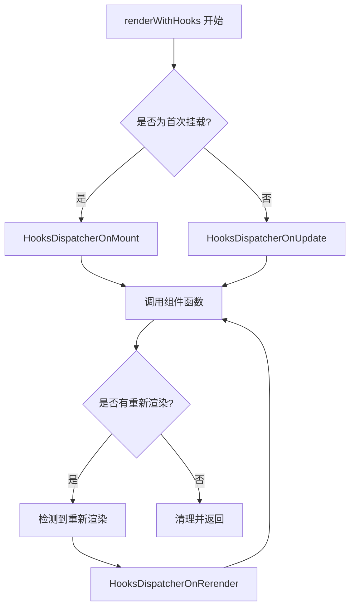

# renderWithHooks

## 概述

`renderWithHooks` 是 React Hook 系统的核心函数，它连接了 Fiber 架构和 Hook 机制。这个函数负责在函数组件渲染过程中管理 Hook 的状态、设置正确的执行上下文，并处理 Hook 的生命周期。理解这个函数是掌握 React Hook 实现的关键。

## 函数签名与作用

### 基本签名

```javascript
function renderWithHooks(
  current,              // 当前的 Fiber 节点
  workInProgress,       // 正在工作的 Fiber 节点
  Component,            // 函数组件
  props,                // 组件的 props
  secondArg,            // 第二个参数（通常是 context）
  nextRenderLanes,      // 渲染的优先级
) {
  // 函数实现
}
```

### 主要职责

1. **设置 Hook 执行环境**：配置全局变量和 dispatcher
2. **调用组件函数**：执行用户编写的函数组件
3. **管理 Hook 状态**：处理 Hook 的创建、更新和清理
4. **错误处理**：捕获和处理 Hook 相关的错误
5. **性能优化**：处理 bailout 和其他优化策略

## 源码实现详解

### 完整的实现

```javascript
// react-reconciler/src/ReactFiberHooks.js

function renderWithHooks(
  current,
  workInProgress,
  Component,
  props,
  secondArg,
  nextRenderLanes,
) {
  // 设置当前渲染的优先级
  renderLanes = nextRenderLanes;
  
  // 设置当前正在渲染的 Fiber 节点
  currentlyRenderingFiber = workInProgress;
  
  if (__DEV__) {
    // 开发环境下的额外检查
    hookTypesDev = current !== null ? current._debugHookTypes : null;
    hookTypesUpdateIndexDev = -1;
    
    // 用于检测不安全的生命周期方法
    ignorePreviousDependencies = 
      current !== null && current.type !== workInProgress.type;
  }
  
  // 重置 Fiber 节点的 Hook 相关状态
  workInProgress.memoizedState = null;
  workInProgress.updateQueue = null;
  workInProgress.lanes = NoLanes;
  
  // 设置正确的 Hook dispatcher
  if (__DEV__) {
    if (current !== null && current.memoizedState !== null) {
      ReactCurrentDispatcher.current = HooksDispatcherOnUpdateInDEV;
    } else if (hookTypesDev !== null) {
      ReactCurrentDispatcher.current = HooksDispatcherOnMountWithHookTypesInDEV;
    } else {
      ReactCurrentDispatcher.current = HooksDispatcherOnMountInDEV;
    }
  } else {
    ReactCurrentDispatcher.current =
      current === null || current.memoizedState === null
        ? HooksDispatcherOnMount      // 首次挂载
        : HooksDispatcherOnUpdate;    // 更新阶段
  }
  
  // 调用组件函数，这里会执行所有的 Hook
  let children = Component(props, secondArg);
  
  // 检查是否有重新渲染的情况
  if (didScheduleRenderPhaseUpdate) {
    let numberOfReRenders = 0;
    do {
      didScheduleRenderPhaseUpdate = false;
      localIdCounter = 0;
      
      if (numberOfReRenders >= RE_RENDER_LIMIT) {
        throw new Error(
          '组件更新次数过多。' +
          '这通常意味着在渲染过程中有无限循环更新。'
        );
      }
      
      numberOfReRenders += 1;
      
      if (__DEV__) {
        ignorePreviousDependencies = false;
      }
      
      // 重新开始渲染
      currentHook = null;
      workInProgressHook = null;
      
      workInProgress.updateQueue = null;
      
      if (__DEV__) {
        hookTypesUpdateIndexDev = -1;
      }
      
      // 设置重新渲染的 dispatcher
      ReactCurrentDispatcher.current = __DEV__
        ? HooksDispatcherOnRerenderInDEV
        : HooksDispatcherOnRerender;
      
      // 重新调用组件函数
      children = Component(props, secondArg);
    } while (didScheduleRenderPhaseUpdate);
  }
  
  // 清理全局状态
  ReactCurrentDispatcher.current = ContextOnlyDispatcher;
  
  if (__DEV__) {
    workInProgress._debugHookTypes = hookTypesDev;
  }
  
  // 保存当前的 Hook 链表用于下次渲染
  const didRenderTooFewHooks =
    currentHook !== null && currentHook.next !== null;
  
  // 重置全局变量
  renderLanes = NoLanes;
  currentlyRenderingFiber = null;
  currentHook = null;
  workInProgressHook = null;
  
  if (__DEV__) {
    currentHookNameInDev = null;
    hookTypesDev = null;
    hookTypesUpdateIndexDev = -1;
    ignorePreviousDependencies = false;
  }
  
  didScheduleRenderPhaseUpdate = false;
  localIdCounter = 0;
  
  if (didRenderTooFewHooks) {
    throw new Error(
      '渲染的 Hook 数量少于预期。' +
      '这可能是由于条件性调用 Hook 引起的。'
    );
  }
  
  return children;
}
```

## 关键全局变量

### Hook 执行上下文变量

```javascript
// 当前正在渲染的 Fiber 节点
let currentlyRenderingFiber = null;

// 当前正在处理的 Hook（来自 current 树）
let currentHook = null;

// 当前正在工作的 Hook（在 workInProgress 树中）
let workInProgressHook = null;

// 当前渲染的优先级
let renderLanes = NoLanes;

// 是否在渲染阶段调度了更新
let didScheduleRenderPhaseUpdate = false;

// 重新渲染的限制次数
const RE_RENDER_LIMIT = 25;

// 用于 useId 的计数器
let localIdCounter = 0;
```

### 开发环境特有变量

```javascript
if (__DEV__) {
  // Hook 类型信息，用于检测 Hook 顺序变化
  let hookTypesDev = null;
  
  // Hook 类型更新索引
  let hookTypesUpdateIndexDev = -1;
  
  // 当前 Hook 的名称
  let currentHookNameInDev = null;
  
  // 是否忽略之前的依赖
  let ignorePreviousDependencies = false;
}
```

## Dispatcher 机制详解

### 不同阶段的 Dispatcher

React 根据组件的渲染阶段使用不同的 Hook dispatcher：



### 挂载阶段的 Dispatcher

```javascript
const HooksDispatcherOnMount = {
  readContext,
  useCallback: mountCallback,
  useContext: readContext,
  useEffect: mountEffect,
  useImperativeHandle: mountImperativeHandle,
  useLayoutEffect: mountLayoutEffect,
  useInsertionEffect: mountInsertionEffect,
  useMemo: mountMemo,
  useReducer: mountReducer,
  useRef: mountRef,
  useState: mountState,
  useDebugValue: mountDebugValue,
  useDeferredValue: mountDeferredValue,
  useTransition: mountTransition,
  useMutableSource: mountMutableSource,
  useSyncExternalStore: mountSyncExternalStore,
  useId: mountId,
  
  unstable_isNewReconciler: enableNewReconciler,
};
```

### 更新阶段的 Dispatcher

```javascript
const HooksDispatcherOnUpdate = {
  readContext,
  useCallback: updateCallback,
  useContext: readContext,
  useEffect: updateEffect,
  useImperativeHandle: updateImperativeHandle,
  useLayoutEffect: updateLayoutEffect,
  useInsertionEffect: updateInsertionEffect,
  useMemo: updateMemo,
  useReducer: updateReducer,
  useRef: updateRef,
  useState: updateState,
  useDebugValue: updateDebugValue,
  useDeferredValue: updateDeferredValue,
  useTransition: updateTransition,
  useMutableSource: updateMutableSource,
  useSyncExternalStore: updateSyncExternalStore,
  useId: updateId,
  
  unstable_isNewReconciler: enableNewReconciler,
};
```

### 重新渲染阶段的 Dispatcher

```javascript
const HooksDispatcherOnRerender = {
  readContext,
  useCallback: updateCallback,
  useContext: readContext,
  useEffect: updateEffect,
  useImperativeHandle: updateImperativeHandle,
  useLayoutEffect: updateLayoutEffect,
  useInsertionEffect: updateInsertionEffect,
  useMemo: updateMemo,
  useReducer: rerenderReducer,      // 特殊处理
  useRef: updateRef,
  useState: rerenderState,          // 特殊处理
  useDebugValue: updateDebugValue,
  useDeferredValue: rerenderDeferredValue,
  useTransition: rerenderTransition,
  useMutableSource: updateMutableSource,
  useSyncExternalStore: updateSyncExternalStore,
  useId: updateId,
  
  unstable_isNewReconciler: enableNewReconciler,
};
```

## 重新渲染机制

### 重新渲染的触发

当在组件渲染过程中调用 `setState` 时，会触发重新渲染：

```javascript
function dispatchSetState(fiber, queue, action) {
  // ... 其他逻辑
  
  if (fiber === currentlyRenderingFiber) {
    // 在渲染过程中调用了 setState
    didScheduleRenderPhaseUpdate = true;
  }
  
  // ... 其他逻辑
}
```

### 重新渲染的处理

```javascript
// 在 renderWithHooks 中处理重新渲染
if (didScheduleRenderPhaseUpdate) {
  let numberOfReRenders = 0;
  
  do {
    didScheduleRenderPhaseUpdate = false;
    localIdCounter = 0;
    
    // 防止无限循环
    if (numberOfReRenders >= RE_RENDER_LIMIT) {
      throw new Error('组件更新次数过多');
    }
    
    numberOfReRenders += 1;
    
    // 重置 Hook 状态
    currentHook = null;
    workInProgressHook = null;
    workInProgress.updateQueue = null;
    
    // 设置重新渲染的 dispatcher
    ReactCurrentDispatcher.current = HooksDispatcherOnRerender;
    
    // 重新调用组件函数
    children = Component(props, secondArg);
    
  } while (didScheduleRenderPhaseUpdate);
}
```

## Hook 顺序检查机制

### 开发环境的 Hook 类型检查

```javascript
if (__DEV__) {
  function updateHookTypesDev() {
    const hookName = currentHookNameInDev;
    
    if (hookTypesDev !== null) {
      hookTypesUpdateIndexDev++;
      
      if (hookTypesDev[hookTypesUpdateIndexDev] !== hookName) {
        warnOnHookMismatchInDev(hookName);
      }
    }
  }
  
  function warnOnHookMismatchInDev(hookName) {
    console.error(
      '组件中 Hook 的调用顺序发生了变化。' +
      '这可能是由于条件性调用 Hook 引起的。' +
      `期望的 Hook: ${hookTypesDev[hookTypesUpdateIndexDev]}，` +
      `实际的 Hook: ${hookName}`
    );
  }
}
```

### Hook 数量检查

```javascript
function finishRenderingHooks() {
  // 检查是否渲染了太少的 Hook
  const didRenderTooFewHooks =
    currentHook !== null && currentHook.next !== null;
  
  if (didRenderTooFewHooks) {
    throw new Error(
      '渲染的 Hook 数量少于预期。' +
      '这可能是由于条件性调用 Hook 引起的。'
    );
  }
}
```

## 错误处理机制

### Hook 调用错误检查

```javascript
function resolveDispatcher() {
  const dispatcher = ReactCurrentDispatcher.current;
  
  if (__DEV__) {
    if (dispatcher === null) {
      console.error(
        'Hook 只能在函数组件的主体中调用。' +
        '请检查以下常见错误：\n' +
        '1. React 和 React DOM 的版本可能不匹配\n' +
        '2. 你可能违反了 Hook 的规则\n' +
        '3. 你可能在同一个应用中有多个 React 副本'
      );
    }
  }
  
  return dispatcher;
}
```

### 无效上下文的 Dispatcher

```javascript
const ContextOnlyDispatcher = {
  readContext,
  useCallback: throwInvalidHookError,
  useContext: throwInvalidHookError,
  useEffect: throwInvalidHookError,
  useImperativeHandle: throwInvalidHookError,
  useLayoutEffect: throwInvalidHookError,
  useInsertionEffect: throwInvalidHookError,
  useMemo: throwInvalidHookError,
  useReducer: throwInvalidHookError,
  useRef: throwInvalidHookError,
  useState: throwInvalidHookError,
  // ... 其他 Hook
};

function throwInvalidHookError() {
  throw new Error(
    'Hook 只能在函数组件的主体中调用。'
  );
}
```

## 性能优化机制

### Bailout 优化

```javascript
function bailoutHooks(current, workInProgress, lanes) {
  // 复用当前的 Hook 状态
  workInProgress.updateQueue = current.updateQueue;
  
  // 清除副作用标记
  workInProgress.flags &= ~(PassiveEffect | UpdateEffect);
  
  // 移除已处理的 lanes
  current.lanes = removeLanes(current.lanes, lanes);
}
```

### 预计算优化

```javascript
function dispatchSetState(fiber, queue, action) {
  // ... 其他逻辑
  
  // 尝试预计算新状态
  if (
    fiber.lanes === NoLanes &&
    (fiber.alternate === null || fiber.alternate.lanes === NoLanes)
  ) {
    const lastRenderedReducer = queue.lastRenderedReducer;
    if (lastRenderedReducer !== null) {
      try {
        const currentState = queue.lastRenderedState;
        const eagerState = lastRenderedReducer(currentState, action);
        
        update.eagerReducer = lastRenderedReducer;
        update.eagerState = eagerState;
        
        if (is(eagerState, currentState)) {
          // 状态没有变化，可以跳过更新
          return;
        }
      } catch (error) {
        // 预计算失败，继续正常流程
      }
    }
  }
  
  // ... 其他逻辑
}
```

## 调试支持

### Hook 调试信息的收集

```javascript
if (__DEV__) {
  function createHookDebugInfo(hookName) {
    return {
      hookName,
      stackTrace: new Error().stack,
      fiber: currentlyRenderingFiber,
      hookIndex: workInProgressHook ? getHookIndex() : -1,
    };
  }
  
  function getHookIndex() {
    let index = 0;
    let hook = currentlyRenderingFiber.memoizedState;
    
    while (hook !== null && hook !== workInProgressHook) {
      hook = hook.next;
      index++;
    }
    
    return index;
  }
}
```

### React DevTools 集成

```javascript
if (__DEV__ && typeof window !== 'undefined') {
  // 为 React DevTools 提供 Hook 信息
  if (window.__REACT_DEVTOOLS_GLOBAL_HOOK__) {
    window.__REACT_DEVTOOLS_GLOBAL_HOOK__.onCommitFiberRoot(
      rendererID,
      fiberRoot,
      undefined,
      (fiber.mode & ProfileMode) !== NoMode,
    );
  }
}
```

## 实际调试示例

### 在源码中设置断点

```javascript
function MyComponent() {
  // 在这里设置断点，观察 renderWithHooks 的执行
  debugger;
  
  const [count, setCount] = useState(0);
  const [name, setName] = useState('');
  
  useEffect(() => {
    console.log('Effect executed');
  }, [count]);
  
  return (
    <div>
      <p>{name}: {count}</p>
      <button onClick={() => setCount(count + 1)}>增加</button>
    </div>
  );
}
```

### 观察关键变量

在调试过程中，重点观察以下变量：

```javascript
// 在 renderWithHooks 函数开始处
console.log('renderWithHooks 开始:', {
  current,
  workInProgress,
  Component: Component.name,
  props,
  nextRenderLanes,
});

// 在组件函数调用前
console.log('调用组件函数前:', {
  currentlyRenderingFiber,
  dispatcher: ReactCurrentDispatcher.current,
  hookList: workInProgress.memoizedState,
});

// 在组件函数调用后
console.log('调用组件函数后:', {
  children,
  hookList: workInProgress.memoizedState,
  updateQueue: workInProgress.updateQueue,
  didScheduleRenderPhaseUpdate,
});
```

## 总结

`renderWithHooks` 是 React Hook 系统的核心枢纽，它：

1. **管理执行环境**：设置正确的全局变量和 dispatcher
2. **处理不同阶段**：通过不同的 dispatcher 处理挂载、更新和重新渲染
3. **确保 Hook 规则**：检查 Hook 调用顺序和数量
4. **处理错误情况**：提供详细的错误信息和调试支持
5. **优化性能**：支持 bailout 和预计算等优化策略
6. **支持调试**：提供丰富的开发时检查和调试信息

理解 `renderWithHooks` 的实现细节，有助于我们：
- 深入理解 Hook 的工作原理
- 更好地调试 Hook 相关问题
- 编写更高效的 Hook 代码
- 设计更好的自定义 Hook

这个函数体现了 React 团队在设计上的精心考虑，既保证了 Hook 的正确性和性能，又提供了良好的开发体验。